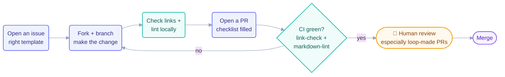

# Contributing

Thanks for helping make the Loop Engineering Crash Course better. Three kinds of
contribution are welcome: **content fixes**, **new prebuilt loops**, and **website
improvements**.

## Ground rules

1. **`docs/` is the single source of truth.** Content is written once there and
   rendered by both GitHub and the website. Never duplicate course text elsewhere.
2. **Concept pages follow the §10 template** (see `loop-plan.md`): hook → plain-English
   explanation → mermaid diagram → dual-tool code tabs (Claude Code ↔ OpenCode) →
   going-deeper callout → check-yourself quiz → Try With AI exercise →
   when-it-goes-wrong box → glossary popovers.
3. **Attribution is not optional.** Adapted material is credited in
   [`resources/sources.md`](resources/sources.md). Quotes are short, marked, and named.
4. **Tool mechanics change weekly.** Write commands as pointers to the tool's live
   docs, not as authoritative references.
5. **New loops declare their shape:** heartbeat type · cadence · week-1 level
   (L1/L2/L3) · token cost · human-gate placement — plus a provable stopping
   condition and a maker≠checker plan. Use the *new-loop* issue template first.

## Workflow

1. Open an issue with the right template (`bug`, `content-fix`, `new-loop`, `question`).
2. Fork, branch, and make your change.
3. Check your links locally before pushing (CI runs `link-check` and `markdown-lint`).
4. Open a PR — the template's checklist mirrors the rules above.
5. A human maintainer reviews everything, including (especially) loop-generated PRs.

## If your contribution was produced by a loop

We dogfood: parts of this repo are maintained by loops (see [`LOOP.md`](LOOP.md)).
Loop-generated PRs are welcome if the PR says which loop produced it, links its run-log
line, and a human stands behind the result. Unreviewed loop output will be closed.

## License

By contributing you agree your work is released under the [MIT License](LICENSE).
