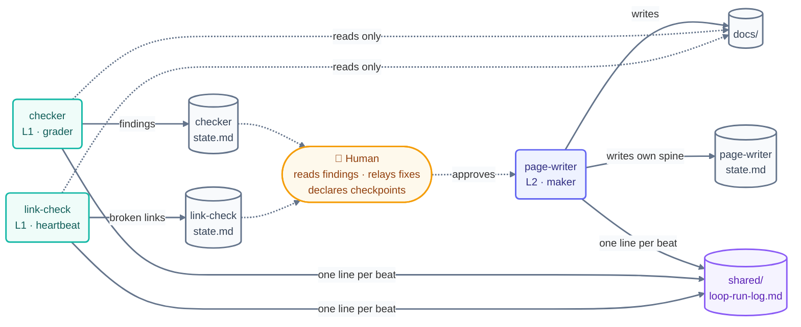

# LOOP.md — Main Loop Rulebook (shared by ALL loops)

> This file defines the rules **every** loop in this repo must follow. It is owned by
> the human, not by any loop — **no loop may edit this file.** Each loop's own
> definition lives in `loops/day1/<loop>/loop.md`; each loop's private spine lives in
> `loops/day1/<loop>/state.md`.

## Registered loops (Day 2 — current fleet)

| Loop | Folder | Heartbeat | Cadence | Level | Role |
| ------ | -------- | ----------- | --------- | ------- | ------ |
| step-writer | `loops/day2/step-writer/` | conditional (run-until-done) | self-paced | L2 (writes docs) | Writes the 14 steps, part indexes, methods, operating handbook. **Current mission: pass-2 tone rewrite per `shared/style-guide.md`** |
| template-checker | `loops/day2/template-checker/` | schedule | 20m (ceiling) | L1 (report-only) | PASS/FAIL per page against the §10 rubric |
| quiz-writer | `loops/day2/quiz-writer/` | conditional, gated on checker PASS | per part | L2 (writes quiz/flashcards only) | One part's `quiz.md` + `flashcards.md` per beat |
| link-check | `loops/day1/link-check/` *(continues unchanged)* | schedule | 30m | L1 (report-only) | Keeps relative links honest all day |

## Registered loops (Day 1 — retired 2026-07-16)

| Loop | Folder | Heartbeat | Cadence | Level | Role |
| ------ | -------- | ----------- | --------- | ------- | ------ |
| page-writer | `loops/day1/page-writer/` | conditional (run-until-done) | self-paced | L2 (writes docs) | Writes the Day 1 entry-layer pages |
| checker | `loops/day1/checker/` | schedule | 10m | L1 (report-only) | Verifies written pages against plan + template |
| link-check | `loops/day1/link-check/` | schedule | 30m | L1 (report-only) | Keeps relative links honest all day |

How the fleet coordinates — no loop calls another; they meet only through files:

## Shared rules (binding for every loop)

### 1. State isolation — never override another loop's work

- Each loop reads and writes **only its own** `state.md`. All other loops' state files
  are strictly read-only.
- Never edit another loop's `loop.md`, this file, `CLAUDE.md`, `loop-plan.md`,
  `shared/goal.md`, or `days-plans/`.
- The shared files each loop MAY touch: append-only lines to `shared/loop-run-log.md`.

### 2. One owner per file/folder (ownership map)

| Path | Owner (only writer) | Everyone else |
| ------ | -------------------- | --------------- |
| `docs/*-part-*` step pages + `README.md`, `docs/09-methods/`, `docs/10-operating/` | **step-writer** (Day 2) | read-only |
| `starters/` and the **banner line only** of `docs/00-start-here/README.md`, `docs/01-prerequisites/environment-setup.md`, `docs/02-foundations/mental-models.md` | **step-writer** (pass-3 grant, human-approved 2026-07-19) | read-only |
| `docs/*-part-*/quiz.md`, `docs/*-part-*/flashcards.md` | **quiz-writer** (Day 2) | read-only |
| `docs/` Day 1 entry layer (foundations, prerequisites, routers) | **page-writer** (retired) | read-only |
| `loops/day2/step-writer/state.md` | **step-writer** | read-only |
| `loops/day2/template-checker/state.md` | **template-checker** | read-only |
| `loops/day2/quiz-writer/state.md` | **quiz-writer** | read-only |
| `loops/day1/<loop>/state.md` | that Day 1 loop (retired) | read-only |
| `shared/loop-run-log.md` | all loops, **append-only** | — |
| `LOOP.md`, `CLAUDE.md`, `loop-plan.md`, `shared/goal.md`, `shared/loop-budget.md`, `shared/style-guide.md`, `STATE.md` | **human** | read-only |

If a loop needs a change outside its ownership, it writes the request into its own
`state.md` under "Escalations" and stops touching that path.

### 3. Every beat, in order

1. Read `loop-constraints.md` (binding) and this file.
2. Read your own `loop.md` and `state.md`; read `shared/goal.md`.
3. Check `shared/loop-budget.md` — if over budget or `loop-pause-all` is set, exit.
4. Do ONE unit of work (one page, one review, one link pass).
5. Update your own `state.md` (the spine — so an interrupted run resumes).
6. Append exactly one line to `shared/loop-run-log.md`.

### 4. The three stops (the only valid exits)

- **Success** — your loop's stopping condition in `loop.md` is provably met.
- **Limit** — your max-runs cap is hit.
- **No progress** — nothing changed for 3 consecutive beats. Log it and stop.

### 5. Maker ≠ checker

- The page-writer never grades its own pages; only the checker does.
- The checker and link-check loops are read-only on `docs/` — they report findings in
  their own state files and never fix pages themselves.

### 6. Human gates

- No pushing, merging, or closing issues/PRs — ever — without human approval.
- The Day 1 checkpoint is declared **only by the human**, after reviewing `README.md`
  and the foundations pages against `shared/goal.md`.

### 7. Budget & logging

- Budgets live in `shared/loop-budget.md`; at 80% of daily cap switch to report-only.
- Run-log format lives in `shared/loop-run-log.md`. One line per beat, no exceptions —
  silent runs are a failure mode.
