<div align="center">

[](https://github.com/ayeshakhalid192007-dev/LoopEngineering-CrashCourse/stargazers)
[](https://github.com/ayeshakhalid192007-dev/LoopEngineering-CrashCourse/commits)
[](https://github.com/ayeshakhalid192007-dev/LoopEngineering-CrashCourse)
[](https://github.com/ayeshakhalid192007-dev/LoopEngineering-CrashCourse/graphs/contributors)
[](https://github.com/ayeshakhalid192007-dev/LoopEngineering-CrashCourse/actions/workflows/loop-ready.yml)

[](LICENSE)
[](https://ayeshakhalid192007-dev.github.io/loop-lab/start-here/)
[](https://ayeshakhalid192007-dev.github.io/loop-lab/starters/getting-started/)
[](https://ayeshakhalid192007-dev.github.io/loop-lab/starters/getting-started/)

[](https://ayeshakhalid192007-dev.github.io/loop-lab/certification/loop-ready-certification/)
[](LICENSE)
[](LOOP.md)
[](CONTRIBUTING.md)

</div>

<!-- HERO-START -->

<div align="center">



# Loop Engineering Crash Course

*Stop prompting one message at a time. Design the loop.*

**Learn to build AI agent loops — autonomous systems with a heartbeat, a body, a
checker, a spine, and a stop you can prove.**

</div>

<!-- HERO-END -->

**Loop engineering is the practice of designing the system that prompts an AI agent — its
trigger, instructions, guardrails, verification, state, and logging — rather than prompting
it by hand.**

The leverage has moved: it no longer lives in the perfect prompt, but in the **control
system that keeps an agent working toward a goal over time**. This free, open-source
course teaches that discipline end to end — 14 steps, 20 ready-to-run loop kits, graded
labs, an operating handbook, and a certification. You don't read *about* loops here;
you build them, in two tools, from a first in-session loop to a certified fleet.

<div align="center">



*Real command, real score — this image is
[rendered from an actual run](scripts/render-loop-ready-terminal.mjs) of the
deterministic [Loop Ready audit](scripts/loop-ready-audit.mjs), and
[CI re-renders it](.github/workflows/loop-ready.yml) on every push. If a kit ever
fails, this terminal goes red.*

</div>

Want a loop running in your own project before the first lesson? One command:

```bash
# see the 20 ready-made loop kits
npx @loop-engineering/loop-kit list

# install one into the project you want the loop to watch
npx @loop-engineering/loop-kit ci-sweeper
```

> **We eat our own cooking.** This is a course about loops that is *built by loops*. The
> rulebook lives in [`LOOP.md`](LOOP.md), the durable spine in [`STATE.md`](STATE.md),
> and every single run is logged, one line at a time, in
> [`shared/loop-run-log.md`](shared/loop-run-log.md).

## 📌 Quick links

| I want to… | |
| --- | --- |
| **Enroll** — find my starting point in 60 seconds | [**View →**](https://ayeshakhalid192007-dev.github.io/loop-lab/start-here/) |
| See the full learning-track map with entry checks | [**View →**](https://ayeshakhalid192007-dev.github.io/loop-lab/start-here/learning-tracks/) |
| Set up my agent (Claude Code, OpenCode, Codex, Grok) | [**View →**](https://ayeshakhalid192007-dev.github.io/loop-lab/prerequisites/environment-setup/) |
| Look up a term in the glossary | [**View →**](https://ayeshakhalid192007-dev.github.io/loop-lab/foundations/glossary/) |
| Install a ready-made loop in my own project | [**View →**](https://ayeshakhalid192007-dev.github.io/loop-lab/starters/getting-started/) |
| Browse the 20 loop patterns | [**View →**](#-loop-pattern-library) |
| Operate loops safely (failure modes, recovery) | [**View →**](https://ayeshakhalid192007-dev.github.io/loop-lab/operating/operating-loops/) |
| Get certified | [**View →**](https://ayeshakhalid192007-dev.github.io/loop-lab/certification/loop-ready-certification/) |


## 💬 Why this matters

The people building today's coding agents say it plainly:

> "You shouldn't be prompting coding agents anymore. You should be designing loops
> that prompt your agents."
>
> — **Peter Steinberger** ([source S8](resources/sources.md))

> "I don't prompt Claude anymore. I have loops running that prompt Claude and figuring
> out what to do. My job is to write loops."
>
> — **Boris Cherny**, Head of Claude Code at Anthropic ([source S8](resources/sources.md))

The job is no longer writing the perfect prompt — it is architecting the control system
that keeps agents working toward a goal over time. That is exactly the discipline this
course teaches, and every voice above is one of its
[nine credited primary sources](resources/sources.md).

## 🧩 The six building blocks

**A heartbeat is the trigger that starts one iteration of a loop — in-session, conditional,
scheduled, or event-driven. A spine is a loop's durable state between runs: with one an
interrupted loop resumes, without one it restarts.**

Every loop in this course — and every kit in the
[pattern library](#-loop-pattern-library) — is assembled from the same six parts:

| Building block | Job in the loop | Taught in |
| --- | --- | --- |
| **Heartbeat** — schedules & automations | discovery + triage on a cadence | [Part 2](https://ayeshakhalid192007-dev.github.io/loop-lab/parts/heartbeat/) |
| **Worktrees** | safe parallel execution | [Part 3](https://ayeshakhalid192007-dev.github.io/loop-lab/parts/the-body/) |
| **Skills** | persistent project knowledge | [Part 3](https://ayeshakhalid192007-dev.github.io/loop-lab/parts/the-body/) |
| **Connectors / MCP** | reach into your real tools | [Part 3](https://ayeshakhalid192007-dev.github.io/loop-lab/parts/the-body/) |
| **Sub-agents** | the maker / checker split | [Part 3](https://ayeshakhalid192007-dev.github.io/loop-lab/parts/the-body/) |
| **+ Spine** — memory / state | durable state outside any conversation | [Part 4](https://ayeshakhalid192007-dev.github.io/loop-lab/parts/the-spine/) |

<div align="center">


</div>

Deep dive: [Primitives](https://ayeshakhalid192007-dev.github.io/loop-lab/foundations/primitives/) ·
[Primitives Matrix](https://ayeshakhalid192007-dev.github.io/loop-lab/foundations/primitives-matrix/) — which block exists in
which tool, side by side.


## 🎓 Choose your track

**New here?** [**Open the 60-second router →**](https://ayeshakhalid192007-dev.github.io/loop-lab/start-here/)

Like any good LMS, this course meets you where you are. Answer four honest questions and
the router drops you onto exactly one of four tracks — so a first-timer never drowns and
a veteran never yawns:

| Track | You are… | You'll learn to… |
| --- | --- | --- |
| **T1 · Foundations** | using an AI agent by hand (or not yet) | explain the shift and run your first in-session loop |
| **T2 · Practitioner** | fluent in the six parts of a loop | choose a heartbeat, write a provable stop, split maker/checker |
| **T3 · Engineer** | able to assemble a loop | build the full six-part loop in two tools and operate it safely |
| **T4 · Ultra-Pro** | shipping loops already | hill-climbing loops, fleets, governance at team scale |

[**View the full track map with entry checks and exit assessments →**](https://ayeshakhalid192007-dev.github.io/loop-lab/start-here/learning-tracks/)


## 📚 Curriculum

**Prerequisites & foundations (read first):**
[Environment Setup](https://ayeshakhalid192007-dev.github.io/loop-lab/prerequisites/environment-setup/) ·
[Agentic-Coding Primer](https://ayeshakhalid192007-dev.github.io/loop-lab/prerequisites/agentic-coding-primer/) ·
[Spec-Driven Primer](https://ayeshakhalid192007-dev.github.io/loop-lab/prerequisites/spec-driven-primer/) ·
[Mental Models](https://ayeshakhalid192007-dev.github.io/loop-lab/foundations/mental-models/) ·
[Concepts](https://ayeshakhalid192007-dev.github.io/loop-lab/foundations/concepts/) ·
[The Four Layers](https://ayeshakhalid192007-dev.github.io/loop-lab/foundations/the-four-layers/) ·
[Primitives](https://ayeshakhalid192007-dev.github.io/loop-lab/foundations/primitives/) ·
[Primitives Matrix](https://ayeshakhalid192007-dev.github.io/loop-lab/foundations/primitives-matrix/) ·
[Glossary](https://ayeshakhalid192007-dev.github.io/loop-lab/foundations/glossary/)

**The 14-step core roadmap** — six parts, each ending in something you built:

| Part | Steps | What you learn | |
| --- | --- | --- | --- |
| **1 · The Shift** | 01–03 | prompting → looping, the four layers, anatomy of a loop | [**Start →**](https://ayeshakhalid192007-dev.github.io/loop-lab/parts/the-shift/) |
| **2 · The Heartbeat** | 04–07 | in-session, run-until-done, schedules, event-driven | [**Start →**](https://ayeshakhalid192007-dev.github.io/loop-lab/parts/heartbeat/) |
| **3 · The Body** | 08–11 | worktrees, skills, connectors/MCP, maker ≠ checker | [**Start →**](https://ayeshakhalid192007-dev.github.io/loop-lab/parts/the-body/) |
| **4 · The Spine** | 12 | durable state between runs | [**Start →**](https://ayeshakhalid192007-dev.github.io/loop-lab/parts/the-spine/) |
| **5 · A Complete Loop** | 13 | build the same loop twice (Claude Code & OpenCode) | [**Start →**](https://ayeshakhalid192007-dev.github.io/loop-lab/parts/complete-loop/) |
| **6 · Human Control** | 14 | staying the engineer: cost, verification, nested loops | [**Start →**](https://ayeshakhalid192007-dev.github.io/loop-lab/parts/human-control/) |

**Then keep climbing:**

| Stage | What it holds | |
| --- | --- | --- |
| **Methods** | design your own loop: [Decision Framework](https://ayeshakhalid192007-dev.github.io/loop-lab/methods/decision-framework/), [Design Checklist](https://ayeshakhalid192007-dev.github.io/loop-lab/methods/loop-design-checklist/), [Pattern Picker](https://ayeshakhalid192007-dev.github.io/loop-lab/methods/pattern-picker/), [Worked Example](https://ayeshakhalid192007-dev.github.io/loop-lab/methods/worked-example-dependency-sweeper/) | [**View →**](https://ayeshakhalid192007-dev.github.io/loop-lab/methods/make-your-own-loop/) |
| **Operating handbook** | safety, failure modes, infinite loops, observability, recovery | [**View →**](https://ayeshakhalid192007-dev.github.io/loop-lab/operating/operating-loops/) |
| **Graded labs** | 11 hands-on projects, from a watch loop to a two-routine gate — with [solutions](https://ayeshakhalid192007-dev.github.io/loop-lab/projects/solutions/) | [**View →**](https://ayeshakhalid192007-dev.github.io/loop-lab/projects/) |
| **Advanced** | hill-climbing, multi-loop coordination, evals & traces, governance, enterprise scale | [**View →**](https://ayeshakhalid192007-dev.github.io/loop-lab/advanced/) |
| **Certification** | the **Loop Ready** capstone: [Final Exam](https://ayeshakhalid192007-dev.github.io/loop-lab/certification/final-exam/) · [Capstone Rubric](https://ayeshakhalid192007-dev.github.io/loop-lab/certification/capstone-rubric/) | [**View →**](https://ayeshakhalid192007-dev.github.io/loop-lab/certification/loop-ready-certification/) |

Every lesson shows the same build in at least two tools, side by side
(Claude Code ↔ OpenCode), so you learn the discipline — not one vendor's syntax.


## 🔁 Anatomy of a loop

**An agent loop is a system that repeatedly runs an AI agent toward a specified outcome
without a human driving each run.** Every production loop declares six parts; a loop missing
one of them is the loop that surprises you at 3am.

Six parts, one discipline. A **heartbeat** decides when the agent runs, a **body** does
the work, a **checker** grades it (the maker never grades its own work), a **spine**
remembers across runs, a **provable stop** ends it, and **you** stay the engineer:


Start with [Mental Models](https://ayeshakhalid192007-dev.github.io/loop-lab/foundations/mental-models/) and
[The Four Layers](https://ayeshakhalid192007-dev.github.io/loop-lab/foundations/the-four-layers/); keep the
[Glossary](https://ayeshakhalid192007-dev.github.io/loop-lab/foundations/glossary/) open in a tab.


## 🧰 Loop pattern library

Twenty production-shaped loop kits, each with a definition, a spine, a budget, a
constitution, and a read-only checker. Install any of them into your own project with
one command — no clone required:

```bash
npx @loop-engineering/loop-kit <pattern-name>
```

| Pattern | What it does |
| --- | --- |
| [`ci-sweeper`](https://ayeshakhalid192007-dev.github.io/loop-lab/patterns/ci-sweeper/) | fires the instant CI goes red on `main` and sweeps it back to green |
| [`pr-babysitter`](https://ayeshakhalid192007-dev.github.io/loop-lab/patterns/pr-babysitter/) | keeps open PRs from rotting — conflicts, red CI, silent reviewers |
| [`daily-triage`](https://ayeshakhalid192007-dev.github.io/loop-lab/patterns/daily-triage/) | clears the overnight noise before you open your laptop |
| [`issue-triage`](https://ayeshakhalid192007-dev.github.io/loop-lab/patterns/issue-triage/) | `daily-triage`'s narrower cousin, stripped down to issues alone |
| [`dependency-sweeper`](https://ayeshakhalid192007-dev.github.io/loop-lab/patterns/dependency-sweeper/) | keeps dependencies current without updating them blind |
| [`dependency-cve-burndown`](https://ayeshakhalid192007-dev.github.io/loop-lab/patterns/dependency-cve-burndown/) | reads the 3 a.m. CVE advisory so it never waits until Monday |
| [`docs-sweep`](https://ayeshakhalid192007-dev.github.io/loop-lab/patterns/docs-sweep/) | catches documentation the moment the code moves on without it |
| [`changelog-drafter`](https://ayeshakhalid192007-dev.github.io/loop-lab/patterns/changelog-drafter/) | drafts the changelog your busy sprint was going to forget |
| [`test-coverage-loop`](https://ayeshakhalid192007-dev.github.io/loop-lab/patterns/test-coverage-loop/) | burns down the "we should really test that" backlog |
| [`test-stabilizer-loop`](https://ayeshakhalid192007-dev.github.io/loop-lab/patterns/test-stabilizer-loop/) | hunts flaky tests until a red run means something again |
| [`prod-error-sweep`](https://ayeshakhalid192007-dev.github.io/loop-lab/patterns/prod-error-sweep/) | sweeps the production errors that actually cost users something |
| [`page-load-loop`](https://ayeshakhalid192007-dev.github.io/loop-lab/patterns/page-load-loop/) | keeps pushing page-load performance downhill, beat after beat |
| [`repo-cleanup-loop`](https://ayeshakhalid192007-dev.github.io/loop-lab/patterns/repo-cleanup-loop/) | clears repository clutter — branches nobody deleted, and worse |
| [`post-merge-cleanup`](https://ayeshakhalid192007-dev.github.io/loop-lab/patterns/post-merge-cleanup/) | finishes the story every merge leaves behind |
| [`ticket-to-pr-ready`](https://ayeshakhalid192007-dev.github.io/loop-lab/patterns/ticket-to-pr-ready/) | one ticket, one run: reproduce, fix, arrive PR-ready |
| [`spec-dev-review`](https://ayeshakhalid192007-dev.github.io/loop-lab/patterns/spec-dev-review/) | one story → a scoped spec packet: findings, progress, review |
| [`clodex-adversarial-review`](https://ayeshakhalid192007-dev.github.io/loop-lab/patterns/clodex-adversarial-review/) | a real maker–checker pair: Claude implements, Codex reviews |
| [`codex-completion-contract`](https://ayeshakhalid192007-dev.github.io/loop-lab/patterns/codex-completion-contract/) | stops "mostly done" from quietly passing as "done" |
| [`loop-harness-verification`](https://ayeshakhalid192007-dev.github.io/loop-lab/patterns/loop-harness-verification/) | a general-purpose harness for any scheduled repo task |
| [`stale-safe-batch-release`](https://ayeshakhalid192007-dev.github.io/loop-lab/patterns/stale-safe-batch-release/) | the bookend: batches what every other kit left safely releasable |

Prefer to design your own from a blank? `npx @loop-engineering/loop-kit new <loop-name>`
scaffolds one from [the blank template](https://ayeshakhalid192007-dev.github.io/loop-lab/starters/_template/).
[**View the full install guide →**](https://ayeshakhalid192007-dev.github.io/loop-lab/starters/getting-started/)


## 🚀 Getting started (5 minutes)

1. **Enroll** — run the [60-second router](https://ayeshakhalid192007-dev.github.io/loop-lab/start-here/). It hands you
   a track.
2. **Set up your agent** — follow the
   [Environment Setup guide](https://ayeshakhalid192007-dev.github.io/loop-lab/prerequisites/environment-setup/)
   (Claude Code, OpenCode, Codex, or Grok; every lesson shows at least Claude Code ↔ OpenCode).
3. **Speed-run the primers** — the
   [Agentic-Coding Primer](https://ayeshakhalid192007-dev.github.io/loop-lab/prerequisites/agentic-coding-primer/) and the
   [Spec-Driven Primer](https://ayeshakhalid192007-dev.github.io/loop-lab/prerequisites/spec-driven-primer/).
4. **Ground yourself in the foundations** — start with
   [Mental Models](https://ayeshakhalid192007-dev.github.io/loop-lab/foundations/mental-models/).
5. **Begin the 14 steps** — [Part 1 · The Shift](https://ayeshakhalid192007-dev.github.io/loop-lab/parts/the-shift/), then follow
   the [curriculum](#-curriculum) through to the
   [Loop Ready certification](https://ayeshakhalid192007-dev.github.io/loop-lab/certification/loop-ready-certification/).


## 🛡️ Operating & safety

A loop without a provable stop is an incident with a delay. The operating handbook is a
first-class part of the course, not an appendix:

- [Operating loops](https://ayeshakhalid192007-dev.github.io/loop-lab/operating/operating-loops/) — the day-to-day handbook
- [Safety](https://ayeshakhalid192007-dev.github.io/loop-lab/operating/safety/) — L1 report-only first, human gates, budgets
- [Failure modes](https://ayeshakhalid192007-dev.github.io/loop-lab/operating/failure-modes/) ·
  [Infinite loops](https://ayeshakhalid192007-dev.github.io/loop-lab/operating/infinite-loops/) ·
  [Anti-patterns](https://ayeshakhalid192007-dev.github.io/loop-lab/operating/anti-patterns/)
- [Observability](https://ayeshakhalid192007-dev.github.io/loop-lab/operating/observability/) ·
  [Recovery playbook](https://ayeshakhalid192007-dev.github.io/loop-lab/operating/recovery-playbook/) ·
  [Multi-loop operation](https://ayeshakhalid192007-dev.github.io/loop-lab/operating/multi-loop/)

The house rules this repo itself runs under — one owner per file, a sacred spine, stop
conditions as specs, green ≠ done — live in [`LOOP.md`](LOOP.md).

> "Build the loop. But build it like someone who intends to stay the engineer, not just
> the person who presses go."
>
> — **Addy Osmani**, *[Loop Engineering](https://addyosmani.com/blog/loop-engineering/)*
> ([source S5](resources/sources.md))

## 🏅 Certification: Loop Ready

**Loop Ready is an auditable score, not a badge.** It certifies that you can design a loop
declaring all six parts, and that the loop you built is verified by something other than
itself.

The course ends with a graded capstone, not a participation badge. You design, build,
and operate a loop of your own, then defend it against the
[Capstone Rubric](https://ayeshakhalid192007-dev.github.io/loop-lab/certification/capstone-rubric/) and pass the
[Final Exam](https://ayeshakhalid192007-dev.github.io/loop-lab/certification/final-exam/).
[**View the full certification path →**](https://ayeshakhalid192007-dev.github.io/loop-lab/certification/loop-ready-certification/)


## 📂 Repository map

| Folder | What it holds |
| --- | --- |
| `docs/` | the course — single source of truth for GitHub *and* the website |
| `loops/` | [the loops that build this course](loops/README.md) — real prompts, real spines |
| `patterns/` | the 20 loop patterns ([table above](#-loop-pattern-library)) |
| `starters/` | [install-and-fill loop kits](https://ayeshakhalid192007-dev.github.io/loop-lab/starters/) — [one `npx` command](https://ayeshakhalid192007-dev.github.io/loop-lab/starters/getting-started/) into any project, or start from [`_template/`](https://ayeshakhalid192007-dev.github.io/loop-lab/starters/_template/) |
| `packages/loop-kit/` | the published CLI behind `npx @loop-engineering/loop-kit` |
| `skills/`, `templates/`, `examples/`, `stories/` | reusable parts and case studies |
| `resources/` | [source attribution](resources/sources.md) for all nine primary sources |
| `web/` | the Next.js course website *(in progress)* |

## 🤝 Contributing & credits

Pull requests are genuinely welcome — start with the
[Contributing Guide](CONTRIBUTING.md). This course stands on the shoulders of nine
primary sources: it synthesizes and adapts MIT-licensed material and public writing,
and it credits every one of them, page by page, on the
[Sources & Attribution page](resources/sources.md). Academic or written citation?
Use [`CITATION.cff`](CITATION.cff).

**Primary sources, linked directly:**

- Addy Osmani — [Loop Engineering](https://addyosmani.com/blog/loop-engineering/)
- LangChain — [The Art of Loop Engineering](https://www.langchain.com/blog/the-art-of-loop-engineering)
- Cobus Greyling — [loop-engineering](https://github.com/cobusgreyling/loop-engineering)
- Panaversity Agent Factory — [Loop Engineering Crash Course](https://agentfactory.panaversity.org/docs/loop-engineering-crash-course) · [Agentic Coding](https://agentfactory.panaversity.org/docs/agentic-coding-crash-course) · [Spec-Driven Development](https://agentfactory.panaversity.org/docs/spec-driven-development-crash-course)
- Anthropic — [Claude Code documentation](https://docs.claude.com/en/docs/claude-code/overview)
- [Model Context Protocol specification](https://modelcontextprotocol.io/)
- GitHub — [scheduled workflow events](https://docs.github.com/en/actions/reference/workflows-and-actions/events-that-trigger-workflows#schedule)
- Peter Steinberger ([@steipete](https://x.com/steipete)) · Andrej Karpathy ([@karpathy](https://x.com/karpathy)) · Andrew Ng ([@AndrewYNg](https://x.com/AndrewYNg))

Full page-by-page attribution: [Sources & Attribution](resources/sources.md).

Licensed [MIT](LICENSE) — free to learn from, fork, and teach with.

**Maintainers:** Saram Ali, Ayesha Khalid

<div align="center">

**[⬆ Back to top](#loop-engineering-crash-course)** · Built with its own loops, one
provable stop at a time.

</div>
