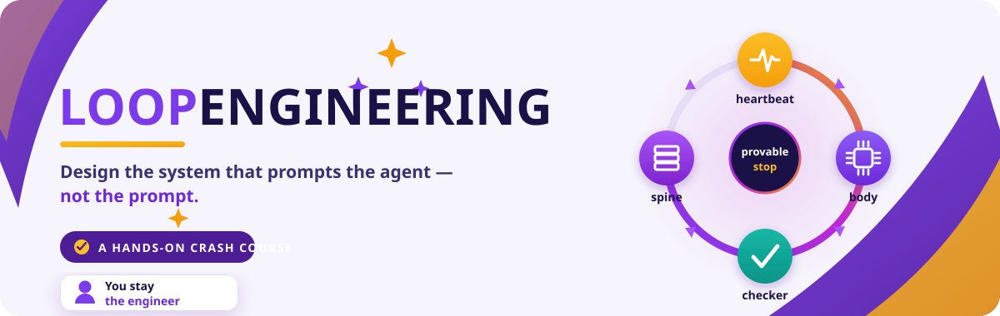

<!-- HERO-START -->

# Loop Engineering Crash Course

**Learn to build AI agent loops — autonomous systems with a heartbeat, a spine, a
checker, and a stop you can prove.**

You will not read *about* loops here; you will build them. By the last page you will
have designed, shipped, and safely operated real loops in two different tools — opening
with a single in-session loop and closing with a certified multi-loop fleet. It is free,
open source, and readable end to end on GitHub.

<!-- HERO-END -->

Loop Engineering is the fast-emerging craft of **designing the system that prompts your
AI agents** instead of prompting them one message at a time. The leverage has moved: it
no longer lives in the perfect prompt, but in the control system that keeps an agent
working toward a goal over time. This repository packages that whole discipline — the
concepts, the mechanics, a library of ready-to-run loops, hands-on labs, and the safety
guidance that keeps you in charge — as a complete course you can read start to finish on
GitHub. The same `docs/` content powers the course website too, so the two surfaces can
never drift apart (one source of truth, always).

> **We eat our own cooking.** This is a course about loops that is *built by loops*. The
> rulebook lives in [`LOOP.md`](LOOP.md), the durable spine in [`STATE.md`](STATE.md),
> and every single run is logged, one line at a time, in
> [`shared/loop-run-log.md`](shared/loop-run-log.md).

## Start here

**New? Spend 60 seconds on the router before anything else:** →
[`docs/00-start-here/README.md`](docs/00-start-here/README.md)

Answer four honest questions and it drops you onto exactly one of four tracks — so a
first-timer never drowns and a veteran never yawns:

| Track | You are… | You'll learn to… |
| ------- | ---------- | ------------------ |
| **T1 · Foundations** | using an AI agent by hand (or not yet) | explain the shift and run your first in-session loop |
| **T2 · Practitioner** | fluent in the six parts of a loop | choose a heartbeat, write a provable stop, split maker/checker |
| **T3 · Engineer** | able to assemble a loop | build the full six-part loop in two tools and operate it safely |
| **T4 · Ultra-Pro** | shipping loops already | hill-climbing loops, fleets, governance at team scale |

Full map with entry checks and exit assessments:
[`docs/00-start-here/learning-tracks.md`](docs/00-start-here/learning-tracks.md)

## Quickstart

1. **Set up your agent** — [`docs/01-prerequisites/environment-setup.md`](docs/01-prerequisites/environment-setup.md)
   (Claude Code, OpenCode, Codex, or Grok; every lesson shows at least Claude Code ↔ OpenCode).
2. **Speed-run the primers** — [`agentic-coding-primer.md`](docs/01-prerequisites/agentic-coding-primer.md)
   and [`spec-driven-primer.md`](docs/01-prerequisites/spec-driven-primer.md).
3. **Ground yourself in the foundations** — start with
   [`mental-models.md`](docs/02-foundations/mental-models.md), keep the
   [`glossary.md`](docs/02-foundations/glossary.md) open in a tab.
4. **Begin the 14 steps** (Part 1 opens Day 2 — see the roadmap below).

## The course at a glance

**Foundations (read first):**
[glossary](docs/02-foundations/glossary.md) ·
[mental models](docs/02-foundations/mental-models.md) ·
[concepts](docs/02-foundations/concepts.md) ·
[the four layers](docs/02-foundations/the-four-layers.md) ·
[primitives](docs/02-foundations/primitives.md) ·
[primitives matrix](docs/02-foundations/primitives-matrix.md)

**The 14-step roadmap** *(content lands over the next days — links activate as parts ship)*:

| Part | Steps | What you learn |
| ------ | ------- | ---------------- |
| 1 · The Shift | 01–03 | prompting → looping, the four layers, anatomy of a loop |
| 2 · The Heartbeat | 04–07 | in-session, run-until-done, schedules, event-driven |
| 3 · The Body | 08–11 | worktrees, skills, connectors/MCP, maker ≠ checker |
| 4 · The Spine | 12 | durable state between runs |
| 5 · A Complete Loop | 13 | build the same loop twice (Claude Code & OpenCode) |
| 6 · Human Control | 14 | staying the engineer: cost, verification, nested loops |

Then: methods for designing your own loop, the operating handbook (safety, failure
modes, recovery), the prebuilt loop library, graded labs, and the **Loop Ready**
certification capstone.

## What's in the repo

| Folder | What it holds |
| -------- | --------------- |
| `docs/` | the course — single source of truth for GitHub *and* the website |
| `loops/` | [the loops that build this course](loops/README.md) — real prompts, real spines |
| `patterns/` | the seven core loop patterns *(Day 2+)* |
| `starters/` | clone-and-run starter kits *(Day 3)* |
| `skills/`, `templates/`, `examples/`, `stories/` | reusable parts and case studies *(Day 2+)* |
| `resources/` | [source attribution](resources/sources.md) for all nine primary sources |
| `web/` | the Next.js course website *(Day 4)* |

## Contributing & credits

Pull requests are genuinely welcome — start with [`CONTRIBUTING.md`](CONTRIBUTING.md).
This course stands on the shoulders of nine primary sources: it synthesizes and adapts
MIT-licensed material and public writing, and it credits every one of them, page by page,
in [`resources/sources.md`](resources/sources.md). Licensed [MIT](LICENSE).
