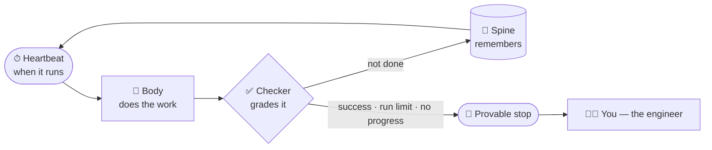

<div align="center">

[](https://github.com/ayeshakhalid192007-dev/LoopEngineering-CrashCourse/stargazers)
[](https://github.com/ayeshakhalid192007-dev/LoopEngineering-CrashCourse/commits)
[](https://github.com/ayeshakhalid192007-dev/LoopEngineering-CrashCourse)
[](https://github.com/ayeshakhalid192007-dev/LoopEngineering-CrashCourse/graphs/contributors)
[](https://github.com/ayeshakhalid192007-dev/LoopEngineering-CrashCourse/actions/workflows/loop-ready.yml)

[](LICENSE)
[](docs/00-start-here/README.md)
[](starters/getting-started.md)
[](starters/getting-started.md)

[](docs/assessments/loop-ready-certification.md)
[](LICENSE)
[](LOOP.md)
[](CONTRIBUTING.md)

</div>

<!-- HERO-START -->

<div align="center">


# Loop Engineering Crash Course

*Stop prompting one message at a time. Design the loop.*

**Learn to build AI agent loops — autonomous systems with a heartbeat, a body, a
checker, a spine, and a stop you can prove.**

</div>

<!-- HERO-END -->

The leverage has moved: it no longer lives in the perfect prompt, but in the **control
system that keeps an agent working toward a goal over time**. This free, open-source
course teaches that discipline end to end — 14 steps, 20 ready-to-run loop kits, graded
labs, an operating handbook, and a certification. You don't read *about* loops here;
you build them, in two tools, from a first in-session loop to a certified fleet.

<div align="center">


*Real command, real score — this image is
[rendered from an actual run](scripts/render-loop-ready-terminal.mjs) of the
deterministic [Loop Ready audit](scripts/loop-ready-audit.mjs), and
[CI re-renders it](.github/workflows/loop-ready.yml) on every push. If a kit ever
fails, this terminal goes red.*

</div>

Want a loop running in your own project before the first lesson? One command:

```bash
# see the 20 ready-made loop kits
npx @loop-engineering/loop-kit list

# install one into the project you want the loop to watch
npx @loop-engineering/loop-kit ci-sweeper
```

> **We eat our own cooking.** This is a course about loops that is *built by loops*. The
> rulebook lives in [`LOOP.md`](LOOP.md), the durable spine in [`STATE.md`](STATE.md),
> and every single run is logged, one line at a time, in
> [`shared/loop-run-log.md`](shared/loop-run-log.md).

## 📌 Quick links

| I want to… | |
| --- | --- |
| **Enroll** — find my starting point in 60 seconds | [**View →**](docs/00-start-here/README.md) |
| See the full learning-track map with entry checks | [**View →**](docs/00-start-here/learning-tracks.md) |
| Set up my agent (Claude Code, OpenCode, Codex, Grok) | [**View →**](docs/01-prerequisites/environment-setup.md) |
| Look up a term in the glossary | [**View →**](docs/02-foundations/glossary.md) |
| Install a ready-made loop in my own project | [**View →**](starters/getting-started.md) |
| Browse the 20 loop patterns | [**View →**](#-loop-pattern-library) |
| Operate loops safely (failure modes, recovery) | [**View →**](docs/10-operating/operating-loops.md) |
| Get certified | [**View →**](docs/assessments/loop-ready-certification.md) |


## 🎓 Choose your track

**New here?** [**Open the 60-second router →**](docs/00-start-here/README.md)

Like any good LMS, this course meets you where you are. Answer four honest questions and
the router drops you onto exactly one of four tracks — so a first-timer never drowns and
a veteran never yawns:

| Track | You are… | You'll learn to… |
| --- | --- | --- |
| **T1 · Foundations** | using an AI agent by hand (or not yet) | explain the shift and run your first in-session loop |
| **T2 · Practitioner** | fluent in the six parts of a loop | choose a heartbeat, write a provable stop, split maker/checker |
| **T3 · Engineer** | able to assemble a loop | build the full six-part loop in two tools and operate it safely |
| **T4 · Ultra-Pro** | shipping loops already | hill-climbing loops, fleets, governance at team scale |

[**View the full track map with entry checks and exit assessments →**](docs/00-start-here/learning-tracks.md)


## 📚 Curriculum

**Prerequisites & foundations (read first):**
[Environment Setup](docs/01-prerequisites/environment-setup.md) ·
[Agentic-Coding Primer](docs/01-prerequisites/agentic-coding-primer.md) ·
[Spec-Driven Primer](docs/01-prerequisites/spec-driven-primer.md) ·
[Mental Models](docs/02-foundations/mental-models.md) ·
[Concepts](docs/02-foundations/concepts.md) ·
[The Four Layers](docs/02-foundations/the-four-layers.md) ·
[Primitives](docs/02-foundations/primitives.md) ·
[Primitives Matrix](docs/02-foundations/primitives-matrix.md) ·
[Glossary](docs/02-foundations/glossary.md)

**The 14-step core roadmap** — six parts, each ending in something you built:

| Part | Steps | What you learn | |
| --- | --- | --- | --- |
| **1 · The Shift** | 01–03 | prompting → looping, the four layers, anatomy of a loop | [**Start →**](docs/03-part-1-the-shift/) |
| **2 · The Heartbeat** | 04–07 | in-session, run-until-done, schedules, event-driven | [**Start →**](docs/04-part-2-heartbeat/) |
| **3 · The Body** | 08–11 | worktrees, skills, connectors/MCP, maker ≠ checker | [**Start →**](docs/05-part-3-the-body/) |
| **4 · The Spine** | 12 | durable state between runs | [**Start →**](docs/06-part-4-the-spine/) |
| **5 · A Complete Loop** | 13 | build the same loop twice (Claude Code & OpenCode) | [**Start →**](docs/07-part-5-complete-loop/) |
| **6 · Human Control** | 14 | staying the engineer: cost, verification, nested loops | [**Start →**](docs/08-part-6-human-control/) |

**Then keep climbing:**

| Stage | What it holds | |
| --- | --- | --- |
| **Methods** | design your own loop: [Decision Framework](docs/09-methods/decision-framework.md), [Design Checklist](docs/09-methods/loop-design-checklist.md), [Pattern Picker](docs/09-methods/pattern-picker.md), [Worked Example](docs/09-methods/worked-example-dependency-sweeper.md) | [**View →**](docs/09-methods/make-your-own-loop.md) |
| **Operating handbook** | safety, failure modes, infinite loops, observability, recovery | [**View →**](docs/10-operating/operating-loops.md) |
| **Graded labs** | 11 hands-on projects, from a watch loop to a two-routine gate — with [solutions](docs/projects/solutions/) | [**View →**](docs/projects/) |
| **Advanced** | hill-climbing, multi-loop coordination, evals & traces, governance, enterprise scale | [**View →**](docs/advanced/) |
| **Certification** | the **Loop Ready** capstone: [Final Exam](docs/assessments/final-exam.md) · [Capstone Rubric](docs/assessments/capstone-rubric.md) | [**View →**](docs/assessments/loop-ready-certification.md) |

Every lesson shows the same build in at least two tools, side by side
(Claude Code ↔ OpenCode), so you learn the discipline — not one vendor's syntax.


## 🔁 Anatomy of a loop

Six parts, one discipline. A **heartbeat** decides when the agent runs, a **body** does
the work, a **checker** grades it (the maker never grades its own work), a **spine**
remembers across runs, a **provable stop** ends it, and **you** stay the engineer:



Start with [Mental Models](docs/02-foundations/mental-models.md) and
[The Four Layers](docs/02-foundations/the-four-layers.md); keep the
[Glossary](docs/02-foundations/glossary.md) open in a tab.


## 🧰 Loop pattern library

Twenty production-shaped loop kits, each with a definition, a spine, a budget, a
constitution, and a read-only checker. Install any of them into your own project with
one command — no clone required:

```bash
npx @loop-engineering/loop-kit <pattern-name>
```

| Pattern | What it does |
| --- | --- |
| [`ci-sweeper`](patterns/ci-sweeper.md) | fires the instant CI goes red on `main` and sweeps it back to green |
| [`pr-babysitter`](patterns/pr-babysitter.md) | keeps open PRs from rotting — conflicts, red CI, silent reviewers |
| [`daily-triage`](patterns/daily-triage.md) | clears the overnight noise before you open your laptop |
| [`issue-triage`](patterns/issue-triage.md) | `daily-triage`'s narrower cousin, stripped down to issues alone |
| [`dependency-sweeper`](patterns/dependency-sweeper.md) | keeps dependencies current without updating them blind |
| [`dependency-cve-burndown`](patterns/dependency-cve-burndown.md) | reads the 3 a.m. CVE advisory so it never waits until Monday |
| [`docs-sweep`](patterns/docs-sweep.md) | catches documentation the moment the code moves on without it |
| [`changelog-drafter`](patterns/changelog-drafter.md) | drafts the changelog your busy sprint was going to forget |
| [`test-coverage-loop`](patterns/test-coverage-loop.md) | burns down the "we should really test that" backlog |
| [`test-stabilizer-loop`](patterns/test-stabilizer-loop.md) | hunts flaky tests until a red run means something again |
| [`prod-error-sweep`](patterns/prod-error-sweep.md) | sweeps the production errors that actually cost users something |
| [`page-load-loop`](patterns/page-load-loop.md) | keeps pushing page-load performance downhill, beat after beat |
| [`repo-cleanup-loop`](patterns/repo-cleanup-loop.md) | clears repository clutter — branches nobody deleted, and worse |
| [`post-merge-cleanup`](patterns/post-merge-cleanup.md) | finishes the story every merge leaves behind |
| [`ticket-to-pr-ready`](patterns/ticket-to-pr-ready.md) | one ticket, one run: reproduce, fix, arrive PR-ready |
| [`spec-dev-review`](patterns/spec-dev-review.md) | one story → a scoped spec packet: findings, progress, review |
| [`clodex-adversarial-review`](patterns/clodex-adversarial-review.md) | a real maker–checker pair: Claude implements, Codex reviews |
| [`codex-completion-contract`](patterns/codex-completion-contract.md) | stops "mostly done" from quietly passing as "done" |
| [`loop-harness-verification`](patterns/loop-harness-verification.md) | a general-purpose harness for any scheduled repo task |
| [`stale-safe-batch-release`](patterns/stale-safe-batch-release.md) | the bookend: batches what every other kit left safely releasable |

Prefer to design your own from a blank? `npx @loop-engineering/loop-kit new <loop-name>`
scaffolds one from [the blank template](starters/_template/README.md).
[**View the full install guide →**](starters/getting-started.md)


## 🚀 Getting started (5 minutes)

1. **Enroll** — run the [60-second router](docs/00-start-here/README.md). It hands you
   a track.
2. **Set up your agent** — follow the
   [Environment Setup guide](docs/01-prerequisites/environment-setup.md)
   (Claude Code, OpenCode, Codex, or Grok; every lesson shows at least Claude Code ↔ OpenCode).
3. **Speed-run the primers** — the
   [Agentic-Coding Primer](docs/01-prerequisites/agentic-coding-primer.md) and the
   [Spec-Driven Primer](docs/01-prerequisites/spec-driven-primer.md).
4. **Ground yourself in the foundations** — start with
   [Mental Models](docs/02-foundations/mental-models.md).
5. **Begin the 14 steps** — [Part 1 · The Shift](docs/03-part-1-the-shift/), then follow
   the [curriculum](#-curriculum) through to the
   [Loop Ready certification](docs/assessments/loop-ready-certification.md).


## 🛡️ Operating & safety

A loop without a provable stop is an incident with a delay. The operating handbook is a
first-class part of the course, not an appendix:

- [Operating loops](docs/10-operating/operating-loops.md) — the day-to-day handbook
- [Safety](docs/10-operating/safety.md) — L1 report-only first, human gates, budgets
- [Failure modes](docs/10-operating/failure-modes.md) ·
  [Infinite loops](docs/10-operating/infinite-loops.md) ·
  [Anti-patterns](docs/10-operating/anti-patterns.md)
- [Observability](docs/10-operating/observability.md) ·
  [Recovery playbook](docs/10-operating/recovery-playbook.md) ·
  [Multi-loop operation](docs/10-operating/multi-loop.md)

The house rules this repo itself runs under — one owner per file, a sacred spine, stop
conditions as specs, green ≠ done — live in [`LOOP.md`](LOOP.md).

## 🏅 Certification: Loop Ready

The course ends with a graded capstone, not a participation badge. You design, build,
and operate a loop of your own, then defend it against the
[Capstone Rubric](docs/assessments/capstone-rubric.md) and pass the
[Final Exam](docs/assessments/final-exam.md).
[**View the full certification path →**](docs/assessments/loop-ready-certification.md)


## 📂 Repository map

| Folder | What it holds |
| --- | --- |
| `docs/` | the course — single source of truth for GitHub *and* the website |
| `loops/` | [the loops that build this course](loops/README.md) — real prompts, real spines |
| `patterns/` | the 20 loop patterns ([table above](#-loop-pattern-library)) |
| `starters/` | [install-and-fill loop kits](starters/README.md) — [one `npx` command](starters/getting-started.md) into any project, or start from [`_template/`](starters/_template/README.md) |
| `packages/loop-kit/` | the published CLI behind `npx @loop-engineering/loop-kit` |
| `skills/`, `templates/`, `examples/`, `stories/` | reusable parts and case studies |
| `resources/` | [source attribution](resources/sources.md) for all nine primary sources |
| `web/` | the Next.js course website *(in progress)* |

## 🤝 Contributing & credits

Pull requests are genuinely welcome — start with the
[Contributing Guide](CONTRIBUTING.md). This course stands on the shoulders of nine
primary sources: it synthesizes and adapts MIT-licensed material and public writing,
and it credits every one of them, page by page, on the
[Sources & Attribution page](resources/sources.md). Academic or written citation?
Use [`CITATION.cff`](CITATION.cff).

Licensed [MIT](LICENSE) — free to learn from, fork, and teach with.

<div align="center">

**[⬆ Back to top](#loop-engineering-crash-course)** · Built with its own loops, one
provable stop at a time.

</div>
