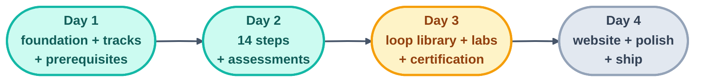

# Project State — Loop Engineering Crash Course (the project-level spine)

> Owned by the human. Tracks overall progress across the 4-day plan. Per-loop state
> lives in each loop's own file — loops write there, never here.

Current phase: **Day 3 set up, not yet run** — the 4-loop fleet (`kit-stamper`,
`audit-loop`, `patterns-page-loop`, `labs-and-advanced-loop`) is defined in
`loops/day3/`, `kit-state.md`/`patterns-state.md`/`review-notes.md` exist, and the
three audit scripts are built and tested. The human starts the loops when ready.
Last updated: 2026-07-20 (Day 3 fleet scaffolded; loop library scoped to 20 kits —
see `kit-state.md`)

## Day progress

- [x] Day 1 — Repo foundation + tracks + prerequisites — **checkpoint declared
      2026-07-16** after human review of README + foundations pages against
      `shared/goal.md`. Built by the loops in `loops/day1/` (page-writer success stop
      20/20 runs; checker: all findings resolved; link-check: clean final pass).
- [x] Day 2 — Full 14-step course + assessments — **checkpoint declared 2026-07-18**
      (human merged PR #3, merge `afec879`; both CI gates green on `main`). All three
      loops hit success stops: step-writer 36/36 pages (14 steps + 13a/13b +
      companions + 6 READMEs + 4 methods + 7 operating), template-checker 36/36 PASS
      (lint 0, diagrams compile, links clean), quiz-writer 6 quizzes + 5 flashcard
      sets. Post-fleet polish in the same PR: docs folders numbered in reading order
      (`00-start-here/` … `10-operating/`), `docs/README.md` contents page, and
      per-page *Sources:* footers (S1–S9) on all 40 course pages.
- [ ] Day 3 — Loop library + labs + advanced tier + certification. Fleet scaffolded
      2026-07-20 (`loops/day3/`, `kit-state.md`, `patterns-state.md`,
      `review-notes.md`, `scripts/{new-loop-scaffold,loop-ready-audit,validate-registry}.mjs`
      — all three scripts tested against an empty `starters/`). **Not yet run.**
      Loop library scope changed from the original 34 to **20 core loops**: the
      original 7 unchanged, plus 13 curated from Forward Future's Loop Library
      (full list in `kit-state.md`).
  - **`labs-and-advanced-loop` checklist** (source: `loop-plan.md` §18–19, §25) —
    take the FIRST unchecked item, one page per beat:
    - [x] `docs/projects/01-a-watch-loop.md`
    - [x] `docs/projects/02-make-the-tests-pass-then-stop.md`
    - [x] `docs/projects/03-the-morning-brief-with-a-memory.md`
    - [x] `docs/projects/04-a-fix-loop-with-a-real-checker.md`
    - [x] `docs/projects/05-codify-the-body.md`
    - [x] `docs/projects/06-the-doorbell-loop.md`
    - [x] `docs/projects/07-break-it-on-purpose.md`
    - [x] `docs/projects/08-your-own-daily-loop-capstone.md`
    - [x] `docs/projects/09-rehearse-a-routine-for-free.md` (drill)
    - [x] `docs/projects/10-the-secrets-drill.md` (drill)
    - [x] `docs/projects/11-the-two-routine-gate.md` (drill)
    - [ ] `docs/projects/solutions/` — reference solution for each of the 11 above
    - [ ] `docs/appendix/routines.md` — A1–A6 (local vs cloud · creation form
          field-by-field · the three triggers · secrets/state/identity · reading
          the runs · the routine safety checklist)
    - [ ] `docs/appendix/cheatsheets/claude-code.md`
    - [ ] `docs/appendix/cheatsheets/opencode.md`
    - [ ] `docs/appendix/cheatsheets/codex.md`
    - [ ] `docs/appendix/cheatsheets/grok.md`
    - [ ] `docs/appendix/cheatsheets/cursor.md`
    - [ ] `docs/appendix/cheatsheets/windsurf.md`
    - [ ] `docs/advanced/hill-climbing.md`
    - [ ] `docs/advanced/loopcraft-stacking-loops.md`
    - [ ] `docs/advanced/evals-and-traces.md`
    - [ ] `docs/advanced/multi-loop-coordination.md`
    - [ ] `docs/advanced/enterprise-scale.md`
    - [ ] `docs/advanced/governance.md`
    - [ ] `docs/advanced/authoring-your-own-loop.md`
    - [ ] `docs/assessments/final-exam.md`
    - [ ] `docs/assessments/capstone-rubric.md`
    - [ ] `docs/assessments/loop-ready-certification.md`
- [ ] Day 4 — Website + polish + ship

## Post-checkpoint content changes

- **2026-07-16 17:41Z — diagram polish.** All **11** foundation and prerequisite mermaid
  diagrams were restyled (GitHub-safe `classDef` colour-coding + a shared `%%init%%`
  theme; **styling only — no prose changed**). Re-verified by the `checker` and
  `link-check` loops (Beat 2 in each spine): markdown lint **0 errors**, **11/11**
  diagrams compile to SVG, **116** relative links resolve, §10 template intact on every
  page. Change set **merged to `main` on 2026-07-16 via PR #2** (merge commit
  `94326f5`), together with the `loops-day1/` → `loops/day1/` move; both CI gates green.
- **2026-07-17 — repo-wide diagram pass.** The same shared `%%init%%` theme extended
  beyond `docs/`: mermaid diagrams added to `README.md`, `LOOP.md`, `STATE.md`,
  `CONTRIBUTING.md`, `shared/goal.md`, `loop-plan.md`, `loops/` (README + all three
  Day 1 `loop.md` files), and all four `days-plans/` files.

## Per-loop spines (Day 1)

| Loop | State file |
| ------ | ----------- |
| page-writer | `loops/day1/page-writer/state.md` |
| checker | `loops/day1/checker/state.md` |
| link-check | `loops/day1/link-check/state.md` |

## Per-loop spines (Day 2)

| Loop | State file |
| ------ | ----------- |
| step-writer | `loops/day2/step-writer/state.md` |
| template-checker | `loops/day2/template-checker/state.md` |
| quiz-writer | `loops/day2/quiz-writer/state.md` |

## Per-loop spines (Day 3)

| Loop | State file | Shared checklist it reads/owns |
| ------ | ----------- | ------------------------------- |
| kit-stamper | `loops/day3/kit-stamper/state.md` | `kit-state.md` (owns) |
| audit-loop | `loops/day3/audit-loop/state.md` | `review-notes.md` (owns) |
| patterns-page-loop | `loops/day3/patterns-page-loop/state.md` | `patterns-state.md` (owns) |
| labs-and-advanced-loop | `loops/day3/labs-and-advanced-loop/state.md` | Day 3 section of this file (owns) |

## High Priority (waiting on human)

- **Run the Day 3 fleet.** Everything is scaffolded and tested: `loops/day3/{kit-stamper,audit-loop,patterns-page-loop,labs-and-advanced-loop}/loop.md`,
  `kit-state.md` (20 loops, 7 kept + 13 sourced from Forward Future's Loop
  Library), `patterns-state.md`, `review-notes.md`, and the three scripts under
  `scripts/` (each dry-run tested against an empty `starters/`). Start
  `kit-stamper` first (the other three either read its output or run in parallel);
  `audit-loop` can run alongside it from beat one.

## Watch List

## Recent Noise (ignored)
