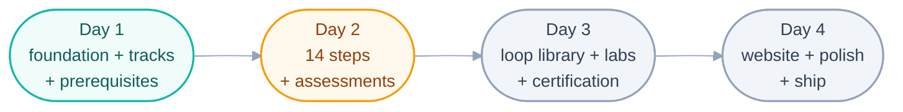

# Project State — Loop Engineering Crash Course (the project-level spine)

> Owned by the human. Tracks overall progress across the 4-day plan. Per-loop state
> lives in each loop's own file — loops write there, never here.

Current phase: **Day 2 in progress** (plan: `days-plans/day2-plan.md`; fleet:
`loops/day2/` — step-writer · template-checker · quiz-writer, + Day 1's link-check)
Last updated: 2026-07-17 (Day 2 fleet created and started; goal rewritten for Day 2)

## Day progress

- [x] Day 1 — Repo foundation + tracks + prerequisites — **checkpoint declared
      2026-07-16** after human review of README + foundations pages against
      `shared/goal.md`. Built by the loops in `loops/day1/` (page-writer success stop
      20/20 runs; checker: all findings resolved; link-check: clean final pass).
- [ ] Day 2 — Full 14-step course + assessments — **fleet complete 2026-07-17,
      awaiting human gate.** All three loops hit success stops: step-writer 36/36
      pages (14 steps + 13a/13b + companions + 6 READMEs + 4 methods + 7 operating),
      template-checker 36/36 PASS (lint 0, 40/40 diagrams compile, links clean),
      quiz-writer 6 quizzes + 5 flashcard sets. **Checkpoint pending: human
      spot-read of one page per part** (rule 9 — only the human declares it).
- [ ] Day 3 — Loop library + labs + advanced tier + certification
- [ ] Day 4 — Website + polish + ship

## Post-checkpoint content changes

- **2026-07-16 17:41Z — diagram polish.** All **11** foundation and prerequisite mermaid
  diagrams were restyled (GitHub-safe `classDef` colour-coding + a shared `%%init%%`
  theme; **styling only — no prose changed**). Re-verified by the `checker` and
  `link-check` loops (Beat 2 in each spine): markdown lint **0 errors**, **11/11**
  diagrams compile to SVG, **116** relative links resolve, §10 template intact on every
  page. Change set **merged to `main` on 2026-07-16 via PR #2** (merge commit
  `94326f5`), together with the `loops-day1/` → `loops/day1/` move; both CI gates green.
- **2026-07-17 — repo-wide diagram pass.** The same shared `%%init%%` theme extended
  beyond `docs/`: mermaid diagrams added to `README.md`, `LOOP.md`, `STATE.md`,
  `CONTRIBUTING.md`, `shared/goal.md`, `loop-plan.md`, `loops/` (README + all three
  Day 1 `loop.md` files), and all four `days-plans/` files.

## Per-loop spines (Day 1)

| Loop | State file |
| ------ | ----------- |
| page-writer | `loops/day1/page-writer/state.md` |
| checker | `loops/day1/checker/state.md` |
| link-check | `loops/day1/link-check/state.md` |

## Per-loop spines (Day 2)

| Loop | State file |
| ------ | ----------- |
| step-writer | `loops/day2/step-writer/state.md` |
| template-checker | `loops/day2/template-checker/state.md` |
| quiz-writer | `loops/day2/quiz-writer/state.md` |

## High Priority (waiting on human)

- Kick off Day 2 (full 14-step course + assessments): review `days-plans/day2-plan.md`
  and set up/start the Day 2 loops. The remote exists and both CI gates (link-check,
  markdown-lint) have validated green on `main`.

## Watch List

## Recent Noise (ignored)
