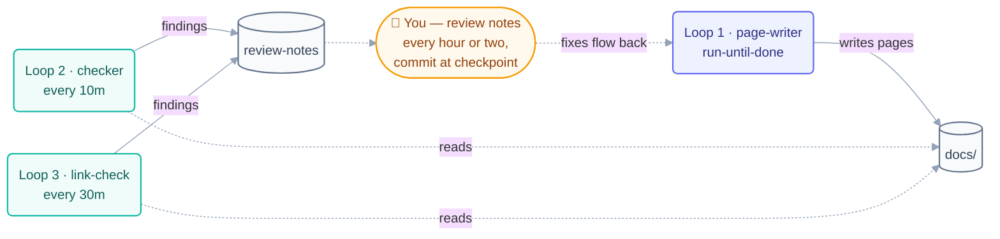

# Day 1 Plan — Repo Foundation + Tracks + Prerequisites

**Goal for today:** By the end of the day, the repo exists on GitHub, looks good, and a visitor can read the basics of the course.

---

## What to build today (in order)

### 1. Set up the repo (morning)

- [ ] Create the repo folder `LoopEngineering-CrashCourse/` and run `git init`
- [ ] Add `LICENSE` (MIT)
- [ ] Write `README.md` — hero section, badges, navigation links, quickstart
- [ ] Write `resources/sources.md` — list and credit all 9 sources
- [ ] Create `.github/` folder:
  - workflows: `link-check.yml`, `markdown-lint.yml` (the rest come later)
  - issue templates: `bug.md`, `new-loop.md`, `content-fix.md`, `question.md`
  - `PULL_REQUEST_TEMPLATE.md`

### 2. Add the "dogfooding" files (we use loops to build a course about loops!)

- [ ] `AGENTS.md` — rules for any AI agent working in this repo
- [ ] `CLAUDE.md` — rules for Claude Code
- [ ] `LOOP.md` — describes the loops that maintain this repo
- [ ] `STATE.md` — the spine (progress file) for our own build loops
- [ ] `loop-budget.md`, `loop-constraints.md`, `loop-run-log.md`

### 3. Start the course content (afternoon)

- [ ] `docs/start-here.md` — 60-second router: "which track am I?"
- [ ] `docs/learning-tracks.md` — the T1 → T4 map
- [ ] `docs/01-prerequisites/` — 3 pages:
  - `environment-setup.md`
  - `agentic-coding-primer.md`
  - `spec-driven-primer.md`
- [ ] `docs/02-foundations/` — 6 pages:
  - `glossary.md`, `mental-models.md`, `concepts.md`,
  - `the-four-layers.md`, `primitives.md`, `primitives-matrix.md`

### 4. Pull helper skills

- [ ] `npx skills add` for `vercel-labs/agent-skills` and `anthropics/skills`

---

## ✅ Day 1 checkpoint (done when…)

The repo is browsable on GitHub. The tracks map, prerequisites, and foundations pages are live and readable.

---

## 🔁 How to build today WITH loops (loop engineering in action)

The trick: don't write every file by hand, one prompt at a time. Set up small loops that do the repetitive work while you review.



### Loop 1 — The page-writer loop (conditional / run-until-done)

Make a simple checklist file first (that's your **spine**):

```markdown
# STATE.md
## Day 1 pages to write
- [ ] docs/start-here.md
- [ ] docs/learning-tracks.md
- [ ] docs/01-prerequisites/environment-setup.md
- ... (all pages above)
```

Then run one loop that repeats until the list is done:

```
/loop Read STATE.md. Pick the FIRST unchecked page. Write it following
the master plan (loop-plan.md). Then check it off in STATE.md and log
one line in loop-run-log.md. Stop when every box is checked.
```

- **Stopping condition:** all boxes checked (provable — the loop can verify it).
- **Limit:** set a max of ~20 runs so it can never run forever.

### Loop 2 — The checker loop (maker ≠ checker)

Never let the writer grade its own work. Run a second, read-only loop:

```
/loop 10m Read the newest pages checked off in STATE.md. Verify each one:
follows the page template, links work, matches loop-plan.md. Write
problems to review-notes.md. Do NOT edit the pages yourself.
```

### Loop 3 — The link-check heartbeat (scheduled)

A tiny loop on a timer that keeps the repo honest all day:

```
/loop 30m Run the link checker on docs/. If anything is broken,
append it to review-notes.md.
```

### Running multiple loops safely

- Give each loop its **own state file** (`STATE.md` for the writer, `review-notes.md` for the checker) so they never fight over one file.
- **One owner per file:** only the writer loop edits `docs/`; the checker only reads.
- You stay the engineer: read `review-notes.md` every hour or two, fix intent problems yourself, and stand behind what ships.

**Today's human jobs:** write the README hero yourself (it's the face of the project), review the checker's notes, and commit at the checkpoint.
