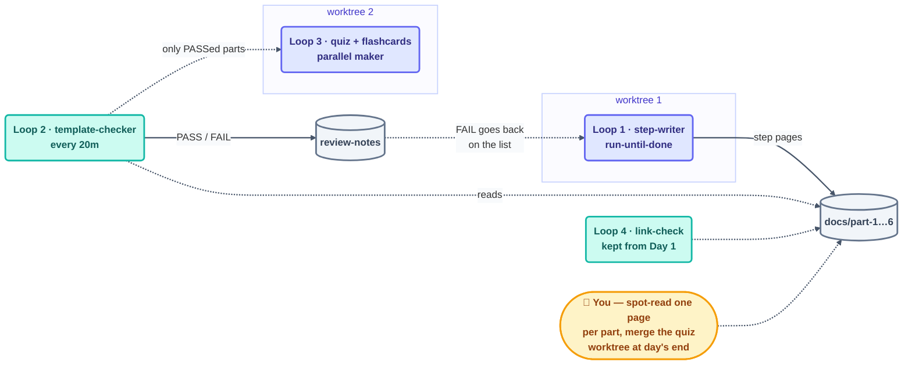

# Day 2 Plan — Write the Full 14-Step Course + Assessments

**Goal for today:** By the end of the day, the entire conceptual course (Parts 1–6, all 14 steps) is complete and readable on GitHub, with quizzes and flashcards for every part.

---

## What to build today (in order)

### 1. The 14 step pages (the heart of the course)

Every step page follows the SAME template, so this is perfect loop work:
> hook → plain explanation → mermaid diagram → dual-tool code tabs (Claude Code ↔ OpenCode) → check-yourself quiz → try-with-AI exercise → when-it-goes-wrong box

- [ ] **Part 1 — The Shift:** steps 01, 02, 03
- [ ] **Part 2 — The Heartbeat:** steps 04, 05, 06, 07
- [ ] **Part 3 — The Body:** steps 08, 09, 10, 11
- [ ] **Part 4 — The Spine:** step 12
- [ ] **Part 5 — A Complete Loop, Twice:** step 13 (+ 13a Claude Code walkthrough, 13b OpenCode walkthrough)
- [ ] **Part 6 — Human Control:** step 14 (+ cost-management, verification, three-nested-loops pages)

### 2. Per-part assessments

- [ ] One `quiz.md` per part (6 total)
- [ ] One `flashcards.md` per part (5 total — part 5 has no flashcards)
- [ ] A `README.md` index page per part

### 3. The methods pages

- [ ] `09-methods/make-your-own-loop.md` — the A–F method
- [ ] `09-methods/loop-design-checklist.md`
- [ ] `09-methods/pattern-picker.md`
- [ ] `09-methods/decision-framework.md`

### 4. The operating pages

- [ ] `10-operating/anti-patterns.md`
- [ ] `10-operating/failure-modes.md`
- [ ] `10-operating/recovery-playbook.md` (the 5-step playbook)
- [ ] `10-operating/safety.md`
- [ ] `10-operating/observability.md`
- [ ] `10-operating/multi-loop.md`

---

## ✅ Day 2 checkpoint (done when…)

The whole T1–T3 course body reads well on GitHub — every step page has a diagram, dual-tool code, a self-check, an exercise, and a troubleshooting box.

---

## 🔁 How to build today WITH loops

Today is ~35 pages that all share one template. This is the best loop day of the project — the work is repetitive and the "done" test is clear.



### Loop 1 — The step-writer loop (run-until-done)

Update `STATE.md` with today's page list, then:

```
/loop Read STATE.md. Take the FIRST unchecked step page. Write it using
the 9-part page template in loop-plan.md §10, pulling content from the
roadmap in §11. Check it off, log one line in loop-run-log.md.
Stop when all step pages are checked.
```

- **Stopping condition:** every page checked AND each page contains all 9 template sections (provable).
- **Limit:** max ~25 runs.

### Loop 2 — The template-checker loop (the grader)

A separate read-only checker with a clear rubric:

```
/loop 20m For each newly finished page in STATE.md, verify it has ALL of:
hook, explanation, mermaid block, both code tabs, quiz question,
exercise, troubleshooting box. Mark PASS/FAIL per page in
review-notes.md with one line saying what is missing. Read-only — never fix.
```

Failed pages go back on the writer loop's list. This is the **maker–checker** split: the writer never grades itself.

### Loop 3 — The quiz-and-flashcards loop (parallel, isolated)

Quizzes don't touch the step pages, so a second maker can run in parallel — in its **own worktree** so the two writers never collide:

```
/loop In a worktree: read each finished part in docs/. Write that part's
quiz.md (5 questions + answers) and flashcards.md (10 cards).
Track progress in quiz-state.md. Stop when all 6 parts are covered.
```

### Loop 4 — The link-check heartbeat (keep it from Day 1)

Same 30-minute scheduled loop as yesterday — it just keeps running.

### Running multiple loops safely today

- **Isolation:** two makers (steps writer, quiz writer) = two worktrees.
- **Separate spines:** `STATE.md`, `quiz-state.md`, `review-notes.md` — one owner each.
- **Order matters:** the quiz loop only picks up parts the checker marked PASS.
- **Budget:** ~35 pages is a lot of tokens. Note a daily cap in `loop-budget.md` and glance at spend at lunch.

**Today's human jobs:** you own the *content quality* — spot-read 1 page per part, fix anything the checker can't judge (tone, accuracy to the 9 sources), and merge the quiz worktree at the end of the day.
