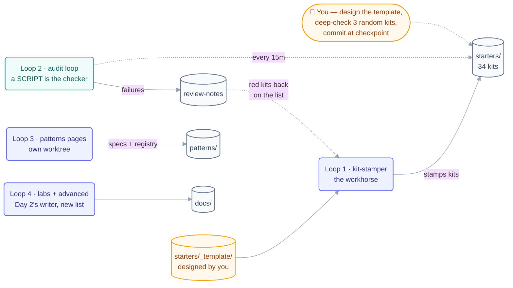

# Day 3 Plan — Loop Library + Labs + Advanced Tier + Certification

**Goal for today:** By the end of the day, Deliverable 1 (the full GitHub learning system, T1 → T4) is feature-complete and production-ready.

⚠️ **This is the highest-risk day** (34 core loop kits!). The plan's own advice: stamp kits out mechanically from a template — never hand-write them one by one. That makes today the most loop-friendly day of all.

---

## What to build today (in order)

### 1. The kit template FIRST (everything else copies it)

- [ ] `starters/_template/` — the canonical kit skeleton:
  - `LOOP.md`, `README.md`, `<name>-state.md.example`
  - `loop-budget.md`, `loop-constraints.md`, `loop-run-log.md`
  - `.claude/` (skill + loop-verifier agent), `.codex/`, `.grok/`, `opencode/`
- [ ] `scripts/new-loop-scaffold.mjs` — a script that stamps a new kit from the template

### 2. The Prebuilt Loop Library

- [ ] **34 core loops** with full multi-tool kits: the original 7 (daily-triage, pr-babysitter, ci-sweeper, dependency-sweeper, changelog-drafter, post-merge-cleanup, issue-triage) + all 27 loops in categories J–Q
- [ ] **Extended loops:** remaining A–I entries + the 6 category-R fleet loops (Claude Code + OpenCode kits only, with porting notes)
- [ ] `patterns/` — one spec page per loop (~62) + `registry.yaml` + schema
- [ ] `examples/` — per-tool worked examples (10 tool folders)
- [ ] `skills/` and `templates/` — the reusable building blocks
- [ ] `stories/` — ~15 adapted, attributed stories

### 3. Practice content

- [ ] `docs/projects/` — 8 labs + 3 drills + reference `solutions/`
- [ ] `docs/appendix/routines.md` (A1–A6) + `cheatsheets/` (6 tools)

### 4. The ultra-pro tier + assessments

- [ ] `docs/advanced/` — 7 pages (hill-climbing, loopcraft, evals, multi-loop coordination, enterprise scale, governance, authoring-your-own-loop)
- [ ] `docs/assessments/` — final exam, capstone rubric, Loop Ready certification

### 5. Quality gates

- [ ] Run link-check, registry-validate, and loop-ready-audit — all green

---

## ✅ Day 3 checkpoint (done when…)

Every folder in the repo tree is populated with real, copy-and-run files, and all three audit scripts pass.

---

## 🔁 How to build today WITH loops

Today you graduate from single loops to a small **fleet**. 34+ kits with identical shape = pure loop work.



### Loop 1 — The kit-stamper loop (the workhorse)

First, make a list of all loops with their details (name, category, heartbeat, cadence, level, cost) in `kit-state.md`. Then:

```
/loop Read kit-state.md. Take the FIRST unbuilt loop. Run
scripts/new-loop-scaffold.mjs to stamp the kit from _template/, then
fill in the loop-specific parts: LOOP.md (job, stops, gate), the
SKILL.md prompt, and the state example. Check it off. Stop when
all 34 core kits exist.
```

- **Stopping condition:** all kits exist AND each passes `loop-ready-audit` (provable by script!).
- **Limit:** max 40 runs.

### Loop 2 — The audit loop (a script IS the checker)

Today's checker is even better than an LLM grader — it's a deterministic script:

```
/loop 15m Run scripts/loop-ready-audit.mjs on every kit in starters/.
Append failures to review-notes.md. Also run validate-registry.mjs.
Read-only.
```

Kits that fail go back on the stamper's list. **Green from a script beats "looks done" from a model.**

### Loop 3 — The patterns-page loop (parallel maker, own worktree)

Pattern spec pages don't touch `starters/`, so they can be built in parallel:

```
/loop In a worktree: for each kit checked off in kit-state.md, write its
patterns/<name>.md spec page and add its registry.yaml entry.
Track in patterns-state.md. Stop when registry matches all kits.
```

### Loop 4 — The labs-and-advanced loop (second parallel maker)

Projects, drills, cheatsheets, and the `advanced/` tier are ordinary pages — reuse Day 2's writer loop with a new list in `STATE.md`.

### This is now a real multi-loop fleet — apply the coordination contract

Today you're living the course's own §15-R rules:

1. **One owner per folder:** stamper owns `starters/`, patterns loop owns `patterns/`, labs loop owns `docs/`.
2. **Separate state files:** `kit-state.md`, `patterns-state.md`, `STATE.md` — plus one shared `loop-run-log.md` everyone appends to.
3. **Priority when things conflict:** fix a red audit before stamping new kits ("red main blocks everything").
4. **Aggregate budget:** today is the most expensive day — track total spend in `loop-budget.md`; if you're burning too fast, pause the labs loop first (lowest priority).

**Today's human jobs:** design the `_template/` yourself (every kit inherits its quality!), spot-check 3 random kits deeply, decide any J–Q kits that slip to fast-follow, and commit at the checkpoint.
