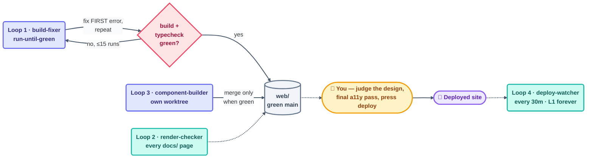

# Day 4 Plan — Build the Website + Polish + Ship

**Goal for today:** By the end of the day, BOTH deliverables are live — the GitHub repo and the Next.js website — rendering the same `docs/` content, production-ready.

---

## What to build today (in order)

### 1. Scaffold the site (morning)

- [ ] Create `web/` — Next.js (App Router) + TypeScript + Tailwind + MDX
- [ ] `lib/content.ts` — reads and renders `../docs` (the single source of truth)
- [ ] `mdx-components.tsx` — the content-to-component mapping:
  - ```claude /```opencode fences → `CodeTabs`
  - `> [!NOTE]` / `> [!WARNING]` → `Callout`
  - `<!-- check -->` → `CheckYourself`
  - mermaid fences → rendered diagrams

### 2. Build the pages

- [ ] Landing page — mindset-shift hero + the 14-step roadmap
- [ ] `tracks/` — the 4 skill tracks + entry checks
- [ ] `docs/[...slug]` — renders every markdown page
- [ ] `loops/` — the interactive prebuilt-loop browser (filter by category/tool/cadence)
- [ ] `loops/[slug]` — kit viewer with file tree, copy button, tool switcher
- [ ] `quiz/[part]` + `flashcards/[part]` — graded quizzes and flip cards
- [ ] `projects/`, `appendix/routines/`, `sources/`, `certification/`

### 3. Build the components (see plan §23)

- [ ] Navigation: `Sidebar`, `ProgressNav`, `TrackSelector`, `ProgressTracker`, `ThemeToggle`
- [ ] Diagrams: `LoopDiagram` (animated 6-part cycle), `LayersStack`, `HeartbeatMenu`, `MakerCheckerDiagram`
- [ ] Content: `CodeTabs`, `Callout`, `CheckYourself`, `TryWithAI`, `TroubleshootBox`, `GlossaryTerm`
- [ ] Interactive: `Quiz`, `Flashcards`, `LoopBrowser`, `StarterViewer`, `LoopReadyChecklist`, `ProjectCard`, `AntiPatternCard`, `CertificateGenerator`

### 4. Polish + ship (afternoon)

- [ ] Responsive pass (mobile → desktop)
- [ ] Accessibility pass (keyboard nav, contrast, alt text)
- [ ] Light/dark theme pass
- [ ] OG social-preview images
- [ ] Deploy (Vercel or GitHub Pages)
- [ ] Verify GitHub and the site show the SAME content from `docs/`

---

## ✅ Day 4 checkpoint (done when…)

Both deliverables are live, every `docs/` file renders on the site, all CI gates are green, and all nine sources are attributed. **The project is done.**

---

## 🔁 How to build today WITH loops

Website day has a different shape: less repetitive writing, more build-fix-verify cycles. So today's loops are **verification loops** — a checker drives, and the maker fixes what it finds.



### Loop 1 — The build-fixer loop (run-until-green)

The classic "make the tests pass, then stop" loop:

```
/loop Run `npm run build` and `npm run typecheck` in web/. If either
fails, fix the FIRST error only, log it in loop-run-log.md, and repeat.
Stop when both pass clean.
```

- **Stopping condition:** build + typecheck exit 0 (perfectly provable).
- **Limit:** max 15 runs — if it's still red, a human needs to look (doom-loop protection).

### Loop 2 — The render-checker loop (every page must render)

Make `render-state.md` listing every `docs/` file, then:

```
/loop Read render-state.md. Take the next unchecked page, load its route,
confirm it renders with no console errors and the right components
(code tabs, callouts, diagrams). Check it off; log failures to
review-notes.md. Stop when every page is checked.
```

### Loop 3 — The component-builder loop

Components are a checklist too — reuse the pattern:

```
/loop Read component-state.md. Build the FIRST unbuilt component per
plan §23, with light/dark support and keyboard access. Check it off.
Stop when all components exist and the build stays green.
```

Run this in a **worktree** so half-built components never break Loop 1's green build on main. Merge only when green.

### Loop 4 — The deploy-watcher heartbeat (after shipping)

Once deployed, start the project's first *permanent* loop — the repo maintaining itself, exactly what the course teaches:

```
/loop 30m Check the deployed site is up, spot-check 3 random pages,
run the link checker. Append status to loop-run-log.md. Report only —
never auto-fix production.
```

Start it at **L1 (report-only)**, just like the course says: prove it before you trust it.

### Running today's fleet safely

- **Priority order:** red build > render failures > new components ("red main blocks everything") — pause Loop 3 whenever Loop 1 goes red.
- **Separate spines:** `render-state.md`, `component-state.md`, shared `loop-run-log.md`.
- **Human gate on the deploy:** loops prepare everything, but *you* press the deploy button and *you* verify the live site. That's accountability — the one thing a loop can never own.

**Today's human jobs:** judge the design (a loop can't tell you if the hero looks good), do the final accessibility click-through yourself, deploy, and announce. Then write the last `stories/` entry: how this course was built by the loops it teaches. 🎉
