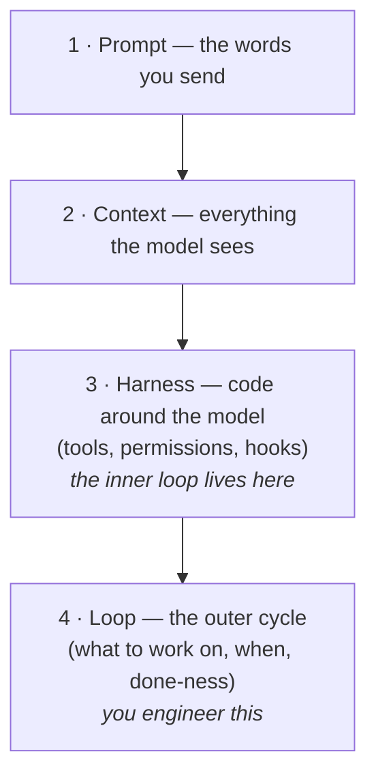

# Core Concepts

> Intent debt, comprehension debt, and the harness-vs-loop distinction — the three
> ideas that explain most loop failures before they happen.

## The hook

A team ships a flawless-looking week of agent-written code. Month two: nobody can
explain why a module exists, the loop keeps "fixing" something nobody asked it to
change, and the one engineer who understood the setup is on vacation. Nothing crashed —
but two invisible debts came due at once.

## Intent debt (plain English)

**Intent debt** is the accumulated gap between what you *meant* and what you
*specified*. A hand-driven session repays it constantly — you see each result and
course-correct. A loop repays nothing: it faithfully executes the written goal, at
scale, unattended. Every vague word in your spec is a loan the loop will collect on.

**You pay it down by:** writing stopping conditions a machine can check, and keeping a
constitution of things that must never change (see the
[spec-driven primer](../prerequisites/spec-driven-primer.md)).

## Comprehension debt

**Comprehension debt** is shipping changes no human on the team understands. Loops
generate it faster than any human coder because they never *need* to understand — and
neither, silently, do you. It's the debt behind "the code works and nobody knows why."

**You pay it down by:** small beats (one reviewable unit per run), human gates placed
where understanding matters (PR review, checkpoint declarations), and run logs that
tell you what changed and why.

## Harness vs. loop

The **harness** is the software shell your agent vendor built: tool execution, error
handling, permissions. The **loop** is the management system *you* build around it.
Confusing the two causes real design errors: expecting the harness to know when work
is done (it can't — that's the loop's stopping condition), or hand-rolling tool
plumbing the harness already does better.

Rule of thumb: **guarantees live in the harness** (permissions, hooks), **judgment
lives in the loop** (what, when, done, checked).

> [!NOTE]
> **Going deeper:** the four-layer stack this sits in gets its own page —
> [the-four-layers.md](the-four-layers.md). The debts are explored with war stories in
> Part 6 (Day 2).

## Check yourself

**Q: A loop renamed 40 functions "for clarity" overnight and every rename is
defensible. The team is furious anyway. Which debt is this, and which loop part was
missing?**

Answer

**Comprehension debt** — defensible or not, the team no longer recognizes its own
codebase. The missing part is the **human gate** (and a scope-limiting spec): "one
fix per run, nothing unrelated" belongs in the loop's constitution, and a human
should approve sweeping changes before they land.

## Try With AI

Take a task you'd trust an agent with and ask it:

> "Before doing anything: list every way your interpretation of this task could
> differ from what I probably mean."

Each item in its answer is intent debt, priced *before* you borrowed. Fix the task
statement until the list gets boring.

## When it goes wrong

| Symptom | Cause | Fix |
|---|---|---|
| Loop does the goal, result feels wrong | Intent debt — spec ≠ intent | Tighten the spec; add the missing constraint to the constitution |
| "Works, but nobody can review it" | Comprehension debt from giant beats | Shrink the unit of work; gate on human review |
| Loop "can't tell it's finished" | Done-ness expected from the harness | Stopping conditions are loop-layer; write one that exits 0 |
| Guardrail keeps getting talked around | Guarantee placed in prose | Move it to permissions/hooks — the harness can't be persuaded |

---

*Glossary terms used on this page:* **intent debt**, **comprehension debt**,
**harness**, **human gate** — see [glossary.md](glossary.md).
