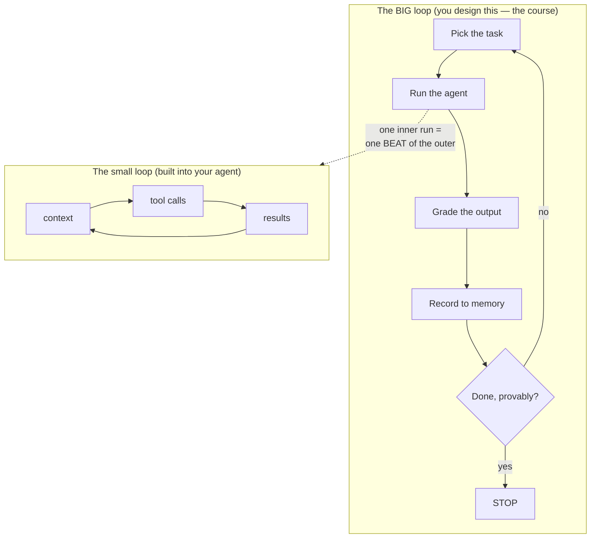

# Mental Models

> Three pictures to keep in your head for the whole course: the operator you're
> replacing, the two loops that share one name, and the body a loop is built like.

## The hook

For about two years, "using a coding agent" meant holding the tool one turn at a time:
write a prompt, read the result, type the next thing. Now picture the person doing
that all day — finding the work, handing it out, checking it, recording what happened,
deciding what's next. **Loop engineering replaces that operator with a small system
you design once.** The agent didn't get smarter; the *management* around it did.

## Model 1 — you move up one seat (plain English)

Your value doesn't vanish when the operator is automated; it concentrates at the two
ends a loop can't own:

- **Intent** — stating what you want precisely enough that the result can be *checked*.
- **Accountability** — standing behind what ships.

Everything between those two ends — triggering, doing, verifying, logging — is the
loop's job.

## Model 2 — two loops share the name

The **small/inner loop** is the agent's own `context → tool calls → results → repeat`
cycle. Its only native stop is the model's self-assessment — the source of every
confident-but-wrong "Done!" you've ever seen. The **big/outer loop** is the manager
around it: it chooses the task, the timing, the grading, and the memory. One inner-loop
run is **one beat** of the outer loop.

## Model 3 — the loop as a body

| Body part | Loop part | Job |
| --- | --- | --- |
| Heart | **Heartbeat** | starts each beat (schedule, event, condition) |
| Spine | **State file** | durable memory so runs compound, not restart |
| Hands | **Connectors (MCP)** | act on the world, not just suggest |
| Immune system | **Checker** | grades output; maker never grades itself |
| Skeleton | **Worktree/isolation** | parallel work that can't collide |
| Trained reflexes | **Skills** | project knowledge written once, read each run |

> [!NOTE]
> **Going deeper:** the metaphor comes from Addy Osmani's *Loop Engineering* (source 5)
> and the six-part anatomy from the Panaversity backbone (source 1) — see
> [../../resources/sources.md](../../resources/sources.md). Part 1 (Day 2) dissects
> each part in depth.

## Check yourself

**Q: Your agent announces "All tests pass, task complete!" — which loop produced that
claim, and why shouldn't the outer loop trust it?**

Answer

The **inner** loop: it ended on the model's self-assessment. The outer loop treats
that as a *signal to verify*, not a verdict — its checker runs the tests itself
(maker ≠ checker). Green from the maker is a claim; green from the checker is a fact.

## Try With AI

Ask your agent:

> "Walk me through your own loop: what starts your turn, what do you see, what tools
> can you call, and what makes you decide you're finished?"

Map its answer onto the inner-loop diagram above. The last part of its answer — how it
decides it's finished — is exactly the gap the outer loop exists to close.

## When it goes wrong

| Symptom | Cause | Fix |
| --- | --- | --- |
| "The agent said done but it isn't" | Trusted the inner loop's self-stop | Add an outer-loop checker with a machine-checkable stop |
| Same mistake every morning | No spine — each run starts amnesiac | Add a state file; read it first, update it every beat |
| You babysit every run anyway | Intent was never made checkable | Rewrite the goal as a spec (see the [spec-driven primer](../prerequisites/spec-driven-primer.md)) |

---

*Glossary terms used on this page:* **beat**, **spine**, **checker**, **heartbeat** —
see [glossary.md](glossary.md).
