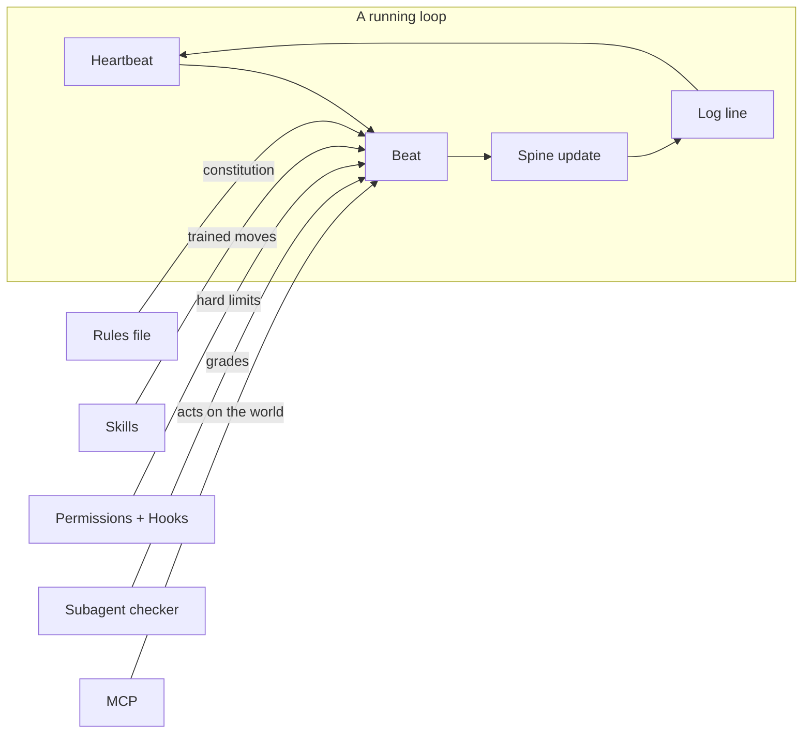

# Primitives

> The raw materials every loop is assembled from — what each one is *for* when the
> goal is autonomy, not assistance.

## The hook

Ask ten engineers to "build a loop" and the weak ones start writing a scheduler from
scratch. The strong ones open their agent's docs and find that eight primitives —
already built, already tested — snap together into the whole thing. Loop engineering
is *assembly*, not invention.

## The eight primitives, seen through loop eyes (plain English)

The [agentic coding primer](../prerequisites/agentic-coding-primer.md) introduced
these as features you use by hand. Here's the shift: each one maps to a part of the
loop's anatomy.

| Primitive | Hand-driven use | **Loop use (the upgrade)** |
| --- | --- | --- |
| Plan mode | preview a risky change | rehearse a whole loop at L1 before granting L2 |
| Permissions | avoid annoying prompts | the L1→L3 ladder; the loop's hard boundary |
| Context | paste in the right files | keep each beat cheap; the spine is read first |
| Rules file | project conventions | the loop's constitution, loaded every beat |
| Skills | shortcuts for chores | the loop's trained moves, versioned in-repo |
| Hooks | format-on-save niceties | unbypassable guardrails between beats |
| Subagents | parallelize a big task | the maker/checker split that makes green mean done |
| MCP / connectors | query a database | the loop's hands: act on issues, PRs, messages |



## Assembly example — the same tiny loop, twice

```claude
# Claude Code: a self-pacing report-only triage loop
# 1 rules file: CLAUDE.md says "report-only; one log line per run"
# 2 skill:      .claude/skills/triage/SKILL.md holds the checklist
# 3 loop:       /loop with no interval (self-paced), or Cron tools for schedules
/loop Run /triage. Append findings to state.md. Stop when the
inbox is empty, after 10 runs, or after 3 no-change runs.
```

```opencode
# OpenCode: same loop, cron-shaped
# 1 rules file: AGENTS.md carries the same two rules
# 2 permissions: opencode.json denies writes outside state.md
# 3 heartbeat:  cron calls `opencode run "$(cat triage-prompt.txt)"`
```

> [!WARNING]
> Flags and file names drift weekly; the *mapping* (primitive → loop part) is the
> lasting layer. Cross-tool specifics live in the
> [primitives matrix](primitives-matrix.md); commands live in each tool's docs.

> [!NOTE]
> **Going deeper:** Part 3 (Day 2) gives worktrees, skills, connectors, and
> maker/checker a full lesson each. Attribution: sources 1, 2, 7 —
> [../../resources/sources.md](../../resources/sources.md).

## Check yourself

**Q: Your loop needs to (a) never touch `secrets/` and (b) always summarize its diff
in the PR body. Which primitive carries each requirement, and why aren't they the
same one?**

<details><summary>Answer</summary>

(a) **Permissions/hooks** — it's a guarantee, so it must be unbypassable machinery.
(b) **Rules file (or a skill)** — it's a behavior, advisory by nature and fine that
way. Putting (a) in prose makes it persuadable; putting (b) in a hook is rigidity
you'll regret. Guarantees in the harness, habits in the rules.

</details>

## Try With AI

In your sandbox repo, ask your agent:

> "Using only your built-in primitives — rules file, permissions, skills, hooks,
> subagents, MCP — sketch how you'd assemble a loop that keeps README.md's examples
> compiling. Name which primitive plays which part."

Grade its sketch against the table above: did it put the checker in a subagent? Did a
guarantee end up in prose?

## When it goes wrong

| Symptom | Cause | Fix |
| --- | --- | --- |
| Loop reinvents scheduling/state in custom scripts | Assembly treated as invention | Use the tool's heartbeat + a plain state file first |
| Checker agrees with the maker suspiciously often | Same session graded its own work | Move the checker to a separate subagent (or separate loop) |
| Guardrail held for weeks, failed once at 3 a.m. | It was a rule, not a hook | Promote guarantees to permissions/hooks |
| Loop is powerful but terrifying | All eight primitives at L3 on day one | Climb the ladder: L1 → watch → L2 → watch → L3 |

---

*Glossary terms used on this page:* **primitive**, **beat**, **spine**, **L1/L2/L3** —
see [glossary.md](glossary.md).
