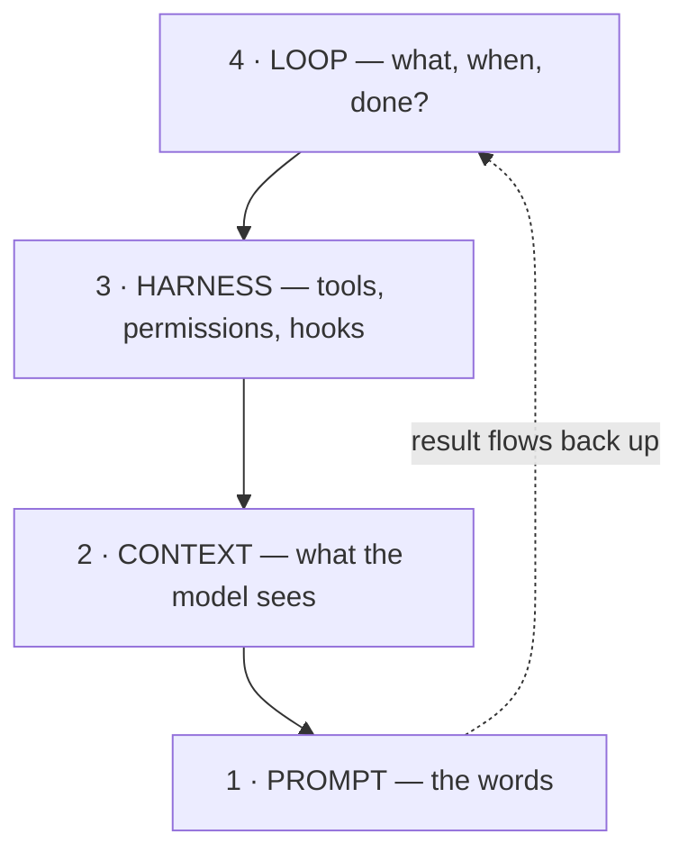

# The Four Layers

> Prompt → context → harness → loop: each layer wraps the previous one and prevents a
> failure the inner layers can't see.

## The hook

Your agent keeps botching the same refactor. You sharpen the prompt — no change. You
paste in more files — worse. The fix turns out to be a permission setting (harness)
and a stopping condition (loop). You were debugging on the wrong layer. This page is
the map that stops that.

## The stack (plain English)

1. **Prompt** — the words you send. Fails by *ambiguity*: the task can be read two ways.
2. **Context** — everything the model sees in one turn: files, history, rules. Fails by
   *starvation or drowning*: the key fact is missing, or buried under noise.
3. **Harness** — the code around the model: tool execution, permissions, hooks, error
   handling. *The inner loop lives here.* Fails by *capability*: the agent can't (or
   worse, can) do something it shouldn't.
4. **Loop** — the outer cycle: what the system works on, when it starts, how it knows
   it's done. Fails by *management*: wrong task, wrong time, no real stop.



**Debug top-down in blame, bottom-up in fixes:** when a loop misbehaves, ask *which
layer's failure signature is this?* — ambiguity, starvation/drowning, capability, or
management — then fix at that layer, not the one you happen to be typing in.

## Where you configure each layer

```claude
# Claude Code — live docs: https://docs.claude.com/en/docs/claude-code
# 1 Prompt:   what you type (or the /loop prompt)
# 2 Context:  CLAUDE.md, @file mentions, /context
# 3 Harness:  /permissions, hooks in .claude/settings.json
# 4 Loop:     /loop, Cron tools, skills like this repo's LOOP.md discipline
```

```opencode
# OpenCode — live docs: https://opencode.ai/docs
# 1 Prompt:   the message (or the scripted run prompt)
# 2 Context:  AGENTS.md, attached files
# 3 Harness:  opencode.json permissions & mcp
# 4 Loop:     cron / GitHub Actions driving `opencode run`, capped `for` loops
```

> [!NOTE]
> **Going deeper:** the four layers come from the Panaversity backbone (source 1);
> Step 02 (Day 2) spends a full lesson here, including how the layers map to the
> LangChain 4-loop stack. Attribution: [../../resources/sources.md](../../resources/sources.md).

## Check yourself

**Q: A nightly loop happily "fixed" the same test five nights running; each morning
the fix is reverted in review. Which layer is failing?**

<details><summary>Answer</summary>

**Layer 4, the loop.** Prompt, context, and harness all did their jobs — work got done.
What's missing is management: a spine that remembers the rejection, and a no-progress
stop (or escalation) after repeated reverts. No prompt wording fixes a memory problem.

</details>

## Try With AI

Take the last time an agent disappointed you and ask it:

> "Here's what I asked, what you saw, what you could do, and what happened: [paste].
> Which of the four layers — prompt, context, harness, loop — most likely caused the
> gap, and what's the smallest fix at that layer?"

Grade its self-diagnosis against the failure signatures above.

## When it goes wrong

| Symptom | Layer | Fix |
| --- | --- | --- |
| Two readings of the task, agent picked the wrong one | Prompt | Restate with one checkable meaning |
| Agent "forgot" a critical constraint mid-run | Context | Move it to the rules file; shrink the noise |
| Agent edited a file it never should have touched | Harness | Narrow write permissions; add a hook |
| Right work, wrong task — or no idea when to stop | Loop | Declare the six parts; write the three stops |

---

*Glossary terms used on this page:* **harness**, **loop**, **inner loop**, **spine** —
see [glossary.md](glossary.md).
