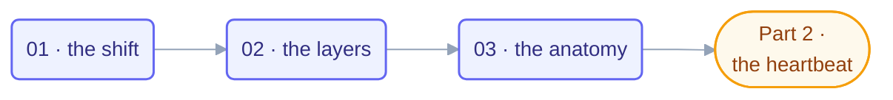

# Part 1 · The Shift

> From prompting to looping: what actually changes, which layer you're standing in,
> and the six-part anatomy every loop shares. This part is pure mental model — the
> machinery starts in [Part 2](../04-part-2-heartbeat/README.md).

## The steps

| Step | Page | One-line takeaway |
| --- | --- | --- |
| 01 | [From Prompting to Looping](01-from-prompting-to-looping.md) | Move the management, keep the intent and the accountability |
| 02 | [The Four Layers](02-the-four-layers.md) | Prompt → context → harness → loop; fix problems at the right layer |
| 03 | [Anatomy of a Loop](03-anatomy-of-a-loop.md) | Six parts, every loop: heartbeat, body, spine, stop, checker, gate |

## Before you start

Comfortable driving an AI coding agent by hand? If not, detour through the
[agentic coding primer](../01-prerequisites/agentic-coding-primer.md) first. The
[glossary](../02-foundations/glossary.md) is worth keeping open in a tab.

## Check your understanding

When the three steps are done: [take the Part 1 quiz](quiz.md) ·
[drill the flashcards](flashcards.md).

*This part belongs to track [T1 · Foundations](../learning-tracks.md).*
