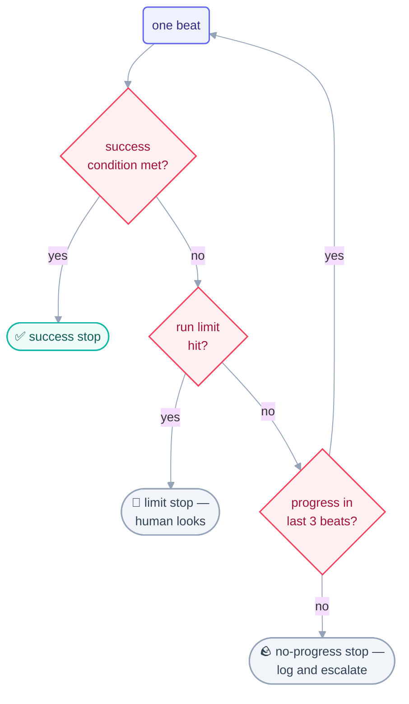

# Step 5 · Conditional Loops — Run Until Done

> No clock at all: the next beat starts because the last one finished and the goal
> isn't met yet. The whole design lives in one sentence — the stopping condition.

## The hook

"Make the tests pass, then stop." Eleven minutes later the suite is green and the
loop is idle. Same prompt on a messier repo: forty minutes in, it's "fixing" the same
test for the ninth time, each fix undoing the last. One sentence separated those two
afternoons — and it wasn't the goal, it was the stop.

## Run-until-done (plain English)

A **conditional loop** has no timer. Its heartbeat is *the condition itself*: beat,
check the condition, beat again, until the condition holds. It's the natural shape
for work that **ends** — empty the checklist, green the suite, resolve the findings.

Because nothing external paces it, everything depends on three stops working:

1. **Success** — the condition is provably met. Write it like a spec, because it is
   one: *"suite exits 0"*, *"no unchecked boxes"* — never *"looks good."*
2. **Limit** — a max-runs cap it can never exceed. This is doom-loop insurance: the
   ninth identical "fix" above should have been impossible, because a sane limit
   (with per-item retry caps like `MAX_RETRIES`, and a watchdog on retries) turns
   an infinite argument with reality into a bounded one that escalates to you.
3. **No progress** — nothing changed for 3 consecutive beats → log it and stop.
   Progress is measured against the spine, not against effort.

The folk name for the degenerate case is the **Ralph loop** — the same beat repeated
naively until something gives. The punchline of this step: with a provable stop, a
limit, and a no-progress rule, even a Ralph loop is safe; without them, no amount of
model intelligence is.



## The mechanics in each tool

```claude
# Claude Code — live docs: https://docs.claude.com/en/docs/claude-code
> /loop Run the suite. Fix the FIRST failure only. Log one line.
  Stop when the suite passes OR after 15 runs.
# Goal-shaped variants (e.g. /goal) pair the maker with a checker that
# reads the transcript and judges "actually done?" — maker ≠ checker,
# applied to done-ness itself. Retry guards (MAX_RETRIES-style caps,
# retry watchdogs) belong on every conditional loop.
```

```opencode
# OpenCode — live docs: https://opencode.ai/docs
# The cap is structural — the for-loop IS the run limit:
for i in $(seq 1 15); do
  npm test >/dev/null 2>&1 && break        # provable success stop
  opencode run "Run the tests. Fix the FIRST failure only."
done
# Bounded agent steps per run are configurable — see the live docs.
```

> [!NOTE]
> **Going deeper:** "stopping condition = spec" is the bridge to the
> [spec-driven primer](../01-prerequisites/spec-driven-primer.md) — a stop you can't
> write precisely is a goal you haven't specified yet. The doom loop and its
> cousins get a full page in [failure modes](../10-operating/failure-modes.md).

## Check yourself

**Q: "Stop when the code is clean" vs. "stop when `npm run lint` exits 0, or after 10
runs, or after 3 beats with an unchanged lint count." What does the second version
have that the first doesn't — name all three?**

<details><summary>Answer</summary>

All three stops: a **provable success condition** (lint exits 0 — a fact), a **limit**
(10 runs — doom-loop insurance), and a **no-progress rule** (unchanged lint count for
3 beats — stuck-detection measured against real state). "Clean" is a feeling; the
loop can neither prove it nor be safely trusted to pursue it unboundedly.

</details>

## Try With AI

In a throwaway repo with a deliberately broken test suite (break 3 tests yourself),
run: "Fix the FIRST failing test only, then stop" — by hand, three times. Now wrap it
in a conditional loop with the three stops and run it once. Diff the experience:
what you did between manual runs (check, decide, re-prompt) is exactly what the
condition + limit + progress rule now encode.

## When it goes wrong

| Symptom | Cause | Fix |
| --- | --- | --- |
| Ninth identical "fix" of the same test | Doom loop — no per-item retry cap | `MAX_RETRIES`-style cap per item; escalate after N attempts |
| Loop declares victory, suite still red | Stop written as a feeling | Success = machine-checkable fact, verified by a checker, not the maker |
| Runs forever making cosmetic changes | No no-progress stop | Progress measured against the spine; 3 unchanged beats = stop |
| Hits the limit every single day | Limit hiding a real problem | The limit stop is a *signal*, not a nuisance — read the log, fix the cause |

---

*Glossary terms used on this page:* **conditional loop**, **doom loop**, **stopping
condition**, **run limit** — see the [glossary](../02-foundations/glossary.md).
