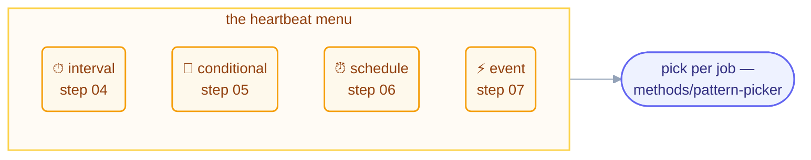

# Part 2 · The Heartbeat

> Four ways a loop decides *when to beat* — from a timer you can watch, to the world
> itself pulling the trigger. This part is a menu: real fleets mix all four.

## The steps

| Step | Page | Heartbeat | One-line takeaway |
| --- | --- | --- | --- |
| 04 | [In-Session Loops](04-in-session-loops.md) | interval, inside a session | training wheels: watchable, interruptible, dies with the session |
| 05 | [Conditional — Run Until Done](05-conditional-run-until-done.md) | the goal itself | everything hangs on three stops: success, limit, no-progress |
| 06 | [Unattended Schedules](06-unattended-schedules.md) | cron, nobody watching | four parts (prompt·repos·connectors·trigger); guardrails first |
| 07 | [Event-Driven](07-event-driven.md) | the world | dropped-not-queued; always pair with a reconciliation sweep |

## The thread through all four

Two rules repeat on every page, because they hold for every heartbeat:

- **Missed beats are dropped, not queued** — design beats that act on *now*.
- **The heartbeat only decides *when*.** What a beat may touch (body), what it
  remembers (spine), and when it all ends (stops) are the other four organs —
  [Part 3](../05-part-3-the-body/README.md) picks up the body.

## Check your understanding

[Take the Part 2 quiz](quiz.md) · [drill the flashcards](flashcards.md)

*This part belongs to track [T2 · Practitioner](../learning-tracks.md).*

*Sources:* Part 2 draws on Panaversity's *Loop Engineering: A Crash Course* (S1),
Panaversity's *Spec-Driven Development* (S3), Panaversity's *Scheduled Tasks: The Loop
Skill & Cron Tools* (S4), and the `cobusgreyling/loop-engineering` reference repo (MIT,
S7). Full attribution: [resources/sources.md](../../resources/sources.md).
