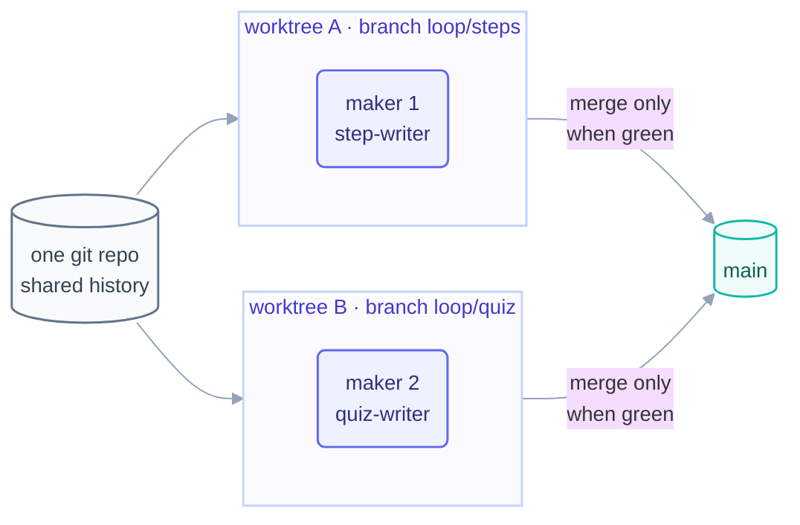

# Step 8 · Worktrees

> Two makers, one repo, zero collisions — because each one is working in its own
> full copy of the tree, cheap enough to create per beat and throw away after.

## The hook

Your step-writer is halfway through rewriting a page when your quiz loop wakes up,
sees "modified files," and helpfully commits the half-sentence. Neither loop is
wrong; they're just standing in the same room. Day 2 of *this course* was built by
two makers running at once — and the reason nothing collided is the subject of this
page.

## Isolation (plain English)

A **worktree** is a second (third, tenth) working directory attached to the same git
repository: same history, same remotes, its own checked-out files on its own branch.
For loops, that buys the one property multi-loop work can't live without —
**isolation**: a loop in its own worktree can't see, stomp, or half-read another
loop's uncommitted mess.

The decision rule is about *files*, not vibes:

- **Disjoint file ownership** (one loop owns `docs/`, another owns `patterns/`) —
  path ownership in the rulebook is enough; a shared tree is fine. That's how this
  repo's `step-writer` and `quiz-writer` share `docs/*-part-*` safely: they own
  different *files*.
- **Overlapping files, or a maker whose failure must not poison `main`'s working
  tree** — worktree, no debate. Half-built work stays quarantined until it's green,
  then merges as a unit.



## The mechanics in each tool

```claude
# Claude Code — live docs: https://docs.claude.com/en/docs/claude-code
# Ask for isolation when dispatching work:
#   subagents / tasks accept a worktree isolation option ("isolation":
#   "worktree") — the agent gets its own tree, auto-cleaned if untouched.
# Or make one yourself and point a session at it:
git worktree add ../myrepo-quiz loop/quiz
claude --worktree ../myrepo-quiz    # (see live docs for current flags)
```

```opencode
# OpenCode — live docs: https://opencode.ai/docs
# Plain git is the whole mechanism — one worktree per loop:
git worktree add ../myrepo-quiz loop/quiz
cd ../myrepo-quiz && opencode run "Write the Part 1 quiz…"
# Cleanup when merged:
git worktree remove ../myrepo-quiz
```

> [!NOTE]
> **Going deeper:** isolation is one of the three legs of multi-loop safety — the
> other two are **separate spines** and **one owner per path**, both visible in this
> repo's [`LOOP.md`](../../LOOP.md) ownership map. The full coordination contract is
> in [multi-loop operating](../10-operating/multi-loop.md).

## Check yourself

**Q: Day 2 of this course ran two makers in ONE shared tree. Why was that safe here,
and what single change to the plan would have forced a real worktree?**

<details><summary>Answer</summary>

Safe because their file sets are **disjoint by rule** — `step-writer` may not touch
`quiz.md`/`flashcards.md`, `quiz-writer` may touch nothing else, and the rulebook's
ownership map enforces it. The moment both makers need the *same file* — say the
quiz-writer also updated each part's `README.md` — path ownership can't split a
file, and a worktree (merge-when-green) becomes mandatory.

</details>

## Try With AI

In a throwaway repo, create a worktree (`git worktree add ../scratch-wt test-branch`)
and run one agent beat in it — any small task. While it works, run `git status` in
your main tree and confirm: nothing moved. Merge the branch back, remove the
worktree, and note what the merge commit gives you that a shared tree never could —
a single reviewable boundary around the loop's whole output.

## When it goes wrong

| Symptom | Cause | Fix |
| --- | --- | --- |
| Two loops' edits interleaved in one file | Shared tree + shared file | Worktree per maker; merge only when green |
| Loop committed another loop's half-done work | "Helpful" commit in a shared tree | Isolation + each loop commits only its own paths |
| Worktrees piling up, disk full of stale trees | No cleanup step in the loop | `git worktree remove` on merge; prune as a scheduled sweep |
| Merge at end of day is a war | Two branches drifted all day | Small beats, frequent merges; rebase the worktree branch regularly |

---

*Glossary terms used on this page:* **worktree**, **isolation**, **one owner per
path**, **merge-when-green** — see the [glossary](../02-foundations/glossary.md).

*Sources:* worktree isolation comes from Panaversity's *Loop Engineering: A Crash
Course* (S1) and Panaversity's *Agentic Coding Crash Course* (S2). Full attribution:
[resources/sources.md](../../resources/sources.md).
