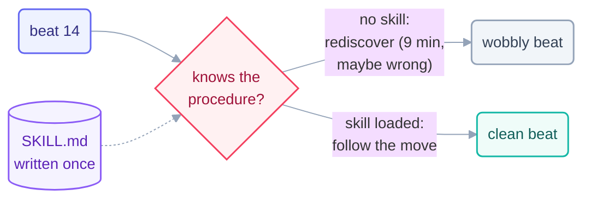

# Step 9 · Skills

> Every beat starts with total amnesia. A skill is the move you teach once, so no
> beat ever has to figure it out again — and the loop prompt shrinks to a sentence.

## The hook

Beat 14, 2:00 am: the loop spends nine minutes rediscovering how this repo deploys —
reading scripts, guessing at flags, almost running the wrong one. Beat 15, 2:30 am:
same nine minutes. Beat 16… You could keep paying that toll every beat, or you could
write the deploy steps down *once*, in a file the harness hands to any beat that
needs it. That file is a skill.

## The cold-start problem (plain English)

A loop's beats are stateless — each one wakes knowing nothing it learned last time.
The spine (Step 12) solves cold-start for **facts** (*what's done, what's next*). A
**skill** solves cold-start for **procedure**: *how do we deploy, how do we review,
what's the checklist for a release note*.

Mechanically, a skill is a markdown file (canonically `SKILL.md` in a named folder)
with a description that tells the harness *when* it applies. The harness surfaces
matching skills to the agent; invoking one loads the instructions into the beat.
Result: the loop prompt stops carrying the how-to and shrinks to intent —

```text
# without a skill — the prompt smuggles in a manual
/loop Check the queue. To deploy: first build with…, then check…, then
  run…, unless it's Tuesday, in which case…   (400 words of procedure)

# with a skill — the prompt is intent; the skill is procedure
/loop Check the queue. Deploy anything approved, per the deploy skill.
```

**Skill vs. plugin:** a skill is *instructions* the model follows (markdown, no
install); a plugin is *software* the harness runs (code, hooks, commands). Teach
judgment-shaped procedure as a skill; ship mechanical capability as a plugin.



## The mechanics in each tool

```claude
# Claude Code — live docs: https://docs.claude.com/en/docs/claude-code
# .claude/skills/deploy/SKILL.md
#   ---
#   name: deploy
#   description: How to deploy this repo. Use for any deploy request.
#   ---
#   1. npm run build && npm run smoke
#   2. ./scripts/deploy.sh staging  → verify  → promote
# Invoke by name (/deploy) or let the description auto-trigger it.
# This repo dogfoods the pattern: see .claude/skills/loop-constraints/.
```

```opencode
# OpenCode — live docs: https://opencode.ai/docs
# Same idea: reusable instruction files the agent loads per task —
# see "skills"/custom commands in the live docs. Minimal portable form:
#   skills/deploy.md  (the procedure, in imperative steps)
#   opencode run "Deploy the approved queue. Follow skills/deploy.md."
```

> [!NOTE]
> **Going deeper:** skills are how a loop's quality becomes *versioned and
> reviewable* — a bad beat traced to a bad instruction is fixed in the skill file,
> and every future beat inherits the fix. That's the seed of the hill-climbing idea
> in [Step 12](../06-part-4-the-spine/12-state-between-runs.md): improve the loop, not
> just the work.

## Check yourself

**Q: Your loop's prompt has grown to 600 words, mostly step-by-step procedure, and
beats still occasionally skip a step. What refactor does this page prescribe, and
what two benefits does it buy?**

<details><summary>Answer</summary>

Extract the procedure into a **skill** and shrink the prompt back to intent plus a
pointer. Benefits: **consistency** (every beat follows the same written move instead
of re-deriving it) and **maintainability** (the procedure is versioned, reviewable,
and fixable in one place — the prompt never bloats again).

</details>

## Try With AI

Find a task you've explained to your agent more than twice — that's the tell. Write
it as a skill: name, one-line description of *when it applies*, then the steps in
imperative voice. Run one beat that uses it, then deliberately ask for the task in
different words and confirm the skill still triggers. You've just converted tribal
knowledge into infrastructure.

## When it goes wrong

| Symptom | Cause | Fix |
| --- | --- | --- |
| Every beat re-figures out the same task | Procedure lives nowhere | Write the skill; prompt carries intent only |
| Skill never triggers | Vague description | Description says *when to use it*, in the words a task would use |
| Skill triggers on the wrong tasks | Description too broad | Narrow it; skills should be few and sharply scoped |
| Fat prompt *and* fat skill | Manual pasted, not distilled | A skill is the checklist, not the essay — steps, constraints, done-check |

---

*Glossary terms used on this page:* **skill**, **cold-start problem**, **plugin**,
**rules file** — see the [glossary](../02-foundations/glossary.md).

*Sources:* skills and the cold-start problem come from Panaversity's *Loop Engineering:
A Crash Course* (S1) and Panaversity's *Agentic Coding Crash Course* (S2). Full
attribution: [resources/sources.md](../../resources/sources.md).
