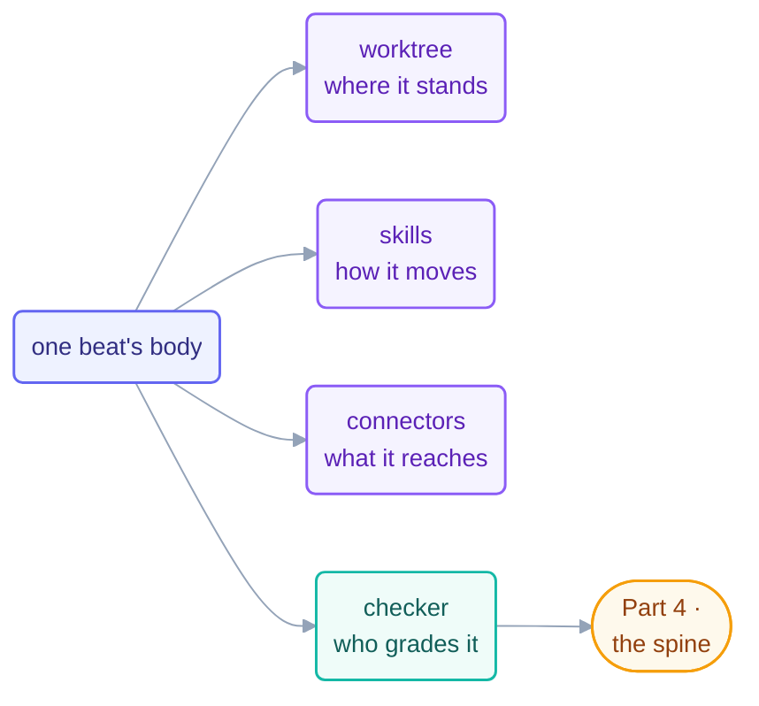

# Part 3 · The Body

> What a beat may *do* and *touch* — and how to keep many hands from colliding:
> isolation, taught moves, hands on the world, and the split that keeps work honest.

## The steps

| Step | Page | Organ | One-line takeaway |
| --- | --- | --- | --- |
| 08 | [Worktrees](08-worktrees.md) | elbow room | overlapping files → worktree; disjoint ownership → shared tree is fine |
| 09 | [Skills](09-skills.md) | trained moves | procedure lives in a skill, written once; the prompt carries intent |
| 10 | [Connectors (MCP)](10-connectors-mcp.md) | hands | few focused tools · idempotent writes · actionable errors |
| 11 | [Maker–Checker](11-maker-checker.md) | second pair of eyes | the hand that writes never approves; cheapest checker that catches the failure |

## The thread through all four

The body is where **blast radius** is decided. Every page above is one instance of
the same rule: give a beat exactly the standing room, moves, and reach its job
needs — nothing more — and put the grading outside the hands that did the work.
What the body *remembers* between beats is [Part 4](../06-part-4-the-spine/README.md)'s
problem.

## Check your understanding

[Take the Part 3 quiz](quiz.md) · [drill the flashcards](flashcards.md)

*This part belongs to track [T2 · Practitioner](../00-start-here/learning-tracks.md).*

*Sources:* Part 3 draws on Panaversity's *Loop Engineering: A Crash Course* (S1),
Panaversity's *Agentic Coding Crash Course* (S2), and Sydney Runkle's *The Art of Loop
Engineering* (LangChain, S6). Full attribution:
[resources/sources.md](../../resources/sources.md).
