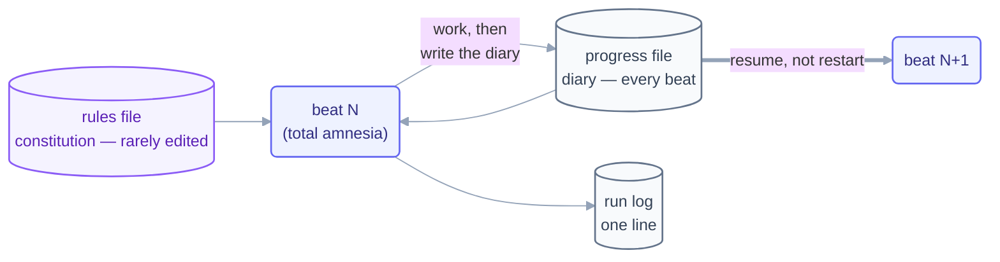

# Step 12 · State Between Runs

> The model forgets everything between beats. The spine is what remembers — and the
> difference between a loop and an expensive way to restart is one committed file.

## The hook

This repo has a scar to show you. Day 1's loops kept their state in files that were
gitignored — and then lost. The pages survived; the checker's three findings, the
record of *what was decided and why*, did not. The reconstruction notice in
[`loops/day1/page-writer/state.md`](../../loops/day1/page-writer/state.md) says it
plainly: **a spine that isn't committed isn't a spine.** Day 2's loops commit theirs
every beat. That's why this page exists — written by a loop whose spine you can read.

## The intern's diary (plain English)

Imagine a brilliant intern with total amnesia: every morning they arrive knowing
nothing about yesterday. You wouldn't fix the amnesia — you'd hand them a **diary**:
*here's what's done, here's what's next, here's what we learned.* They read it first
thing, work, and write the next entry before leaving.

That diary is the **spine**, and it comes in two files with two jobs:

- The **rules file** (`CLAUDE.md` / `AGENTS.md`) — the *constitution*. What never
  changes: conventions, boundaries, how we work here. Written by you, read every
  beat, edited rarely.
- The **progress file** (`state.md`, `STATE.md`) — the *diary*. What changes every
  beat: the checklist, what's done, what's blocked, what the last beat learned.
  Written by the loop, **one owner per file**, updated before the beat ends.

The order of operations inside a beat is load-bearing: **do the work, update the
spine, then log** — so an interruption costs you a log line, not the work. And the
spine is a *record*, not a scratchpad: escalations, discrepancies, and lessons go in
it, because the spine is what the next beat — and the human — will actually read.



## The mechanics in each tool

```claude
# Claude Code — live docs: https://docs.claude.com/en/docs/claude-code
# Constitution: CLAUDE.md (auto-loaded every session/beat)
# Diary: a state.md your loop prompt reads FIRST and updates LAST:
> /loop Read state.md. Do the FIRST unchecked item. Update state.md,
  append one line to run-log.md, commit both. Stop when all checked.
# The commit in the prompt is not decoration — it IS the durability.
```

```opencode
# OpenCode — live docs: https://opencode.ai/docs
# Constitution: AGENTS.md (project rules, loaded per run)
# Diary: same state.md pattern; the shell wrapper enforces the commit:
opencode run "Read state.md; do the first unchecked item; update it."
git add state.md run-log.md && git commit -m "beat: $(date -u +%H:%M)"
```

> [!NOTE]
> **Going deeper — the loop that improves the loop:** once lessons land in the spine
> ("beat 7 failed because the lint rule was ambiguous"), a slower loop can read
> *those* and edit the rules file or skills — **hill-climbing**: the work loop gets
> better without getting bigger. Distinguish **self-learning** (spine accumulates
> facts and lessons — safe, do it from day one) from **self-improving** (the loop
> edits its own prompt/rules — powerful, gate it behind human review of every
> change). The advanced tier (Day 3) covers the second kind.

## Check yourself

**Q: Your loop crashed at beat 7 of 20. On restart it re-did beats 1–6, redundantly
and expensively. The prompt already says "continue from where you left off." Why
didn't that work, and what's the actual fix?**

<details><summary>Answer</summary>

"Where you left off" lives in the model's memory, and the model's memory ended with
the crash — beats are amnesiac by nature. The fix is structural, not rhetorical: a
**progress file** the loop reads at beat start and updates (and commits) at beat
end. Then restart-vs-resume stops depending on anyone's memory: beat 8 reads the
diary and picks up item 8, because items 1–7 are *written down* as done.

</details>

## Try With AI

Give your agent a 6-item checklist task with the spine discipline: read `state.md`
first, one item per beat, update + commit before ending. After beat 3, kill the
session mid-task on purpose. Start a fresh session with the same prompt and watch it
resume at item 4 without being told anything. Then read your own `state.md` history
in git log: that's a loop's memory, made auditable.

## When it goes wrong

| Symptom | Cause | Fix |
| --- | --- | --- |
| Restart repeats finished work | No progress file — state in memory | Diary read first, updated last, every beat |
| Spine says done, work says otherwise | Spine updated before the work verified | Work → verify → spine → log, in that order |
| State file survived, lessons didn't | Spine used as checkbox list only | Record escalations, discrepancies, lessons — it's a record, not a scratchpad |
| The file existed and still got lost | Never committed (this repo, Day 1) | **Commit the spine every beat** — uncommitted state is pre-lost |

---

*Glossary terms used on this page:* **spine**, **rules file**, **progress file**,
**hill-climbing** — see the [glossary](../02-foundations/glossary.md).

*Sources:* state-between-runs and the intern's-diary metaphor come from Panaversity's
*Loop Engineering: A Crash Course* (S1) and Panaversity's *Agentic Coding Crash Course*
(S2); the hill-climbing loop from Sydney Runkle's *The Art of Loop Engineering*
(LangChain, S6). Full attribution: [resources/sources.md](../../resources/sources.md).
