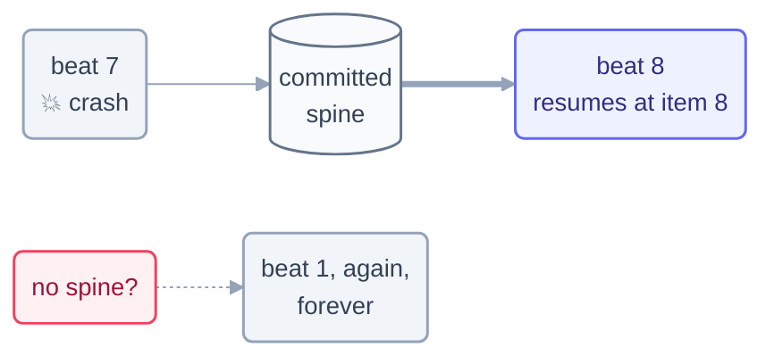

# Part 4 · The Spine

> One step, one organ, one rule: the model forgets, so the files must remember.
> This is the shortest part of the course — and the one whose absence kills the
> most loops.

## The step

| Step | Page | One-line takeaway |
| --- | --- | --- |
| 12 | [State Between Runs](12-state-between-runs.md) | constitution + diary, updated every beat, **committed** — resume, never restart |

## Why this part is one page long

Because the discipline is small and absolute. Every loop in this repo carries
it, and you can audit them: each `loops/*/state.md` is a live spine. The Day 1
reconstruction notices document what happens when the rule is skipped. With
heartbeat, body, and spine in hand, you're ready to build the whole animal —
[Part 5](../07-part-5-complete-loop/README.md) builds one loop twice, in two
tools.

## Check your understanding

[Take the Part 4 quiz](quiz.md) · [drill the flashcards](flashcards.md)

*This part belongs to track [T2 · Practitioner](../00-start-here/learning-tracks.md).*

*Sources:* Part 4 draws on Panaversity's *Loop Engineering: A Crash Course* (S1),
Panaversity's *Agentic Coding Crash Course* (S2), and Sydney Runkle's *The Art of Loop
Engineering* (LangChain, S6). Full attribution:
[resources/sources.md](../../resources/sources.md).
