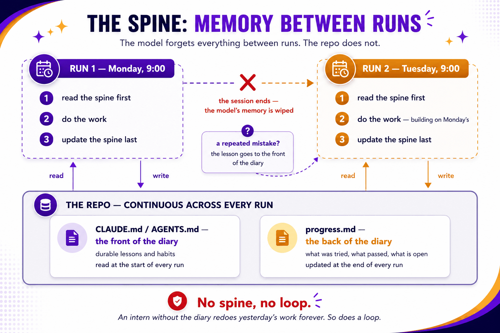
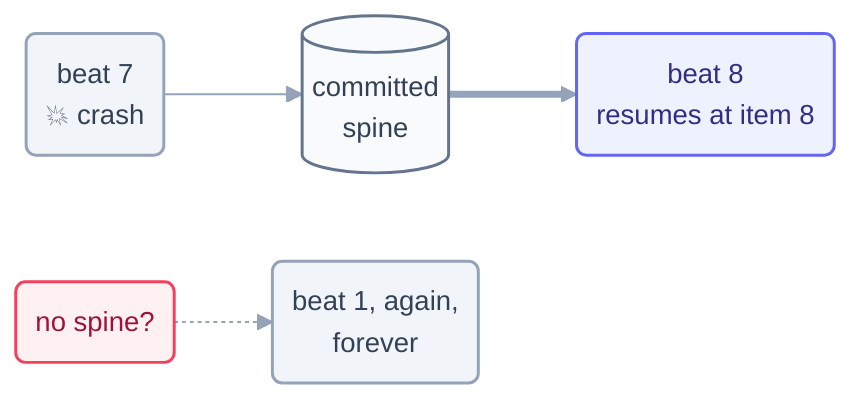

# Part 4 · The Spine

> One step, one organ, one unbending rule: the model forgets, so the files have to
> remember. This is the briefest part of the whole course — and the one whose absence
> quietly kills more loops than anything else.

## The step

| Step | Page | One-line takeaway |
| --- | --- | --- |
| 12 | [State Between Runs](12-state-between-runs.md) | constitution + diary, updated every beat, **committed** — resume, never restart |

## Why this part fits on one page

Because the discipline itself is tiny and non-negotiable. Every loop in this repo lives by
it, and you can check their homework: each `loops/*/state.md` is a spine you can open right
now. The Day 1 reconstruction notices are the cautionary half — they record, in the loops'
own words, what happens when the rule gets skipped. With heartbeat, body, and spine all in
hand, you're finally equipped to assemble the whole creature —
[Part 5](../07-part-5-complete-loop/README.md) builds one loop twice, once in each tool.

## Check your understanding

[Take the Part 4 quiz](quiz.md) · [drill the flashcards](flashcards.md)

*This part belongs to track [T2 · Practitioner](../00-start-here/learning-tracks.md).*

*Sources:* Part 4 draws on Panaversity's *Loop Engineering: A Crash Course*
([S1](https://agentfactory.panaversity.org/docs/loop-engineering-crash-course)),
*Agentic Coding Crash Course*
([S2](https://agentfactory.panaversity.org/docs/agentic-coding-crash-course)), and Sydney
Runkle's *The Art of Loop Engineering*
([S6](https://www.langchain.com/blog/the-art-of-loop-engineering)). Full attribution:
[resources/sources.md](../../resources/sources.md).
