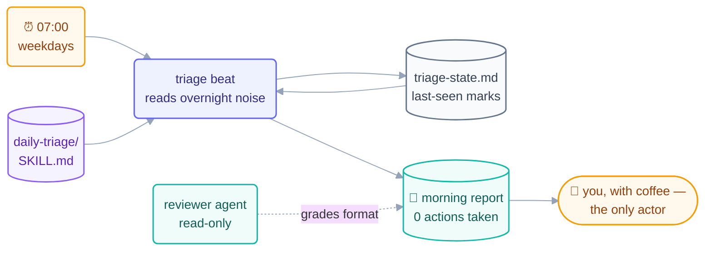

# Step 13 · Build the Morning-Triage Loop — Twice

> Everything from Steps 1–12 joins into one working loop: a morning triage that
> reads your repo's overnight noise and hands you a report with your coffee. You'll
> build it twice — Claude Code and OpenCode — to prove the shape is the thing.

## The hook

Tomorrow at 7:00 am, a loop will read every issue, PR, and CI failure that landed
overnight, sort the urgent from the ignorable, and leave a five-line report where
you'll see it — taking **no other action**. Building that is not a demo. It's the
smallest loop with all six organs, and both walkthroughs in this part ship it for
real.

## The design (plain English)

**The job:** each morning, triage the repo. **The shape** (via the pattern-picker
logic from the methods layer): the work
*repeats* on a calendar → a **scheduled** heartbeat; the beat is a read → **L1
report-only**; the output is judgment → a **human gate** reads the report.
(The picker page itself: [09-methods/pattern-picker.md](../09-methods/pattern-picker.md).)

The six parts, filled in:

| Part | The triage loop's answer |
| --- | --- |
| Heartbeat | schedule: weekdays 07:00 (your timezone) |
| Body | read issues/PRs/CI via the SCM CLI; **write only the report + log** |
| Spine | `triage-state.md` — last-seen timestamps, so beats never re-triage |
| Stopping condition | one beat = one report written; daily cap 1 |
| Checker | the report *format* is script-checkable; content graded by you |
| Human gate | you read the report; nothing acts until you do |

Both tools share two artifacts, written once: a **`daily-triage/SKILL.md`** (the
procedure: what to read, how to rank, the report template) and a **`reviewer`
agent** definition (a read-only grader both tools can run over the report). The
walkthroughs differ only in heartbeat plumbing: a cloud Routine or `claude -p` cron
([13a](13a-claude-code-walkthrough.md)) vs. cron/GitHub Actions
([13b](13b-opencode-walkthrough.md)).



## The minimum-safe checklist (before EITHER version runs)

Seven items. This repo's own loops clear this list before every first run; yours
does too, or it doesn't run:

1. Provable success condition (report file exists, matches template)
2. Run limit (daily cap: 1)
3. Spine written **first**, committed
4. Report-only (L1) — no write permissions beyond report + spine
5. Human gate placed (you, reading the report)
6. One log line per beat, no silent runs
7. Kill switch you've actually tested (schedule off / pause flag)

## The skill both versions share

```claude
# daily-triage/SKILL.md — used verbatim by BOTH walkthroughs
# name: daily-triage
# description: Morning repo triage. Read-only. Produces the 5-line report.
# 1. Read: new/updated issues, PRs, CI runs since state's last-seen marks.
# 2. Rank: broken-main > failing-CI > stale-urgent-PRs > new-issues > rest.
# 3. Write triage-report.md: ≤5 lines, most urgent first, one line each:
#    [rank] what · why it matters · suggested (NOT taken) action.
# 4. Update triage-state.md last-seen marks. Take NO other action.
```

```opencode
# The reviewer agent both tools run over the report (read-only grader):
# reviewer: "Check triage-report.md: ≤5 lines? ranked? each line has
#   what/why/suggested-action? last-seen marks updated? PASS/FAIL + why."
# In Claude Code this is a subagent definition; in OpenCode an agent
# config — see each walkthrough. Neither may edit the report.
```

> [!NOTE]
> **Going deeper:** "one real morning" is the graduation rule — the loop earns
> trust by running for real, watched, at L1, at least once before you stop
> checking it daily. The promotion ladder beyond L1 (labeling issues at L2,
> and what would justify L3) is [Step 14](../08-part-6-human-control/14-staying-the-engineer.md)'s
> subject. Build it now: [13a — Claude Code](13a-claude-code-walkthrough.md) ·
> [13b — OpenCode](13b-opencode-walkthrough.md).

## Check yourself

**Q: The triage loop's body could easily label the issues while it's reading them —
it would save you clicks. The design says no. What justifies leaving obvious value
on the table on day one?**

<details><summary>Answer</summary>

Trust hasn't been earned yet — and **labels are writes on a shared system** other
people see. L1 first means the loop's judgment gets audited (via reports) for real
mornings before its hands are granted; if the ranking logic is subtly wrong, you
find out from a wrong *report*, not from a hundred wrong labels. The clicks are the
tuition. Promotion to labeling-at-L2 comes after the reports have been boringly
right for a while.

</details>

## Try With AI

Before opening either walkthrough, fill in the six-part table above for **your**
repo instead of the generic one: real ranking rules (what counts as urgent *here*?),
real report destination, real cap. Ask your agent to red-team the design against
the 7-item checklist. Every mismatch it finds now is a 7 am surprise it prevents
later.

## When it goes wrong

| Symptom | Cause | Fix |
| --- | --- | --- |
| Report re-triages the same items daily | Spine has no last-seen marks | State the marks; beat reads them first, updates them last |
| Report ballooned to 40 lines | No format contract | The skill's template is the contract; reviewer FAILs oversized reports |
| Loop labeled/closed things at 7 am | Writes granted before earned | L1: body = report + spine only; promotion is a human decision |
| Beautiful reports, wrong priorities | Skill's ranking ≠ your ranking | Fix the skill (once), not the report (daily); that's the whole point of skills |

---

*Glossary terms used on this page:* **minimum-safe checklist**, **L1 (report-only)**,
**routine**, **human gate** — see the [glossary](../02-foundations/glossary.md).

*Sources:* the morning-triage build and the minimum-safe checklist come from
Panaversity's *Loop Engineering: A Crash Course* (S1). Full attribution:
[resources/sources.md](../../resources/sources.md).
