# Step 13a · The Morning-Triage Loop in Claude Code

> The design from [Step 13](13-build-the-loop-twice.md), assembled piece by piece in
> Claude Code: skill, agent, spine, schedule — then one real morning at L1.

## The hook

Four files and one schedule. That's the entire build. By the end of this page the
loop exists; by tomorrow 7:05 am it has run for real; and nothing in between
requires you to trust it — only to read what it wrote.

## Build order (spine first — always)

**1. The spine, committed before anything runs** (minimum-safe item 3):

```claude
# triage-state.md  — commit this BEFORE the first beat
## Last-seen marks
issues: (none yet)   prs: (none yet)   ci: (none yet)
## Escalations
(none)
```

**2. The skill** — `.claude/skills/daily-triage/SKILL.md`, verbatim from
[Step 13](13-build-the-loop-twice.md). The frontmatter description ("Morning repo
triage. Read-only.") is what lets any session — scheduled or manual — pick it up.

**3. The reviewer agent** — `.claude/agents/reviewer.md`: a read-only subagent
whose whole prompt is the grading rubric from Step 13. It may read
`triage-report.md`; it may write nothing but its verdict.

**4. The heartbeat** — two interchangeable options:

```claude
# Claude Code — live docs: https://docs.claude.com/en/docs/claude-code
# Option A · cloud Routine (runs even with your machine off):
#   /schedule → prompt: "Run the daily-triage skill. Report only." ·
#   repos: this one · connectors: none · trigger: weekdays 07:00
#   caps: 1 run/day · may push only claude/-prefixed branches
# Option B · local cron + headless mode:
#   0 7 * * 1-5  cd ~/repo && claude -p "Run the daily-triage skill. \
#     Report only." >> triage-cron.log 2>&1
```

**5. Permissions** (minimum-safe item 4) — deny-by-default; the beat gets read
tools, plus writes to exactly `triage-report.md`, `triage-state.md`, and the run
log. `/permissions` is the harness layer: the "report-only" promise becomes a
guarantee.

```mermaid
%%{init: {'theme':'base','themeVariables':{'fontFamily':'ui-sans-serif, system-ui, sans-serif','fontSize':'14px','lineColor':'#94a3b8'},'flowchart':{'curve':'basis','nodeSpacing':45,'rankSpacing':50,'padding':10}}}%%
flowchart LR
    S1("1 · spine<br/>committed"):::file --> S2("2 · skill<br/>SKILL.md"):::cfg
    S2 --> S3("3 · reviewer<br/>agent"):::check --> S4("4 · schedule<br/>07:00 ×1/day"):::time
    S4 --> S5("5 · permissions<br/>report-only"):::limit --> RUN(["one real<br/>morning, watched"]):::win
    classDef file fill:#f8fafc,stroke:#64748b,stroke-width:1.5px,color:#334155;
    classDef cfg fill:#f5f3ff,stroke:#8b5cf6,stroke-width:1.5px,color:#5b21b6;
    classDef check fill:#effcf9,stroke:#14b8a6,stroke-width:1.5px,color:#115e59;
    classDef time fill:#fef9ec,stroke:#f59e0b,stroke-width:1.5px,color:#92400e;
    classDef limit fill:#fff1f2,stroke:#f43f5e,stroke-width:1.5px,color:#9f1239;
    classDef win fill:#effcf9,stroke:#14b8a6,stroke-width:1.5px,color:#115e59;
```



## The first real morning

Don't wait for 7:00 to discover a typo — rehearse tonight, watched:

```claude
> Run the daily-triage skill now, exactly as the schedule would.
# Watch the beat: reads → ranks → writes report → updates spine → logs.
# Then grade it:
> Use the reviewer agent on triage-report.md.
# PASS → enable the schedule. FAIL → fix the SKILL, not the report.
```

```opencode
# (This page is the Claude Code build — the OpenCode twin, same skill
#  and same rubric with cron/Actions as the heartbeat, is 13b:)
# → 13b-opencode-walkthrough.md
```

Tomorrow, read the real report with your coffee. That's "one real morning" — the
loop is now *proven at L1*, which is the only currency promotions accept.

> [!NOTE]
> **Going deeper:** this build is the template for every scheduled L1 loop you'll
> ever make — swap the skill and the report name and you have a security sweeper, a
> dependency scout, a docs-drift detector. The library of such loops is Day 3's
> deliverable; the promotion rules are in
> [Step 14](../08-part-6-human-control/14-staying-the-engineer.md).

## Check yourself

**Q: Why does the walkthrough rehearse the beat manually the night before, instead
of just letting the 7 am schedule be the first run?**

<details><summary>Answer</summary>

Because the first run of anything is the most likely to fail, and a 7 am failure is
unwatched by definition. Rehearsing the identical beat in-session costs one manual
run and converts every "would have broken at 7 am" bug into a watched, fixable one —
*prove it before it runs unattended* is the whole L1 discipline in miniature.

</details>

## Try With AI

Do the build for real in a scratch repo: the four files, the permission set, the
rehearsal beat, the reviewer grade. Total time is under an hour. If the rehearsal
PASSes, arm the schedule and let tomorrow's beat run. You now own a production
loop — the smallest real one there is.

## When it goes wrong

| Symptom | Cause | Fix |
| --- | --- | --- |
| 7 am beat never fired | Schedule created but not armed / machine asleep (cron) | Routines run cloud-side; for cron, the machine must be awake — pick accordingly |
| Beat fired, report empty | Last-seen marks never initialized | The spine commit (build step 1) is not optional |
| Report written but unranked | Skill description too vague to trigger fully | Sharpen the skill; rehearse again — fix the skill, never the report |
| Beat tried to label issues | Permissions looser than the design | Deny-by-default; allow exactly the three files; re-run the rehearsal |

---

*Glossary terms used on this page:* **routine**, **headless mode**, **subagent**,
**L1 (report-only)** — see the [glossary](../02-foundations/glossary.md).
