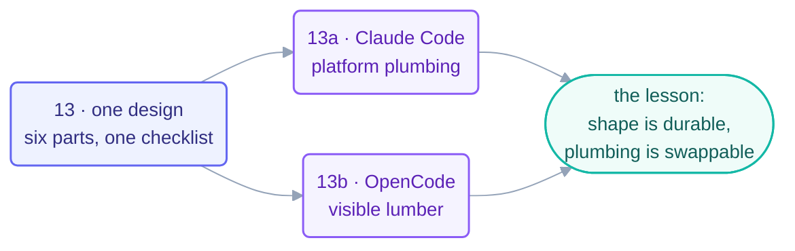

# Part 5 · A Complete Loop, Twice

> The capstone of the build track: every organ from Parts 1–4 assembled into one
> production loop — then assembled *again* in a second tool, to separate the shape
> from the plumbing.

## The steps

| Step | Page | One-line takeaway |
| --- | --- | --- |
| 13 | [Build the Morning-Triage Loop](13-build-the-loop-twice.md) | the design: six parts filled in + the 7-item minimum-safe checklist |
| 13a | [Claude Code walkthrough](13a-claude-code-walkthrough.md) | skill · reviewer agent · Routine/cron · permissions · one real morning |
| 13b | [OpenCode walkthrough](13b-opencode-walkthrough.md) | same skill, same rubric — cron + wrapper script as visible lumber |

## Why twice?

Because after the second build you can answer the only portability question that
matters: *which parts would survive a tool change?* (All six organs, the checklist,
the L1 discipline.) *Which parts wouldn't?* (Every command you typed.) Memorize the
first list; look up the second — that's the lasting-vs-mechanical rule this course
repeats on purpose.

## Check your understanding

[Take the Part 5 quiz](quiz.md) — *(this part has no flashcards: the exercise IS
the two builds).*

Then on to the last part: [Part 6 · Human Control](../08-part-6-human-control/README.md).

*This part belongs to track [T3 · Engineer](../00-start-here/learning-tracks.md).*

*Sources:* Part 5 draws on Panaversity's *Loop Engineering: A Crash Course* (S1). Full
attribution: [resources/sources.md](../../resources/sources.md).
