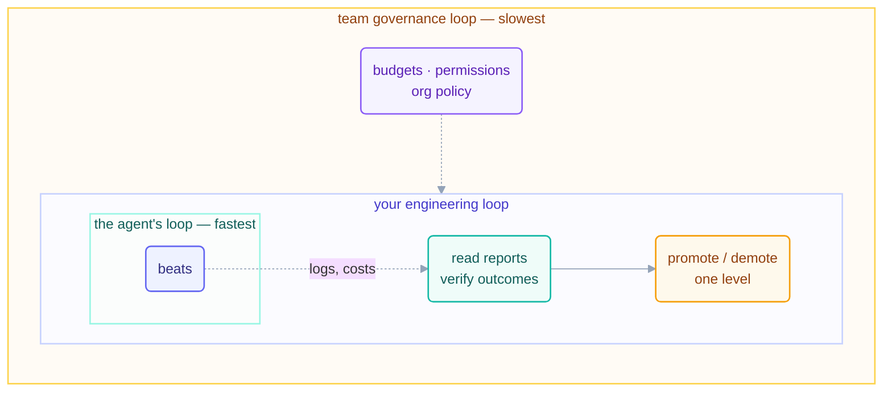

# Step 14 · Staying the Engineer

> The last step is not about loops. It's about you: the person who must still
> understand, still verify, and still answer for whatever the fleet did while you
> weren't looking.

## The hook

Six months from now your loops work. That's when the real risk starts — not the doom
loop (you'd notice), but the quiet slide where reports go unread because they're
always fine, promotions happen because asking felt slow, and one day a question
lands — *"why did the system do that?"* — and the honest answer is that nobody
knows anymore. Nothing failed. You just stopped being the engineer.

## The job that remains (plain English)

Automating the typing was Steps 1–13. What can never be automated is **ownership**,
and it decomposes into exactly the three things loops are worst at:

- **Paying attention to cost.** Tokens are the fleet's food bill, and loops eat on
  a schedule whether or not the work matters. You own the budget, the caps, and the
  question "is this loop worth what it burns?" —
  [cost-management](cost-management.md) is the practice.
- **Verifying outcomes, not statuses.** A green run means the loop finished, not
  that the work is right — **green ≠ done** is the observability rule that makes
  run logs worth reading. [verification](verification.md) is the practice.
- **Keeping comprehension.** Every beat you don't understand adds to the
  comprehension debt you met in
  [concepts](../02-foundations/concepts.md) — and loops generate it at machine
  speed. Small beats, read reports, and spot-reads are how you stay solvent.

The frame that holds it together is [the three nested
loops](the-three-nested-loops.md): the agent's loop runs inside *your* engineering
loop, which runs inside the *team's* governance loop. Autonomy levels, promotions,
and budgets are decisions made in the outer loops **about** the inner one — never
by it.

Two rules from those outer loops are absolute:

1. **Prove before overnight.** No loop runs unattended before a human has watched
   a full real run succeed at the current autonomy level. Promotion is one level at
   a time, and demotion after any incident is automatic (the recovery playbook's
   step 5).
2. **Resist AI gravity.** The pull to hand the next decision to the system because
   it handled the last one — scope creeping from "label issues" to "close stale
   ones" without anyone deciding. Every capability expansion is an explicit human
   decision, written down, or it doesn't happen.



## The engineer's beat, in each tool

```claude
# Claude Code — live docs: https://docs.claude.com/en/docs/claude-code
# YOUR loop has beats too. A weekly 15-minute one:
> Read shared/loop-run-log.md for the week. For each loop: runs, cost,
  escalations, anything promoted/demoted? Summarize in 5 lines.
# /cost and the run log are your instruments; the promotion decision
# is yours alone — never delegate it to the loop being promoted.
```

```opencode
# OpenCode — live docs: https://opencode.ai/docs
# Same weekly beat, script-assisted:
grep '"pattern"' shared/loop-run-log.md | tail -50   # what actually ran
opencode run "READ-ONLY: summarize this week's run-log: cost per loop,
  escalations, anomalies. 5 lines."
```

> [!NOTE]
> **Going deeper:** at org scale these habits become policy — shared budgets, a
> loop registry, review requirements for L3, incident playbooks. That's the T4
> track (`advanced/`, Day 3). The three companion pages go deeper on each pillar:
> [cost-management](cost-management.md) ·
> [verification](verification.md) ·
> [the-three-nested-loops](the-three-nested-loops.md).

## Check yourself

**Q: A teammate proposes: "our loops have been green for a quarter — let's stop
reviewing their PRs and auto-merge." Name the two Step-14 rules this violates and
the failure it invites.**

<details><summary>Answer</summary>

It surrenders to **AI gravity** (capability expansion justified by streak, not by
decision) and abolishes the **human gate** that keeps comprehension debt payable.
The invited failure: the first confidently-wrong change merges at machine speed
into a codebase whose owners have spent a quarter *not reading* — maximum blast
radius, minimum understanding. Green streaks argue for *trust in the current
level*, never for skipping the gate.

</details>

## Try With AI

Run your first engineer's beat on this very repo: ask your agent to summarize
`shared/loop-run-log.md` — cost per loop, escalations, the self-throttle event.
Then answer, yourself, on paper: which of this repo's loops would you promote,
which would you leave at L1 forever, and why? (There is a defensible "L1 forever"
answer in this fleet — find it.)

## When it goes wrong

| Symptom | Cause | Fix |
| --- | --- | --- |
| Reports unread because "always fine" | Attention decayed with success | Shrink reports (5 lines max); one weekly engineer's beat, calendared |
| Loop quietly doing more than designed | AI gravity — scope crept | Capability changes are written decisions; audit body vs. loop.md |
| "Why did it do that?" — nobody knows | Comprehension debt compounding | Small beats, spot-reads per part, run log as narrative |
| First unattended night was a disaster | Promotion skipped the proof | One real watched run per level; demote on incident, automatically |

---

*Glossary terms used on this page:* **green ≠ done**, **AI gravity**,
**comprehension debt**, **promotion/demotion** — see the
[glossary](../02-foundations/glossary.md).

*Sources:* the stay-the-engineer principle comes from Addy Osmani's *Loop Engineering*
(S5); the cost/verification/comprehension framing from Panaversity's *Loop Engineering:
A Crash Course* (S1); the nested-loops and success-criteria ideas from Andrew Ng &
Andrej Karpathy's public statements (S9). Full attribution:
[resources/sources.md](../../resources/sources.md).
