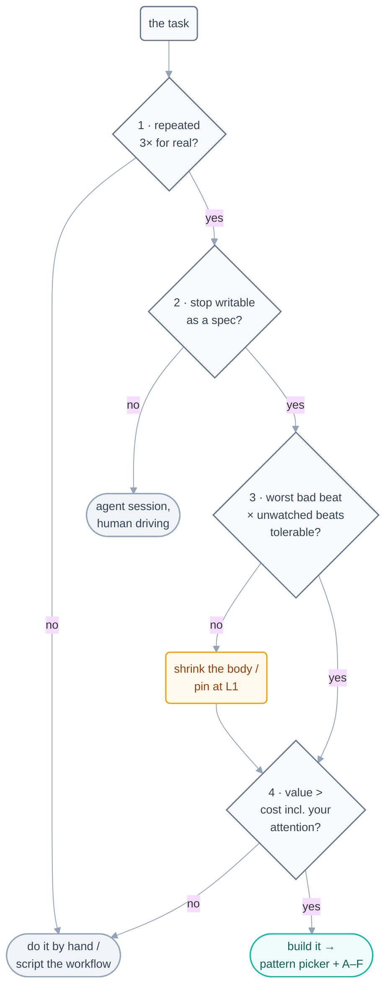

# The Decision Framework — Should This Be a Loop at All?

> The pattern picker assumes a loop is warranted. This page is the gate before it:
> four tests a task must pass before it deserves a heartbeat — because the most
> expensive loop is the one that shouldn't exist.

## The four tests

### 1 · The repetition test

Has this task actually happened three times? Not "will surely recur" — *has
recurred*. Building a loop for a predicted repetition is speculative
infrastructure. The third real occurrence is when prediction becomes data.
(One-off with many steps? That's a **workflow** — script it, don't loop it.)

### 2 · The specification test

Can you write the stopping condition as a machine-checkable spec *today*? If the
goal only exists as taste ("make the docs better"), a loop will manufacture
plausible-looking progress forever. Judgment-shaped goals need a human in the
driver's seat, with the agent as hands — a session, not a loop.

### 3 · The tolerance test

Multiply: (worst realistic bad beat) × (beats per week nobody watches). A weekly
report loop's worst case is one silly report — loop it freely. An auto-merge
loop's worst case is machine-speed damage to a shared codebase. The tolerance
test says: not until the checker and gate structure is *stronger than your best
reviewer*. If the product of that multiplication scares you, the answer isn't
"no" — it's "L1, and a smaller body."

### 4 · The economics test

Loop cost = build + (tokens × beats) + **your attention on its reports, forever**.
Loop value = human minutes saved × how often + errors prevented. The commonly
forgotten term is the attention one: a loop whose report you must read daily has
hired *you*. If value < cost, the by-hand version was fine all along.

## The honest outcomes

Roughly half of candidate tasks should end at one of the gray boxes — and that's
the framework succeeding, not failing:

| Outcome | It means |
| --- | --- |
| **Do it by hand** | rare, or cheaper than a loop's true cost |
| **Script the workflow** | many steps, one pass, no recurrence — determinism beats a heartbeat |
| **Agent session, human driving** | recurs but can't be specified — judgment work |
| **Build it, smaller** | loop-worthy, but body/level shrunk until the tolerance test passes |
| **Build it** | all four passed — proceed to the [pattern picker](pattern-picker.md) and [A–F](make-your-own-loop.md) |

## The anti-pattern this page exists to stop

**Reaching for the biggest loop** — automating the most impressive version of the
task instead of the most repeated one, at maximum autonomy, because the demo felt
good. Its fingerprints: no third real occurrence, a stop written as vibes, a
tolerance product nobody multiplied, and attention costs waved away. Every one of
those has a named failure mode waiting in the
[operating handbook](../10-operating/failure-modes.md).

*Course context:* this framework is Question Zero of the capstone — before the
rubric grades your loop, it asks whether you should have built one.

*Sources:* the decision framework distills Panaversity's *Loop Engineering: A Crash
Course* (S1) and Addy Osmani's *Loop Engineering* (S5). Full attribution:
[resources/sources.md](../../resources/sources.md).
