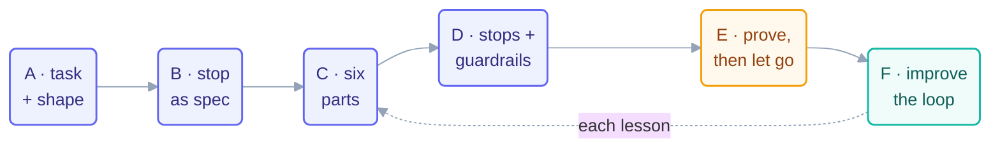

# Make Your Own Loop — the A–F Method

> The 14 steps taught you the organs. This page is the surgery manual: six moves,
> A through F, that turn "I keep doing this by hand" into a loop you can trust.

## When to reach for this page

Any time you catch yourself doing the same agent-assisted task a third time. Third
time is the tell — once is work, twice is coincidence, three times is a loop you
haven't built yet.

## The method

### A · Pick the task and its shape

Name the task in one sentence, then let its *ending* choose the heartbeat:

- The work **ends** (a list empties, a suite greens) → **conditional** run-until-done.
- The work **repeats** (every morning, every PR) → **schedule** or **event**.
- The work happens **once** → **no loop.** Just do it. (Most common mistake: looping
  a one-off because loops are fun.)

### B · Write the stopping condition as a spec

Before any prompt: one sentence a machine can verify. *"Every box in `state.md` is
checked."* *"`npm test` exits 0."* If you can't write it, you don't have a loop task
yet — you have a wish. Sharpen the task until the stop writes itself.

### C · Assemble the six parts

Fill the table — every row, even when the answer is small:

| Part | Your answer must name… |
| --- | --- |
| Heartbeat | the exact trigger (cadence / condition / event) |
| Body | the paths + tools it may touch, and *nothing else* |
| Spine | the state file, created and committed **before** the first beat |
| Stopping condition | the spec from B, verbatim |
| Checker | script, read-only LLM, or human — cheapest that catches your feared failure |
| Human gate | where a person decides (review, approve, promote) |

### D · Add the three stops and the guardrails

Success (from B) · **limit** (max runs — pick a number that would embarrass you if
hit) · **no-progress** (3 unchanged beats → stop and log). Then the guardrails:
budget caps + the 80% tripwire, kill switch, one log line per beat.

### E · Prove it, then let go — one level at a time

**L1 report-only** for real runs, watched → **L2 assisted** (writes, human reads
every output) → **L3 unattended** (writes, human samples). One promotion per proven
level, demotion on any incident. Never skip a rung because the streak felt good.

### F · Improve the loop, not just the work

When a beat disappoints: fix the *skill*, the *rubric*, or the *spec* — not the
output. Output fixes evaporate; loop fixes compound. (This is hill-climbing's seed:
see [Step 12](../06-part-4-the-spine/12-state-between-runs.md).)

## Worked in 90 seconds

*Task:* "changelog entries pile up unwritten." **A:** repeats per merge → event
loop. **B:** "every merged PR since the last beat has a changelog line."
**C:** body = `CHANGELOG.md` only; spine = last-processed PR number; checker =
script (does every merged PR number appear?); gate = release manager reads before
tagging. **D:** limit 10/day; no-progress = 3 beats with an unprocessable PR →
escalate. **E:** one week of L1 drafts-as-comments before it may commit. **F:**
entries came out too terse → fix the skill's template, not Tuesday's entry.

## Use it against real paper

- Blank six-part table + checklist: [loop-design-checklist](loop-design-checklist.md)
- Which heartbeat/pattern fits: [pattern-picker](pattern-picker.md)
- Should this be a loop at all: [decision-framework](decision-framework.md)

*Course context:* this method is the bridge from
[Part 5's build](../07-part-5-complete-loop/13-build-the-loop-twice.md) to loops of
your own design — and the capstone assessment asks you to walk A–F cold.
