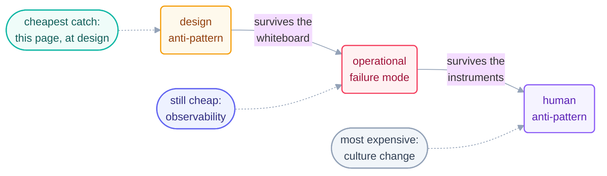

# Anti-Patterns

> [Failure modes](failure-modes.md) are how running loops break. Anti-patterns are
> how loops get *designed* broken — the mistakes this catalog exists to catch at
> the whiteboard, where they cost a conversation instead of an incident.

## Design anti-patterns

| Anti-pattern | Why it feels right | Why it's wrong | Instead |
| --- | --- | --- | --- |
| **No spending limit** | "it's just a small loop" | small × unattended × daily compounds | caps + tripwire before beat 1 |
| **No stuck-check** | "it'll finish eventually" | doom loops burn budget invisibly | no-progress stop, 3 beats |
| **Maker grades itself** | "self-review saves a loop" | blind spots co-sign their own bugs | separate checker, cheapest kind that works |
| **Vague stopping condition** | "we'll know it when we see it" | the loop won't; it manufactures plausible progress | stop written as a machine-checkable spec |
| **Prompting-instead-of-looping maintenance** | each fix is "just one prompt" | you become the heartbeat; nothing accumulates | third repetition → build the loop |
| **Fat prompt / bloated rules file** | more instructions = more control | context degrades; instructions collide | intent in the prompt, procedure in skills, constitution short |
| **Too many overlapping tools** | "give it everything, it'll pick" | every extra tool is a loaded option for a confused beat | few, focused tools ([Step 10](../05-part-3-the-body/10-connectors-mcp.md)) |
| **Non-idempotent writes** | happy path works fine | retries/double-fires duplicate actions | "ensure X" beats "do X"; key on ids |
| **Silent error handling** | clean logs look good | failures become no-ops nobody sees | errors are loud, actionable, logged |
| **Reaching for the biggest loop** | the impressive demo | maximum autonomy before minimum trust | smallest pattern that does the job; promote later |
| **A workflow mistaken for a loop** | it repeats steps, doesn't it? | fixed one-pass sequences need no heartbeat | script it; a workflow is one beat's body |
| **Too-strict constitution** | more rules = safer | the loop escalates everything, does nothing | rules earn their place; prune what never fires |

## Operational anti-patterns (design-time seeds of runtime failures)

| Anti-pattern | It becomes | Catalog entry |
| --- | --- | --- |
| state kept in the model's memory | restart-from-zero | [no spine](failure-modes.md) |
| trusting statuses over outcomes | broken product, green board | [green ≠ done](failure-modes.md) |
| secrets reachable from the loop's body | exfiltration risk | [safety](safety.md) — deny-listed paths |
| events assumed queued | silent gaps in bursts | [dropped-not-queued](../04-part-2-heartbeat/07-event-driven.md) |
| unrestricted branch pushes | 3 am writes to `main` | [safety](safety.md) — branch guardrails |

## Human anti-patterns

The expensive ones — they arrive last and cost the most:

- **Cognitive surrender.** "The loop probably knows better" as a reflex. The
  loop is never the authority on itself. Instruments are.
- **Comprehension debt as a lifestyle.** Shipping faster than anyone understands,
  indefinitely — until the first "why?" nobody can answer.
- **Intent debt as a lifestyle.** Specs that stay vague because tightening them
  is work. The loop collects on every vague word, at scale.
- **AI gravity.** Each success pulls the next decision toward the system — scope
  creep without a decider. Antidote: capability changes are *written* decisions.

*Use at the whiteboard: walk any new `loop.md` down the design table — every row
you can't rule out with a sentence is homework before the
[design checklist](../09-methods/loop-design-checklist.md) gets its checkmarks.*

*Sources:* the anti-pattern catalog is drawn from the `cobusgreyling/loop-engineering`
reference repo (MIT, S7) and the essays of Addy Osmani's *Loop Engineering* (S5) and
Sydney Runkle's *The Art of Loop Engineering* (LangChain, S6). Full attribution:
[resources/sources.md](../../resources/sources.md).
