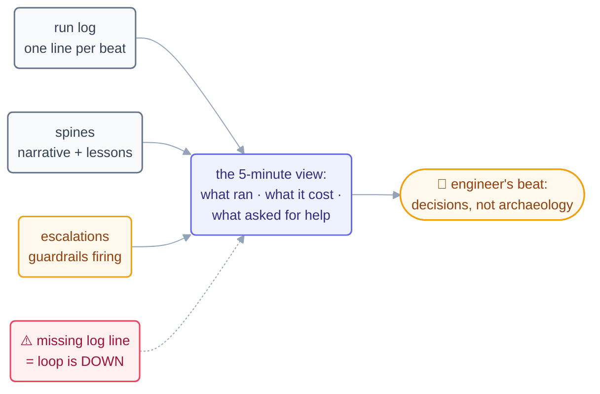

# Observability

> You can't stay the engineer of a fleet you can't see. Observability for loops is
> three artifacts — the run log, the spines, the escalations — and the discipline
> of reading them before they're interesting.

## The three instruments

### 1 · The run log — the fleet's heartbeat monitor

One shared, append-only file; **one line per beat, no exceptions**. This repo's
format ([`shared/loop-run-log.md`](../../shared/loop-run-log.md)):

```text
{"run_id": "2026-07-16T10:31:10Z", "pattern": "checker", "duration_s": 120,
 "items_found": 3, "actions_taken": 0, "escalations": 0,
 "tokens_estimate": 15000, "outcome": "report-only"}
```

Every field earns its place: `items_found` vs `actions_taken` *proves* maker ≠
checker held (3 found, 0 taken — the compliance record from
[Step 11](../05-part-3-the-body/11-maker-checker.md)); `tokens_estimate` feeds
[cost management](../08-part-6-human-control/cost-management.md); `outcome` makes the
line greppable. **Silence is the loudest signal:** a loop with no line for a period
it should have beaten is *down*, and nothing else will tell you.

### 2 · The spines — per-loop narrative

The run log says *that* things happened; the spine says *what and why*. A healthy
spine reads like a diary: checklist state, lessons, discrepancies honestly
recorded. (See this repo's Day 1 spines — including the beat-count discrepancy
they chose to *document* rather than smooth over. That's what trustworthy state
looks like.)

### 3 · Escalations — the fleet asking for help

An escalation is a loop writing "I need a human" into its own spine and stopping —
the *success* of a guardrail, not a failure. Track the rate: zero forever means
limits are too loose to ever trip; constant means the loop's job is misdesigned.

## Green ≠ done, operationalized

A status is a claim about the *loop*; verification is a claim about the *work*.
The [verification ladder](../08-part-6-human-control/verification.md) turns that
slogan into layers; observability's job is to make each layer's evidence **visible
in one place** — checker verdicts in a committed spine, script results in CI, the
run log tying them together by timestamp.



## The five-minute fleet review

The test of your observability: can you answer these in five minutes, from files,
without asking any model?

1. What ran yesterday, and did anything that *should* have run stay silent?
2. What did each loop cost, and who's nearest their tripwire?
3. Did any maker take an action its checker or level doesn't justify?
4. What escalated, and has a human responded to each?
5. Is any spine's story inconsistent with the log's numbers?

If any answer requires reconstruction, that's the observability gap to fix *this
week* — reconstruction after the fact is exactly how this repo's Day 1 spines had
to be rebuilt, and some of that history is permanently gone.

## Practical defaults

- **Retention:** prune run-log entries older than 30 days (this repo's rule);
  spines keep their narrative — they're the long-term memory.
- **Timestamps:** UTC everywhere, ISO-8601, or correlating log↔spine↔CI becomes
  archaeology.
- **Dashboards:** optional; files are the source of truth. A dashboard that
  disagrees with the run log is wrong by definition.
- **Alerting:** two rules only — page on *silence* (expected beat missing) and on
  *escalation*. Alerting on every beat trains you to ignore alerts.

*Next in the handbook: what the instruments catch —
[failure-modes.md](failure-modes.md).*

*Sources:* observability and “green ≠ done” draw on Panaversity's *Loop Engineering: A
Crash Course* (S1) and Addy Osmani's *Loop Engineering* (S5). Full attribution:
[resources/sources.md](../../resources/sources.md).
