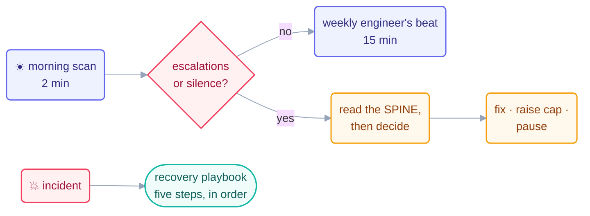

# Operating Loops — the Day-to-Day Handbook

> Designing a loop is an afternoon. *Operating* loops is every day after — the
> routines that keep a running fleet boring. This page is the front door of the
> operating handbook.

## The operator's day (the short version)

- **Morning (2 min):** scan the last 24 hours of the run log. Did every loop
  that should have beaten actually beat? Is any `escalations` count above zero?
  Is any loop silent that shouldn't be? Treat silence as a *page*, not a
  relief. No log line means the loop didn't run, and you want to know which
  organ failed.
- **On every escalation (10 min):** read the loop's spine, not just the alert.
  The spine carries the context the alert lacks. Then decide one of three
  things: fix the cause, raise a cap deliberately (like this repo's Day 1
  [budget event](../../shared/loop-budget.md)), or pause the loop.
- **Weekly (15 min):** the engineer's beat from
  [Step 14](../08-part-6-human-control/14-staying-the-engineer.md) — cost per loop,
  drift check (body vs. `loop.md`), promote/hold/demote/retire per loop.
- **On any incident:** stop reading this page, open the
  [recovery playbook](recovery-playbook.md), follow the five steps in order.

## The operating invariants

Six rules that hold for every running loop, every day — each one earned by a
failure somewhere:

| Invariant | Because otherwise |
| --- | --- |
| One log line per beat, no silent runs | you can't tell "quiet" from "dead" |
| Spine updated + committed every beat | interruption = restart, and state can be lost forever |
| Budget file read at every beat start | caps drift out of sync with reality |
| The maker never grades its own work | failures get co-signed instead of caught |
| Capability changes are written decisions | AI gravity grows the body silently |
| Kill switch tested, not just present | the off button fails exactly once — during the incident |

## The handbook's chapters

| Page | Read it when |
| --- | --- |
| [safety.md](safety.md) | granting any permission, ever |
| [observability.md](observability.md) | you can't answer "what did the fleet do yesterday?" in 5 minutes |
| [failure-modes.md](failure-modes.md) | something feels off and you want its name |
| [anti-patterns.md](anti-patterns.md) | *before* building — the mistakes catalog |
| [recovery-playbook.md](recovery-playbook.md) | a loop has already failed — five steps, in order |
| [multi-loop.md](multi-loop.md) | running two makers, or your first fleet |

## The mindset

A well-operated fleet is **boring**. Beats land. Logs accumulate. Escalations
are rare and informative. The interesting decisions all happen in your loop,
not the agent's. If operating your loops feels exciting, something in this
handbook is being skipped. Excitement is unhandled risk with better marketing.

*Live example: this repo's own operating artifacts are one directory up —
[`LOOP.md`](../../LOOP.md), [`shared/loop-budget.md`](../../shared/loop-budget.md),
[`shared/loop-run-log.md`](../../shared/loop-run-log.md), and a spine per loop
under [`loops/`](../../loops/README.md).*

*Sources:* day-to-day operating practice draws on Panaversity's *Loop Engineering: A
Crash Course* (S1) and the `cobusgreyling/loop-engineering` reference repo (MIT, S7).
Full attribution: [resources/sources.md](../../resources/sources.md).
