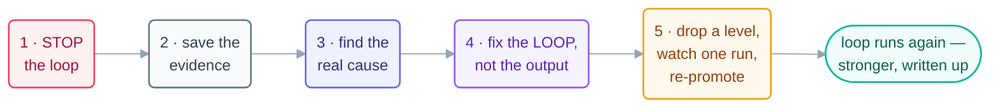

# The Recovery Playbook

> Your loop has already failed. Good news: what happens next is a fixed sequence,
> not a judgment call. Five steps, in order, no skipping — and every recovery ends
> with a stronger loop than the one that broke.

## Step 1 · Stop the loop first

Pause the schedule. Disarm the trigger. Set the pause flag. Do all of it
**before** you investigate anything. A loop that is still beating rewrites the
crime scene while you study it. Every new beat moves state under your hands and
can add fresh damage. You tested the kill switch for exactly this moment — pull
it.

## Step 2 · Save the evidence

Copy the spine and the run log exactly as they are, before anything else touches
them. Then quarantine the unverified output: close (don't merge) the suspect PR,
hold the unsent message. Evidence is what separates a root cause from a guess.
It is also the first thing a restarted loop overwrites.

## Step 3 · Find the real cause

Start at the last known-good beat and replay the story forward through the logs.
At each beat, ask one question: **where did the recorded state stop matching
reality?** The divergence point names the organ that broke. Maybe the heartbeat
fired wrong. Maybe the spine went stale, the checker passed what it shouldn't,
or the limit never tripped. Fix the layer that broke, not the layer that
*noticed* — they are usually different. The
[failure-modes catalog](failure-modes.md) maps tells to organs.

## Step 4 · Fix the loop, not just the output

Hand-patching the bad output feels like recovery. It isn't. The loop that
produced the output is unchanged, so the same incident is already scheduled for
next week. Strengthen the organ you found in step 3: sharpen the stop, add the
rubric row, tighten the cap, move the gate. Then record the fix in the spine's
lessons. The spine is the loop's own memory of why it is shaped the way it is.

## Step 5 · Earn trust back

Drop the loop **one autonomy level** — L3 to L2, L2 to L1. This is automatic,
not a negotiation. Watch **one full real run** succeed at the reduced level.
Then re-promote. Trust is re-earned the same way it was earned the first time.
Finally, file the write-up. This repo turns recoveries into `stories/` entries,
because a documented failure teaches more than an undocumented success.

## Why a fixed sequence

Because incident time is the worst time to improvise. The five steps are
decades of incident-response practice, in loop form. Mitigate first. Preserve
the timeline. Chase the root cause, not the symptom. Fix the *class* of
failure, not the instance. File a blameless write-up where the team will find
it. A playbook turns a scary failure into a calm routine — no panic, no
guesswork, no repeat.

## The 60-second drill (run it before you need it)

For your most autonomous loop, answer now, from memory:

1. Where is its kill switch, exactly? (If you had to look it up — that's the drill
   failing usefully. Practice the pull.)
2. Which two files are its evidence? (Spine + run log; know their paths.)
3. Who gets told, and where does the write-up go?

A team that can answer in 60 seconds recovers in minutes. A team that can't
will improvise — badly, at 3 am, with the loop still beating.

*Prevention lives one page over: [failure-modes](failure-modes.md) ·
[anti-patterns](anti-patterns.md) ·
[safety](safety.md).*

*Sources:* the five steps mirror Google SRE incident-response practice (*Incident
Management* & *Postmortem Culture*), with loop-specific rules from Sydney Runkle's *The
Art of Loop Engineering* (LangChain, S6) and the `cobusgreyling/loop-engineering`
reference repo (MIT, S7). Full attribution:
[resources/sources.md](../../resources/sources.md).
