# The Recovery Playbook

> Your loop has already failed. The good news: what comes next is a fixed sequence, not a judgment
> call. Five steps, in order, no skipping — and every recovery ends with a loop stronger than the
> one that broke.

## Step 1 · Stop the loop first

Pause the schedule. Disarm the trigger. Set the pause flag. Do all of it **before** you
investigate a single thing. A loop that's still beating is rewriting the crime scene while you
study it — every new beat shifts state under your hands and can pile on fresh damage. You tested
the kill switch for exactly this moment; pull it.

## Step 2 · Save the evidence

Copy the spine and the run log exactly as they stand, before anything else lays a finger on them.
Then quarantine the unverified output: close (don't merge) the suspect PR, hold the unsent
message. Evidence is what separates a root cause from a guess — and it's also the very first thing
a restarted loop overwrites.

## Step 3 · Find the real cause

Begin at the last known-good beat and replay the story forward through the logs. At each beat, ask
one question and only one: **where did the recorded state stop matching reality?** That divergence
point names the organ that broke. Maybe the heartbeat fired wrong. Maybe the spine went stale, the
checker waved through what it shouldn't have, or the limit never tripped. Fix the layer that
*broke*, not the layer that *noticed* — they're usually two different layers. The
[failure-modes catalog](failure-modes.md) maps tells to organs.

## Step 4 · Fix the loop, not just the output

Hand-patching the bad output *feels* like recovery. It isn't. The loop that produced that output
is unchanged, which means the same incident is already on next week's calendar. Strengthen the
organ you found in step 3: sharpen the stop, add the rubric row, tighten the cap, move the gate.
Then record the fix in the spine's lessons — the spine is the loop's own memory of why it's shaped
the way it is.

## Step 5 · Earn trust back

Drop the loop **one autonomy level** — L3 to L2, L2 to L1. This is automatic, not a negotiation.
Watch **one full real run** succeed at the reduced level, then re-promote. Trust gets re-earned
the exact same way it was earned the first time. Finally, file the write-up. This repo turns its
recoveries into `stories/` entries, because a documented failure teaches far more than an
undocumented success.

```mermaid
%%{init: {'theme':'base','themeVariables':{'fontFamily':'ui-sans-serif, system-ui, sans-serif','fontSize':'14px','lineColor':'#64748b','edgeLabelBackground':'#f8fafc'},'flowchart':{'curve':'basis','nodeSpacing':45,'rankSpacing':55,'padding':12}}}%%
flowchart LR
    S1("1 · STOP<br/>the loop"):::stop --> S2("2 · save the<br/>evidence"):::file
    S2 --> S3("3 · find the<br/>real cause"):::q --> S4("4 · fix the LOOP,<br/>not the output"):::fix
    S4 --> S5("5 · drop a level,<br/>watch one run,<br/>re-promote"):::gate
    S5 --> OUT(["loop runs again —<br/>stronger, written up"]):::win
    linkStyle default stroke:#64748b,stroke-width:2px;
    classDef stop fill:#fff1f2,stroke:#f43f5e,stroke-width:2px,color:#9f1239;
    classDef file fill:#f8fafc,stroke:#64748b,stroke-width:2px,color:#334155;
    classDef q fill:#eef2ff,stroke:#6366f1,stroke-width:2px,color:#312e81;
    classDef fix fill:#f5f3ff,stroke:#8b5cf6,stroke-width:2px,color:#5b21b6;
    classDef gate fill:#fef9ec,stroke:#f59e0b,stroke-width:2px,color:#92400e;
    classDef win fill:#effcf9,stroke:#14b8a6,stroke-width:2px,color:#115e59;
```

## Why a fixed sequence

Because incident time is the single worst time to improvise. These five steps are decades of
incident-response practice, translated into loop form. Mitigate first. Preserve the timeline.
Chase the root cause, not the symptom. Fix the *class* of failure, not the instance. File a
blameless write-up somewhere the team will actually find it. A playbook turns a scary failure into
a calm routine — no panic, no guesswork, no repeat.

## The 60-second drill (run it before you need it)

For your most autonomous loop, answer these now, from memory:

1. Where is its kill switch, exactly? (If you had to look it up — good, that's the drill failing
   usefully. Now practice the pull.)
2. Which two files are its evidence? (Spine + run log; know their paths cold.)
3. Who gets told, and where does the write-up go?

A team that can answer in 60 seconds recovers in minutes. A team that can't will improvise —
badly, at 3 am, with the loop still beating.

*Prevention lives one page over: [failure-modes](failure-modes.md) ·
[anti-patterns](anti-patterns.md) · [safety](safety.md).*

*Sources:* the five steps mirror Google SRE incident-response practice (*Incident Management* &
*Postmortem Culture*), with loop-specific rules from Sydney Runkle's *The Art of Loop Engineering*
([S6](https://www.langchain.com/blog/the-art-of-loop-engineering)) and the
`cobusgreyling/loop-engineering` reference repo
([S7](https://github.com/cobusgreyling/loop-engineering), MIT). Full attribution:
[resources/sources.md](../../resources/sources.md).
