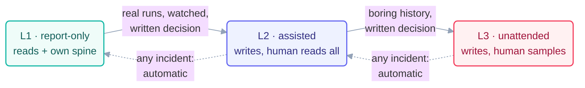

# Safety

> Safety for loops is not a vibe — it's four mechanisms, each living where prose
> can't reach it: permissions, levels, gates, and switches. Everything else on this
> page is arrangement.

## The first principle: guarantees below the prompt

A rule the model must *choose* to follow is a request. A rule the harness enforces
is a guarantee. Every safety property you care about should live as low as it can:

| Property | Wrong home | Right home |
| --- | --- | --- |
| "never touch `main`" | the prompt | branch protection + permission rule |
| "never edit secrets" | the prompt | deny-listed paths (`.env*`, `auth/`, `payments/`, `secrets/`, `credentials/`) |
| "one page per beat" | hope | run limit + rubric row the checker enforces |
| "stop if spending too much" | the model's judgment | budget file + 80% tripwire, read every beat |

This repo's [`loop-constraints.md`](../../loop-constraints.md) is the visible half;
the permission config enforcing it is the half that works at 3 am.

## The autonomy ladder (levels are earned, not assigned)

- **L1 · report-only.** May read; writes only its report + own spine. *Every* loop
  starts here, on real work, watched. Some loops rightly stay forever — this
  repo's checkers have no path to L2 *by design*.
- **L2 · assisted.** May write its owned paths; a human reads every output (diff,
  PR, report) before it lands anywhere shared.
- **L3 · unattended.** Writes land with sampling instead of per-output review.
  Only after boring L2 history, only by a written decision naming who decided —
  and external actions (comments strangers see, emails, closes) are a *separate*
  grant, gated hardest of all.

**Demotion is automatic:** any incident drops the loop one level — earn it back
via the [recovery playbook](recovery-playbook.md)'s step 5.

## Human gates: placed, not sprinkled

A gate is a point where work *cannot proceed* without a person. Place them where
judgment or accountability concentrates, and write the placement into `loop.md`:

- **Before anything irreversible or outward-facing** — pushes to shared branches,
  merges, closes, messages. Non-negotiable at every level.
- **At checkpoints** — a day/milestone is "done" only when the human declares it
  (rule 9 of this repo's [`CLAUDE.md`](../../CLAUDE.md)).
- **At promotions** — levels change by human decision only
  ([the three nested loops](../08-part-6-human-control/the-three-nested-loops.md):
  arrows point inward).

## Kill switches: the tested kind

Three layers, because switches fail: the **pause flag** every beat checks first
(this fleet's `loop-pause-all`), the **schedule off-switch** (disarm the cron /
routine), and the **permission revoke** (harness-level, works even on a beat
already running). Test one pull of each *before* the first unattended run — a kill
switch that's never been pulled is a hypothesis.

## Secrets and untrusted input

Loops never read or write secret paths (deny-list above) — a loop with repo access
and secrets access is an exfiltration machine waiting for a confused beat. And
every externally-triggered loop ([Step 7](../04-part-2-heartbeat/07-event-driven.md))
treats inbound text — issue bodies, PR comments, chat messages — as **untrusted
input that may be trying to steer it**: instructions found inside data are data,
never commands.

*The failure catalog for everything this page prevents:
[failure-modes.md](failure-modes.md) · [anti-patterns.md](anti-patterns.md).*
