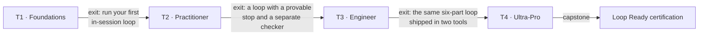

# Learning Tracks — the T1→T4 map

> Four tracks take you from never-having-built-a-loop to designing and governing loop
> *fleets*. You graduate a track by **building**, not by reading.

## The hook

A colleague asks: "I did the intro — am I qualified to put a loop on our production
repo?" The honest answer isn't a page count, it's an exit assessment: *show me the loop
you built, its stopping condition, and who checks its work.* Tracks make that answer
concrete.

## How tracks work (plain English)

Each track is a contract with three parts: an **entry check** (what you're assumed to
know — verify it in minutes), a **body of study** (pages plus labs), and an **exit
assessment** (something you build that a rubric can grade). Finish the exit assessment
and the next track's entry check is already satisfied.



## The four tracks

### T1 · Foundations — *Beginner*

| | |
|---|---|
| **Entry check** | You can use an AI coding agent by hand (or are willing to install one now) |
| **You study** | [Prerequisites](prerequisites/environment-setup.md) → [Foundations](00-foundations/glossary.md) → Part 1 *(Day 2)* |
| **Labs** | Project 1 — the watch loop |
| **Exit assessment** | Explain the prompting→looping shift and the six parts; run your first in-session loop |

### T2 · Practitioner — *Intermediate*

| | |
|---|---|
| **Entry check** | You can name the six parts of a loop without looking |
| **You study** | Parts 2–4 (heartbeat, body, spine) + the make-your-own-loop method *(Day 2)* |
| **Labs** | Projects 2–4 |
| **Exit assessment** | A loop with a chosen heartbeat, a provable stopping condition, a maker/checker split, and a spine |

### T3 · Engineer — *Advanced*

| | |
|---|---|
| **Entry check** | You've assembled a working loop of your own |
| **You study** | Parts 5–6, the prebuilt loop library, operating & safety *(Days 2–3)* |
| **Labs** | Projects 5–8 |
| **Exit assessment** | The full six-part loop built in **two** tools (Claude Code ↔ OpenCode), operated within a budget |

### T4 · Ultra-Pro — *Expert*

| | |
|---|---|
| **Entry check** | You've shipped at least one loop others rely on |
| **You study** | `advanced/`: hill-climbing, loopcraft, multi-loop coordination, enterprise governance *(Day 3)* |
| **Labs** | Fleet drills + the certification capstone |
| **Exit assessment** | The **Loop Ready** capstone: design, justify, and govern a multi-loop system against the rubric |

## Which tools you'll touch

Every track teaches with **Claude Code ↔ OpenCode** side by side; Codex and Grok appear
where a mechanic differs. Verify your setup:

```claude
claude --version
```

```opencode
opencode --version
```

> [!NOTE]
> **Going deeper:** the tracks map onto the "lasting vs mechanical" split — tracks
> certify the *lasting* layer (shapes, judgment). The mechanical layer (today's flags
> and commands) is looked up, never memorized. See
> [00-foundations/mental-models.md](00-foundations/mental-models.md).

## Check yourself

**Q: You finished T2's exit assessment. What's the T3 entry check, and do you pass it?**

<details><summary>Answer</summary>

The T3 entry check is "you've assembled a working loop of your own" — which is exactly
what T2's exit assessment made you build. That's the design: each exit satisfies the
next entry, so there's never a placement gap.

</details>

## Try With AI

Paste your current track's **exit assessment** into your agent and ask: "Draft the
smallest plan to get me there in one week, using only this repo's pages and labs."
Grade *its plan* against the track table above — did it skip the labs? (Reading
doesn't graduate a track. Building does.)

## When it goes wrong

| Symptom | Cause | Fix |
|---|---|---|
| Stuck mid-track, pages feel abstract | Skipped the labs | Do the track's first lab before reading further |
| Passed the exit but production loops still scare you | Exit done in a toy repo only | Re-run the assessment on a real (low-stakes) repo |
| Team members all claim different tracks | Self-assessment drift | Use entry checks as a shared bar — they're verifiable in minutes |

---

*Glossary terms used on this page:* **six parts**, **heartbeat**, **spine**,
**maker/checker**, **Loop Ready** — see [00-foundations/glossary.md](00-foundations/glossary.md).
