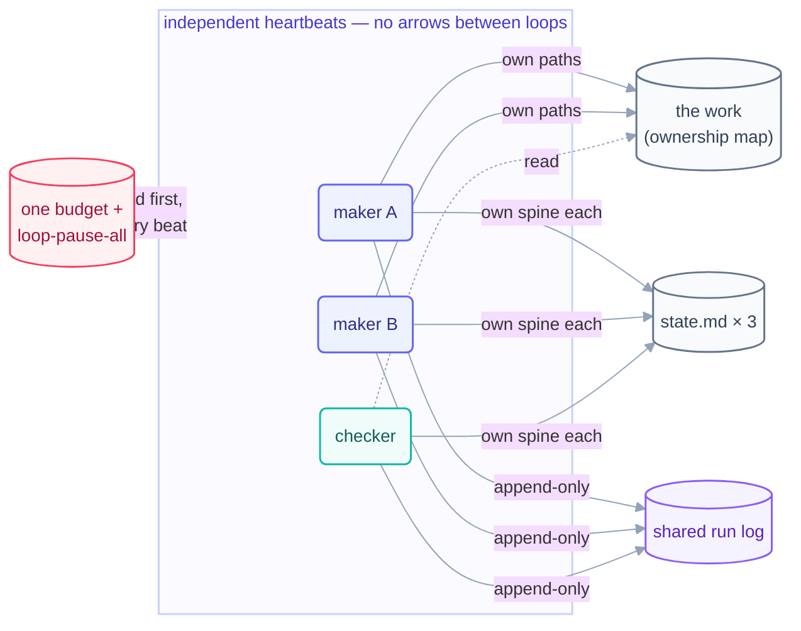

# Multi-Loop Coordination

> One loop is a tool; several are a fleet — and a fleet needs a contract. Four
> clauses keep loops from fighting: ownership, separate spines, priority, and one
> shared budget. Everything else is commentary.

## The hook

The fleet that wrote this course ran a maker, a checker, and a link-checker
simultaneously — and on Day 2, *two* makers at once. No orchestrator, no message
bus, no loop ever calling another. Nothing collided. The whole trick is a
four-clause contract written down before the second loop ever started.

## The coordination contract

### 1 · One owner per path

Every file and folder has exactly one loop that may write it; everyone else is
read-only. The map lives in the human-owned rulebook (this repo's
[`LOOP.md`](../../LOOP.md)), and the harness enforces what the map declares. Two
writers needing the same *file* is not a negotiation — it's a design error: split
the file, or give one maker a [worktree](../part-3-the-body/08-worktrees.md).

### 2 · Separate spines, one shared log

Each loop keeps its own `state.md` — no loop ever writes another's. The *only*
shared write surface is the run log, and it is **append-only**: an append-only
file is the one thing concurrent writers can share safely. Fleet state = the sum
of spines; fleet history = the one log.

### 3 · A priority order for conflicts

Decided before conflicts, because during one nobody agrees: **red main blocks
everything** — a broken build pauses every maker until it's green; checkers
outrank makers (finding problems beats making more of them); lowest-value maker
pauses first under pressure. Write the order in the rulebook; a fleet without one
resolves conflicts by whoever beat last.

### 4 · One budget, fleet-wide

Per-loop caps plus a **fleet total** in one shared file
([`shared/loop-budget.md`](../../shared/loop-budget.md)): at 80% of any cap that
loop goes report-only; at 100% of the fleet total *everyone* pauses. The budget
file doubles as the fleet-wide kill switch's home (`loop-pause-all`) — one flag,
checked by every loop, first thing every beat.

## Coordination through files, never through calls

The deeper principle under all four clauses: loops meet **only through durable
files** — spines, the log, the work itself. No loop triggers, calls, or waits on
another. What that buys, at the cost of some latency:

- **Independent failure.** The checker crashing costs checking; the maker never
  notices. No chain to break, no orchestrator to be the single point of failure.
- **Independent heartbeats.** Each loop's cadence fits its job — self-paced maker,
  20-minute checker — no scheduling negotiation.
- **Auditability for free.** Every interaction *is* a file change: the whole
  fleet's coordination history is `git log`.

Sequencing still happens — through state, not signals: this repo's quiz-writer
starts a part only when the checker's spine shows PASS. That's a *gate on durable
state*, readable and replayable, not a call.

## Growing a fleet without growing chaos

- **Add loops one at a time**, each through the full
  [design checklist](../methods/loop-design-checklist.md) + L1 proving period —
  a fleet's trust is per-loop, never wholesale.
- **Update the contract first:** new loop → new ownership rows, budget line, and
  priority slot *before* beat 1, in the same commit as its `loop.md`.
- **Watch the seams:** fleet incidents live where ownerships touch (one loop's
  output is another's input). The weekly engineer's beat audits seams, not just
  loops.
- **Scale ceiling:** when the contract file stops fitting in one screen, you've
  reached governance territory — the T4 track (`advanced/`, Day 3) picks up
  registries, org policy, and fleets-of-fleets.

*The live example is one directory up: [`loops/`](../../loops/README.md) — two
days of real fleets, contracts, spines, and one shared log, exactly as this page
prescribes.*
