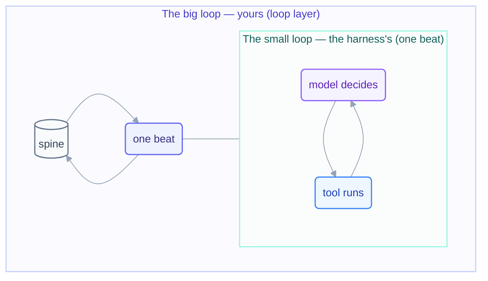

# Step 2 · The Four Layers

> Prompt → context → harness → loop. Locating which layer you're working in is the
> fastest way to know which tool fixes your problem.

## The hook

Two engineers hit the same bug: the agent keeps "fixing" a file it shouldn't touch.
One spends the afternoon rewording the prompt — politely, then firmly, then in caps.
The other adds a single deny rule to the harness permissions and moves on. Same
problem, different layer — only one of them was standing on the right floor of the
building.

## The four layers (plain English)

1. **Prompt** — the words you send this turn. Cheap to change, weakest guarantees.
2. **Context** — everything the model can see: rules files, open files, prior turns.
   You *curate* this layer; it's how the same prompt lands differently.
3. **Harness** — the vendor-built software shell around the model: tool execution,
   permissions, hooks. Guarantees live here, because code can't be persuaded.
4. **Loop** — the outer cycle *you* engineer: what to work on, when to run, when it's
   done, who checks. Judgment lives here.

The foundations page [the-four-layers.md](../00-foundations/the-four-layers.md) maps
the stack itself; this step adds the part that matters for looping: **the small loop
and the big loop are different layers.**

## The small loop vs. the big loop

Inside the harness there is already a loop — the model calls a tool, reads the
result, calls another, until the turn ends. You don't build that. What you build sits
one layer up:

```text
# the small loop — the harness runs this for you, inside ONE beat
while True:
    action = model.decide(context)
    if action.is_done: break
    context += harness.execute(action)   # tool call → result → back to model

# the big loop — YOU engineer this; each beat invokes the small loop once
while not stopping_condition_met():      # provable, or it isn't a stop
    read_spine()                         # durable state, not memory
    do_one_unit_of_work()                # one beat = one small-loop run
    update_spine_and_log()
```



Confusing the two produces the classic errors: expecting the harness to know when the
*project* is done (it only knows when a *turn* is done), or hand-building tool
plumbing the harness already does better.

## The layers in each tool

```claude
# Claude Code — live docs: https://docs.claude.com/en/docs/claude-code
# 1 Prompt:   what you type (or a /loop prompt)
# 2 Context:  CLAUDE.md, @file mentions, /context
# 3 Harness:  /permissions, hooks in .claude/settings.json
# 4 Loop:     /loop, scheduled tasks, your spine + rulebook (like this repo's LOOP.md)
```

```opencode
# OpenCode — live docs: https://opencode.ai/docs
# 1 Prompt:   opencode run "..."
# 2 Context:  AGENTS.md, attached files
# 3 Harness:  permission config in opencode.json
# 4 Loop:     shell timers / capped for-loops / CI schedules around `opencode run`
```

> [!NOTE]
> **Going deeper:** the harness-vs-loop boundary and the two debts it protects you
> from are in [concepts.md](../00-foundations/concepts.md). The rule of thumb from
> there applies verbatim here: **guarantees in the harness, judgment in the loop.**

## Check yourself

**Q: Your loop keeps committing to `main` even though the prompt says "always use a
branch." Which layer is failing, and which layer is the fix?**

<details><summary>Answer</summary>

The failure is at the **prompt/context layer** — prose rules are requests, not
guarantees. The fix belongs one layer down in the **harness**: a permission rule or
hook that blocks commits to `main` outright. Words ask; the harness enforces.

</details>

## Try With AI

In a throwaway repo, give your agent a rule in prose ("never edit files in
`legacy/`") and ask it to summarize its constraints — then, in a fresh session, give
the same rule as a harness permission and ask it to edit `legacy/anything.txt`.
Watch where each one fails. You've just measured the difference between layer 1 and
layer 3.

## When it goes wrong

| Symptom | Cause | Fix |
| --- | --- | --- |
| Re-prompting harder changes nothing | Problem lives below the prompt layer | Find the layer: context (missing rules?), harness (missing guard?), loop (missing stop?) |
| Agent forgets project rules every session | Rules live in chat, not context | Move them to the rules file (`CLAUDE.md` / `AGENTS.md`) |
| "The loop is smart, why does it repeat work?" | No spine — big-loop state kept in small-loop memory | Durable state file, read at every beat (Step 12) |
| Guardrail bypassed under pressure | Guarantee placed in prose | Move it to permissions/hooks — the harness can't be argued with |

---

*Glossary terms used on this page:* **harness**, **loop**, **beat**, **spine**,
**rules file** — see the [glossary](../00-foundations/glossary.md).
