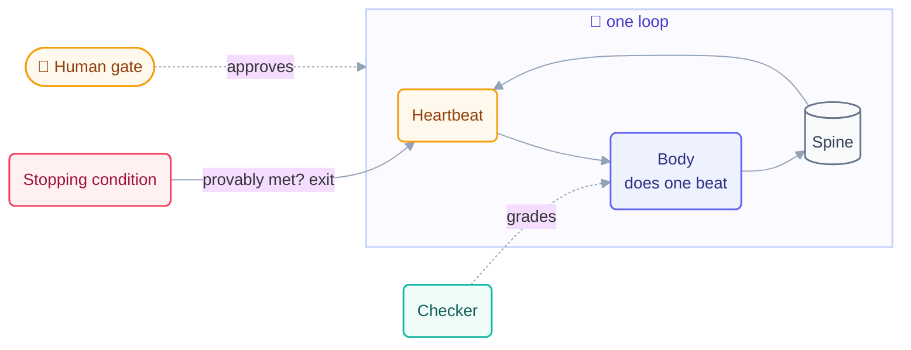

# Step 3 · Anatomy of a Loop

> Six parts, every loop, no exceptions: heartbeat, body, spine, stopping condition,
> checker, human gate. Learn the shape once and you can read any loop in the wild.

## The hook

Someone shows you their "AI automation" and asks why it ran all weekend and produced
nothing usable. You ask six questions: *When does it wake? What may it touch? What
does it remember? How does it know it's done? Who grades it? Where do you sign off?*
They can answer two. That's not an automation problem — that's four missing organs.

## The six parts (plain English)

| Part | Body metaphor | The question it answers |
| --- | --- | --- |
| **Heartbeat** | pulse | *when* does a beat start? (timer, condition, event) |
| **Body** | hands | *what* may it do and touch? (tools, permissions, scope) |
| **Spine** | memory | *what* survives between beats? (state file, run log) |
| **Stopping condition** | finish line | *how* does it provably end? (a fact, not a feeling) |
| **Checker** | second pair of eyes | *who* grades the work? (never the maker itself) |
| **Human gate** | signature | *where* does a person decide? (review, approve, ship) |

A loop missing any one of these has a name: no heartbeat is just a script you run; no
body limits is a hazard; no spine restarts from zero; no stop runs forever; no checker
grades itself; no human gate ships without an owner.



## The finish line, as pseudo-code

The stopping condition deserves its own moment, because it is where most loops are
actually broken. A stop must be a **fact a machine can check**:

```text
# real stops (provable)
all_boxes_checked("state.md")        # the spine says done
test_suite_exit_code == 0            # the world says done
runs_used >= MAX_RUNS                # the limit says stop anyway

# fake stops (feelings)
"stop when the docs look good"
"stop when you think you're finished"
```

Every loop in this repo stops on exactly three things — success, limit, or no
progress for 3 beats. "Feels done" is never one of them.

## A six-part loop in each tool

```claude
# Claude Code — live docs: https://docs.claude.com/en/docs/claude-code
> /loop Read state.md (SPINE). Take the FIRST unchecked item (BODY: one
  unit per beat). Check it off and log one line. Stop when every box is
  checked (STOPPING CONDITION) or after 20 runs (LIMIT).
# heartbeat: /loop's cycle · checker: a second read-only session or agent
# human gate: you review the diff before anything merges
```

```opencode
# OpenCode — live docs: https://opencode.ai/docs
# heartbeat + limit: a capped for-loop; spine: state.md; stop: grep
for i in $(seq 1 20); do
  grep -q "\[ \]" state.md || break     # stopping condition: no unchecked boxes
  opencode run "Read state.md. Do the FIRST unchecked item only. Check it off."
done
# checker: separate `opencode run` with a read-only prompt; gate: your review
```

> [!NOTE]
> **Going deeper:** it's not only for code. A content calendar, a paper-review queue,
> a hiring pipeline — anything with repeatable units, checkable done-ness, and a
> person accountable at the end can wear these six parts. The primitives behind each
> part are mapped per tool in the
> [primitives matrix](../00-foundations/primitives-matrix.md).

## Check yourself

**Q: A teammate's loop reads a todo file, does one item, ticks it off, and stops when
the file is empty. It's been perfect for weeks. Which parts is it still missing, and
why does that matter even though it "works"?**

<details><summary>Answer</summary>

The **checker** and the **human gate**. Nothing grades the work (the todo tick is the
maker grading itself), and nothing requires a person before results ship. It
"works" until the first beat that's confidently wrong — then there's no organ in the
system positioned to catch it. Weeks of green is luck wearing the costume of design.

</details>

## Try With AI

Take the loop you built in [Step 1](01-from-prompting-to-looping.md) and audit it
against the six parts — ask your agent: "For this loop, name its heartbeat, body,
spine, stopping condition, checker, and human gate. For any that are missing,
propose the smallest possible version." Add the two it's most likely missing (checker,
gate) and run one more beat.

## When it goes wrong

| Symptom | Cause | Fix |
| --- | --- | --- |
| Ran all weekend, nothing usable | No provable stop, no checker | Write the stop as a fact; add a grader that isn't the maker |
| Crash at beat 7 restarts at beat 1 | No spine | State file updated *every* beat, committed |
| Perfect for weeks, then a confident disaster | Maker grades itself | Separate checker (Step 11) + human gate before shipping |
| "It touched files it had no business in" | Body unscoped | One owner per path; permissions, not promises |

---

*Glossary terms used on this page:* **heartbeat**, **body**, **spine**, **stopping
condition**, **checker**, **human gate** — see the
[glossary](../00-foundations/glossary.md).
