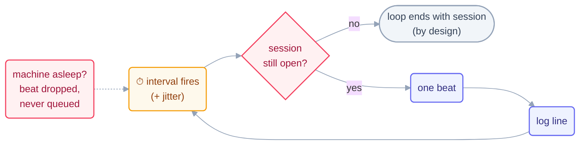

# Step 4 · In-Session Loops

> The gentlest heartbeat there is: a timer inside a session you're still sitting in.
> Everything about bigger loops is easier to learn here, where you can watch.

## The hook

You want the test suite checked every five minutes while you write a design doc. You
could set a phone alarm and alt-tab all afternoon — or you could type one line, keep
writing, and let the session's own pulse do the checking. Same afternoon, one less
job: that's an in-session loop.

## In-session heartbeats (plain English)

An **in-session loop** runs on a timer *inside* a live agent session. It's the
training-wheels heartbeat: you see every beat as it happens, you can interrupt at any
moment, and when the session ends, the loop ends with it. That last property is a
feature, not a bug — an in-session loop can never outlive your attention.

Two flavors matter:

- **Interval loops** — "every N minutes, do X." The beat fires on the clock.
- **Scheduled tasks** — "at these times, do X," managed by the harness's own
  scheduler (create/list/delete them like little cron entries).

The scheduler is a real system with real rules, and they're worth knowing before you
trust it: caps on how many tasks may exist (Claude Code's cron tools cap at **50
tasks**), automatic **expiry** (~3 days) so forgotten timers die on their own,
**jitter** so many tasks don't stampede at once, and **no catch-up** — a beat missed
while the machine slept is *dropped*, not replayed. Design for "misses are normal."



## The mechanics in each tool

```claude
# Claude Code — live docs: https://docs.claude.com/en/docs/claude-code
> /loop 5m Run the test suite. Report new failures only.   # interval loop
# Scheduled tasks: the Cron tools (CronCreate / CronList / CronDelete)
#   caps: ~50 tasks · ~3-day expiry · jitter · missed beats are NOT replayed
# Kill switch for all of it: the CLAUDE_CODE_DISABLE_CRON env var
```

```opencode
# OpenCode — live docs: https://opencode.ai/docs
# No built-in /loop — the shell IS the timer:
while sleep 300; do
  opencode run "Run the test suite. Report new failures only."
done
# For a persistent session to attach beats to, see `opencode serve` /
# attaching to a running server in the live docs.
```

> [!NOTE]
> **Going deeper:** in-session loops are Level-of-autonomy training grounds — this
> repo's own rule "L1 report-only first" (see [`LOOP.md`](../../LOOP.md)) exists
> because an in-session loop is the cheapest place to *watch* a loop earn trust.
> When the session must end but the loop must not, you've outgrown this heartbeat —
> that's [Step 6](06-unattended-schedules.md).

## Check yourself

**Q: Your laptop lid was closed from 12:00–13:00. Your 15-minute in-session loop was
supposed to fire four times in that window. How many beats run at 13:01, and why is
that the *right* answer?**

<details><summary>Answer</summary>

**At most one** — the next scheduled beat. The four missed beats are dropped, not
queued. That's right because catch-up would mean four stale beats stampeding at once
against a world that has moved on; a loop should always act on *now*, and a beat
that observes current state makes missed beats cost nothing.

</details>

## Try With AI

In a throwaway repo, start a report-only interval loop: "every 2 minutes, count the
TODO comments in `src/` and append the number with a timestamp to `todo-count.log`."
Let it run five beats while you do something else. Then read the log: you have just
run your first L1 loop, and the log *is* its spine.

## When it goes wrong

| Symptom | Cause | Fix |
| --- | --- | --- |
| Loop died at lunch | Session closed — in-session loops don't outlive it | Expected; promote to a schedule (Step 6) if it must survive you |
| Tasks silently stopped appearing | Scheduler cap (~50) or expiry (~3 days) hit | List tasks, prune dead ones; treat expiry as a feature |
| Beats bunch up / drift off the minute | Jitter — by design, to avoid stampedes | Don't build beats that assume exact times; read state, act on now |
| "It missed a beat and never made it up" | No catch-up, dropped-not-queued | Make each beat idempotent over current state, not over history |

---

*Glossary terms used on this page:* **heartbeat**, **beat**, **L1 (report-only)**,
**idempotent** — see the [glossary](../00-foundations/glossary.md).
