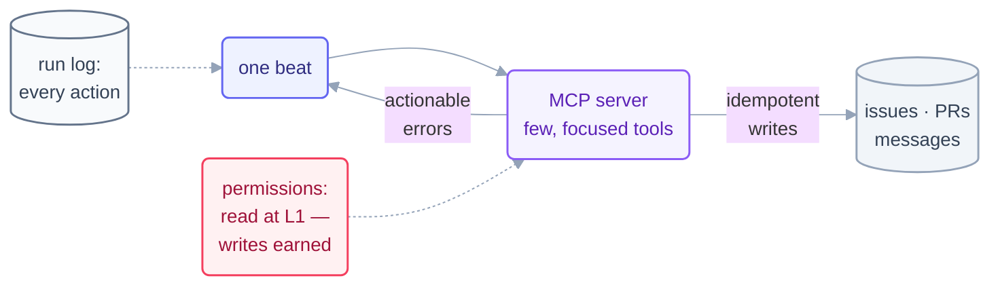

# Step 10 · Connectors (MCP)

> Without connectors a loop can only talk about the world. With them it can act on
> issues, PRs, and messages — which is exactly why the rules for connectors are
> stricter than for anything else in the body.

## The hook

Your triage loop writes a beautiful nightly report: "issue #482 duplicates issue
number 291 — recommend closing." It has written that same line for four nights, because
recommending is all it can do. Wire it to the issue tracker and the beat becomes:
*linked, labeled, closed, one line logged.* Same intelligence — the difference is
hands.

## Act vs. talk (plain English)

**MCP (Model Context Protocol)** is the standard plug by which agents reach external
systems: an MCP server exposes a system (GitHub, a database, a mail box) as a set of
**tools** the agent can call. Connectors are the loop's **hands** — the part of the
body that touches the world outside the repo.

Hands raise the stakes. A bad file edit is caught by git; a bad *email* is caught by
nobody. So connector design follows three rules:

1. **Few, focused tools.** Expose the five tools the loop's job needs, not the
   fifty the API offers. Every extra tool is surface for a confused beat. A loop
   that only triages issues needs `search`, `label`, `comment`, `link`, `close` —
   it does not need `delete_repository`.
2. **Idempotent writes.** Beats retry and events double-fire (Step 7). An action
   applied twice must equal it applied once: "ensure label X is on issue N" beats
   "add label X" — and dedupe against the spine before acting.
3. **Actionable errors.** When a call fails, the error must tell the *model* what to
   do next ("rate-limited, retry after 60s" / "issue is locked — skip and log"), not
   just fail. A loop can't ask you what an opaque 400 means at 3 am.



## The mechanics in each tool

```claude
# Claude Code — live docs: https://docs.claude.com/en/docs/claude-code
# Register an MCP server (project-scoped, in .mcp.json or via CLI):
claude mcp add github -- npx -y @modelcontextprotocol/server-github
# Loop beats then see tools like mcp__github__* — gate them the same
# way as files: allow reads at L1; writes are earned, per-tool, in
# /permissions. GitHub also works tool-free via the gh CLI — prefer
# the smallest hands that do the job.
```

```opencode
# OpenCode — live docs: https://opencode.ai/docs
# MCP servers are configured in opencode.json ("mcp": { … }) — same
# protocol, same servers. Same discipline: register few servers,
# allow write tools explicitly, log every action the beat takes.
```

> [!NOTE]
> **Going deeper:** connectors are where the L1→L2→L3 ladder bites hardest — this
> repo's own loops ran *file-only* on Day 1–2 precisely to keep the blast radius at
> "a weird commit." The rules for granting hands live in
> [operating/safety.md](../operating/safety.md); the per-tool mapping is in the
> [primitives matrix](../00-foundations/primitives-matrix.md).

## Check yourself

**Q: A retried beat just posted the same PR comment twice, and last week a beat
called a `delete_branch` tool nobody remembers allowing. Which two of the three
connector rules were broken?**

<details><summary>Answer</summary>

**Idempotent writes** — a retry must not double-post; the beat should have checked
"is my comment already there?" (or the tool should be "ensure-comment"). And **few,
focused tools** — `delete_branch` had no business being exposed to a comment loop;
every unneeded tool is a loaded option for a confused beat. (The third rule,
actionable errors, is what keeps failures from becoming silent no-ops.)

</details>

## Try With AI

Wire one read-only connector into a throwaway project (the GitHub MCP server against
a scratch repo works well). Run an L1 beat: "list open issues, propose labels,
take no action." Then look at the tool list the server exposed and count the tools
your loop's job actually needs. Write the allowlist you'd grant before this loop
ever earned writes — that list *is* your connector design.

## When it goes wrong

| Symptom | Cause | Fix |
| --- | --- | --- |
| Duplicate comments/labels after retries | Non-idempotent writes | "Ensure"-shaped actions; dedupe against the spine before acting |
| Beat did something no one granted | Over-broad tool surface | Few, focused tools; explicit per-tool allowlist |
| Loop stalls on every API hiccup | Opaque errors | Errors that say what to do next; retry/skip/escalate logic in the loop |
| An email/comment went out that shouldn't have | Hands granted before trust | External writes are L3-grade: earn them last, gate them hardest |

---

*Glossary terms used on this page:* **MCP**, **connector**, **idempotent**,
**blast radius** — see the [glossary](../00-foundations/glossary.md).
