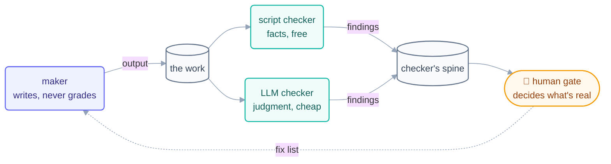

# Step 11 · Maker–Checker

> The oldest control in banking, ported to loops: the hand that writes is never the
> hand that approves. One cheap read-only grader turns "probably fine" into a system.

## The hook

Day 1 of building *this course*, the run log recorded a quiet, perfect moment:
`items_found: 3, actions_taken: 0`. The checker loop had found three problems in the
maker's pages — and fixed none of them, because fixing wasn't its job. The maker
fixed them the next beat. That boring pair of numbers is the whole pattern working.

## Writer ≠ grader (plain English)

A loop that grades its own work will always, eventually, find its own work
acceptable — not from vanity but from shared blind spots: the misreading that
produced the bug also passes the self-review. The **maker–checker** split breaks the
blind spot with structure:

- The **maker** does the work. It may write its files, tick its spine — and it
  *cannot* declare the work good.
- The **checker** grades the work against a rubric. It is **read-only on the work**
  — it *cannot* fix anything, which is exactly what makes its findings trustworthy.

The checker can be three things, in rising cost: a **script** (link checker, linter
— cheapest, never has an opinion), a **read-only LLM session** with a rubric
(LLM-as-judge — catches judgment-shaped problems scripts can't), or a **human** (the
gate — final, expensive, reserved for what matters). Use the cheapest checker that
can actually catch the failure you fear; a read-only LLM beat costs a fraction of a
maker beat (this repo's Day 1 checker used ~3% of its token budget in one run).

**The dynamic-workflows interlude:** a *workflow* (fixed steps, deterministic
order) isn't a rival to loops — a workflow is the **body of one beat**. The loop
decides *when* and *whether*; the workflow inside the beat does *how*; the checker
grades what came out.



## The mechanics in each tool

```claude
# Claude Code — live docs: https://docs.claude.com/en/docs/claude-code
# Maker (may write docs/):
> /loop Read state.md. Write the FIRST unchecked page. Check it off.
# Checker (separate loop/agent, read-only on docs/ by permissions):
> /loop 20m Grade each newly finished page against the rubric in
  loop.md. Write PASS/FAIL to YOUR OWN state.md. Never edit the pages.
# Subagents work too: a read-only "verifier" agent graded per beat.
```

```opencode
# OpenCode — live docs: https://opencode.ai/docs
# Same split as two runs with different permissions (opencode.json):
opencode run "Write the next unchecked page per state.md…"          # maker
opencode run "READ-ONLY: grade the newest pages against rubric.md;
  append PASS/FAIL to review-notes.md; never edit the pages."       # checker
```

> [!NOTE]
> **Going deeper:** this pattern is running in the repo you're reading —
> [`loops/day2/template-checker/`](../../loops/day2/template-checker/loop.md) grades
> the very page in front of you against a 9-row rubric it cannot edit. When the
> checker can be a *script*, prefer it: see the link-check loop's
> [provability note](../../loops/day1/link-check/loop.md).

## Check yourself

**Q: To save tokens, a team merges their maker and checker into one loop that
"self-reviews before committing." Reviews pass 100% for a month. Why is that number
evidence *against* the design rather than for it?**

<details><summary>Answer</summary>

Because a 100% pass rate from a self-grading maker measures *agreement with itself*,
not quality. Whatever blind spot produces a defect also produces the approving
review — the failures aren't being caught, they're being co-signed. A separate
checker's value shows up precisely as the findings a self-review would never file:
`items_found > 0` with `actions_taken: 0`.

</details>

## Try With AI

Take any finished piece of agent work and run a read-only checker over it: give a
fresh session a 5-row rubric and the instruction "grade only — you may not fix."
Compare its findings with what the maker said about its own work in the transcript.
The delta between those two reports is the exact value of the split — measured, in
one experiment, on your own repo.

## When it goes wrong

| Symptom | Cause | Fix |
| --- | --- | --- |
| Checker "fixed" the pages itself | Checker has write access to the work | Permissions, not promises: read-only on the work, write-only to its spine |
| Findings vanish between runs | Checker reports to chat / uncommitted file | Findings go in the checker's **committed** spine (this repo learned this the hard way) |
| Checker rubber-stamps everything | No rubric — "review this" | Explicit rubric rows; PASS/FAIL per row, one line on what's missing |
| Checker costs as much as the maker | Full-context grading of everything | Grade the diff, not the repo; scripts for facts; LLM only for judgment |

---

*Glossary terms used on this page:* **maker–checker**, **LLM-as-judge**,
**workflow**, **human gate** — see the [glossary](../00-foundations/glossary.md).
