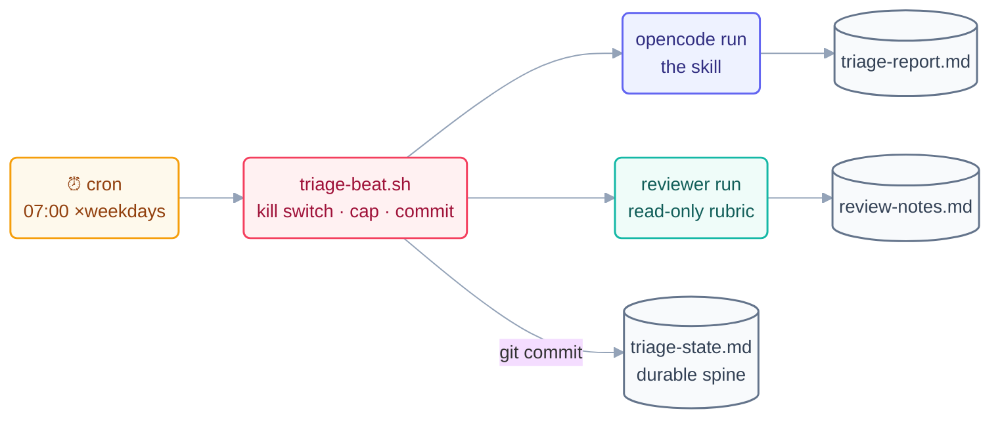

# Step 13b · The Morning-Triage Loop in OpenCode

> The same loop as [13a](13a-claude-code-walkthrough.md) — same skill text, same
> rubric, same spine — with the heartbeat and guardrails built from parts you can
> see: cron, a shell wrapper, and a permissions config. Nothing is magic twice.

## The hook

If 13a felt like assembling furniture, 13b is building the same piece from lumber.
Every organ the platform provided there, you'll wire by hand here — which is exactly
why building the loop *twice* is the exercise: afterwards you'll know which parts
are the tool and which parts are the **shape**.

## Build order (same order, different lumber)

**1. The spine** — identical file, identical rule: `triage-state.md`, committed
before the first beat.

**2. The skill** — the same `daily-triage` text from
[Step 13](13-build-the-loop-twice.md), stored as `skills/daily-triage.md`. OpenCode
loads project instructions from `AGENTS.md` — add one line there: *"For morning
triage, follow `skills/daily-triage.md` exactly."*

**3. The reviewer** — the same rubric as an agent config (see agents in the live
docs) or, simplest portable form, a second read-only run whose prompt *is* the
rubric.

**4. The heartbeat + the beat wrapper** — cron (or any scheduler) calling a wrapper
script that enforces the loop discipline around the agent run:

```opencode
# OpenCode — live docs: https://opencode.ai/docs
# triage-beat.sh — the BODY of one beat, discipline included:
#!/usr/bin/env bash
set -euo pipefail
cd "$(dirname "$0")"
grep -q "pause: on" loop-pause 2>/dev/null && exit 0        # kill switch
[ -f ".ran-$(date +%F)" ] && exit 0                          # daily cap: 1
opencode run "Follow skills/daily-triage.md. Report only."   # the beat
opencode run "READ-ONLY: grade triage-report.md against the rubric in
  skills/daily-triage.md; append PASS/FAIL to review-notes.md."
touch ".ran-$(date +%F)"                                     # cap marker
git add triage-report.md triage-state.md review-notes.md
git commit -qm "triage beat $(date -u +%F)"                  # spine durability
# crontab: 0 7 * * 1-5 /home/you/repo/triage-beat.sh
```

```claude
# (The Claude Code twin of this build — Routine or `claude -p` cron,
#  permissions via /permissions — is 13a:)
# → 13a-claude-code-walkthrough.md
```

**5. Permissions** — in `opencode.json`, restrict tool access for this project:
read-broad, write-narrow (the three files). The wrapper adds a second fence: even a
confused beat can't exceed a `set -euo pipefail` script that only commits three
paths.



## The first real morning

Same graduation rule as 13a: run `./triage-beat.sh` by hand tonight, watched, and
grade the output. PASS → arm the crontab line. If your machine sleeps at 7 am,
that's not a bug in the loop but a fact about cron — move the same wrapper into a
GitHub Actions `schedule:` job and it runs machine-off (the Step 6 trade, made
concrete).

> [!NOTE]
> **Going deeper — what building it twice taught:** line the two builds up. The
> **shape** (six parts, L1 first, spine-first, rehearse-then-arm) appeared in both,
> untouched. Only the **plumbing** moved: Routine ↔ cron, `/permissions` ↔
> `opencode.json` + wrapper, subagent ↔ second run. That split — durable shape,
> swappable plumbing — is the course's "lasting vs. mechanical layer" rule made
> physical, and it's why the loop library (Day 3) ships per-tool kits from one
> shared `LOOP.md` spec.

## Check yourself

**Q: The wrapper script implements three of the seven minimum-safe checklist items
itself, without the agent's cooperation. Which three, and why does it matter that
they're in bash rather than in the prompt?**

<details><summary>Answer</summary>

The **kill switch** (pause-file check), the **run limit** (daily-cap marker file),
and the **spine durability** (unconditional `git commit`). In bash they're
*harness-layer guarantees* — they hold even if the model has its worst beat ever;
in the prompt they'd be requests to the very process they're meant to bound. Same
lesson as Step 2: guarantees live below the layer they constrain.

</details>

## Try With AI

Build it: the wrapper, the skill file, the `AGENTS.md` line, the crontab entry —
then run the rehearsal beat. When it PASSes, do one more thing 13a couldn't:
`cat triage-beat.sh` and label each line with the loop organ it implements. A loop
you can annotate line-by-line is a loop you actually understand.

## When it goes wrong

| Symptom | Cause | Fix |
| --- | --- | --- |
| Beat ran twice on the same day | Cap marker not written (script died early) | `set -euo pipefail` + write the marker only after commit succeeds |
| Cron fired, nothing happened | Environment differs under cron (PATH, cwd) | Absolute paths in the wrapper; `cd` first; log stderr to a file |
| Report/spine changes vanished | No commit in the wrapper | The commit line is an organ, not housekeeping |
| Machine asleep at 7 am | Local cron's nature | GitHub Actions `schedule:` for machine-off mornings |

---

*Glossary terms used on this page:* **wrapper**, **kill switch**, **daily cap**,
**lasting vs. mechanical layer** — see the [glossary](../00-foundations/glossary.md).
