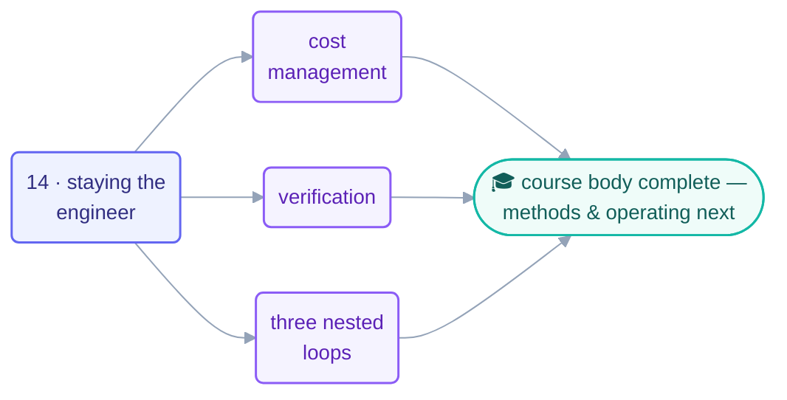

# Part 6 · Human Control

> The course ends where accountability lives: with you. Four pages on the job that
> can't be automated — paying for, verifying, and understanding what your loops do,
> inside a structure that keeps every decision human.

## The steps

| Step | Page | One-line takeaway |
| --- | --- | --- |
| 14 | [Staying the Engineer](14-staying-the-engineer.md) | cost + verification + comprehension; prove before overnight; resist AI gravity |
| — | [Cost Management](cost-management.md) | caps before first run; the 80% tripwire; budgets stop runaway cost, you stop pointless cost |
| — | [Verification](verification.md) | green ≠ done: scripts → checker → outcome check → human spot-read |
| — | [The Three Nested Loops](the-three-nested-loops.md) | agent < engineer < governance; every arrow points inward |

## Where to next

The 14 steps taught the *shape*; two layers turn it into daily practice: the
[methods pages](../methods/make-your-own-loop.md) (design your own loop, A–F) and
the [operating handbook](../operating/operating-loops.md) (running fleets without
surprises). Both belong to this part's track.

## Check your understanding

[Take the Part 6 quiz](quiz.md) · [drill the flashcards](flashcards.md)

*This part belongs to track [T3 · Engineer](../learning-tracks.md).*
