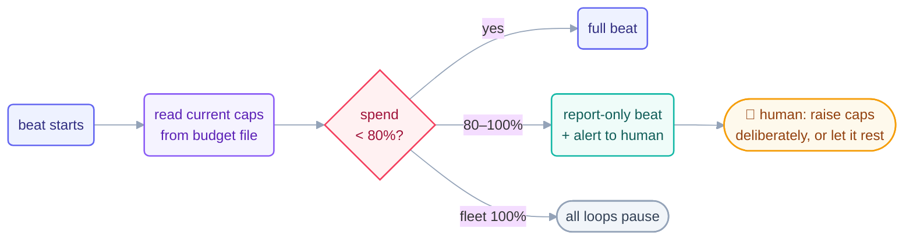

# Cost Management

> A loop spends tokens the way a tap spends water: silently, on a schedule, and
> forever — unless someone owns the meter. That someone is you.

## The hook

Mid-afternoon on Day 1 of building this course, the page-writer loop stopped itself:
*≈79% of the daily token cap, 6 items left, switching to report-only.* Nobody was
watching the meter — the meter was watching itself, because a budget rule put a
tripwire there. The human read the alert, raised the caps deliberately, and the loop
finished. That alert is still in
[`shared/loop-budget.md`](../../shared/loop-budget.md) — cost management, working.

## The practice (plain English)

- **Budget per loop, cap per day.** Every loop declares max runs/day and max
  tokens/day *before it first runs* — a loop without a cap is a blank check with a
  heartbeat. Keep the numbers in one shared file the whole fleet reads.
- **The 80% tripwire.** At 80% of any cap, the loop drops to report-only and says
  so. (Measure against the cap *as it reads now* — this repo once ran to 90%
  because the tripwire checked a stale number. The fix is one line in the budget
  file.)
- **Know your loop economics.** Read-only checkers are an order of magnitude
  cheaper than makers — this repo's Day 1 checker used ~3% of its budget while the
  maker used ~90% of its raised one. Corollary: when in doubt, add a checker, not
  a bigger maker beat.
- **Estimate, then measure.** Before a loop runs: rough tokens/beat × beats/day.
  After a week: the run log's `tokens_estimate` column tells you what it *actually*
  costs, and whether the loop earns its bill.



## The meters in each tool

```claude
# Claude Code — live docs: https://docs.claude.com/en/docs/claude-code
/cost                     # current session spend
# Fleet accounting = your run log, by design:
#   every beat appends {"tokens_estimate": …} — grep and sum per loop.
# Budget discipline as a skill: this repo's loop-budget skill reads
# shared/loop-budget.md before and after every run.
```

```opencode
# OpenCode — live docs: https://opencode.ai/docs
# Per-run usage appears in output/logs (see live docs); fleet-level is
# the same run-log discipline:
grep step-writer shared/loop-run-log.md \
  | grep -o '"tokens_estimate": [0-9]*' | awk '{s+=$2} END {print s}'
```

> [!NOTE]
> **Going deeper:** cost isn't only tokens — it's your attention (reports you must
> read) and CI minutes (loops promoted into workflows). The same cap-and-tripwire
> shape works for all three. Fleet-level budget arithmetic — priority order, which
> loop to pause first — is in [multi-loop](../operating/multi-loop.md).

## Check yourself

**Q: Your nightly loop costs 60k tokens and its report has changed your behavior
zero times in three weeks. The cap says it can keep running. Should it?**

<details><summary>Answer</summary>

No — the cap answers "may it spend?", never "is it worth it?" A report nobody acts
on is a loop whose *value* is zero while its cost compounds nightly. Retire it,
shrink its cadence, or change what it reports until it changes decisions. Budgets
stop runaway cost; only the engineer stops pointless cost.

</details>

## Try With AI

Compute this repo's actual Day 2 bill: have your agent sum `tokens_estimate` per
pattern from `shared/loop-run-log.md`, then compare against the caps in
`shared/loop-budget.md`. Which loop was closest to its tripwire? Would you have set
the caps differently — and what would you set for *your* first loop, given these
real numbers?

## When it goes wrong

| Symptom | Cause | Fix |
| --- | --- | --- |
| Surprise bill at month's end | No caps, or caps nobody reads | Caps in one shared file, read at every beat start |
| Loop blew past its tripwire | Tripwire measured a stale cap | 80% of the cap *as currently written* — re-read each beat |
| Fleet starves the important loop | No priority order in the budget | Rank loops; pause lowest-value first (labs before checkers) |
| Caps raised in a panic mid-run | Alert had no process | Alert → human reads context → deliberate raise, logged (like Day 1's) |

---

*Glossary terms used on this page:* **token budget**, **tripwire**, **report-only**,
**kill switch** — see the [glossary](../00-foundations/glossary.md).
