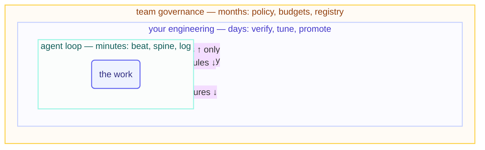

# The Three Nested Loops

> The agent's loop is the smallest of three. Yours turns slower around it; the
> team's turns slower still — and every safety property this course teaches lives
> in the gap between two of them.

## The hook

"Who decided the triage loop could close issues?" Four people look at each other.
The loop didn't decide — loops can't. Somebody promoted it, or nobody did and it
drifted. The question that finds the answer is always the same: *which loop was
supposed to make that call, and when did it last actually turn?*

## The three loops (plain English)

1. **The agent's loop — turns in minutes.** Beat, spine, log, repeat. Everything
   in Parts 1–5. It produces *work* — and it is structurally incapable of judging
   whether it should exist, what it should cost, or what it may touch next.
2. **Your engineering loop — turns in days.** Read the run log, verify outcomes,
   tune skills and rubrics, promote or demote one level, retire what stopped
   earning its cost. It produces *decisions about loops*. Step 14's weekly beat is
   this loop's heartbeat.
3. **The team's governance loop — turns in weeks or months.** Budgets, permission
   policy, the loop registry, what L3 requires, what happens after an incident. It
   produces *rules about deciding*. At org scale this is where accountability
   provably lives — a named owner per loop, or the loop doesn't run.

The load-bearing property: **every arrow points inward.** Outer loops configure
inner ones; inner loops *report* outward but never configure anything above them.
Each nesting violation is a named anti-pattern: a loop raising its own caps (inner
writing outer — the reason this repo's budget file is human-owned), a loop
promoting itself ("the reviews were all passing anyway" — AI gravity as
architecture), a team letting the fleet's behavior *define* policy because nobody
wrote any (governance by drift).



## The outer loops, made concrete

```claude
# Claude Code — live docs: https://docs.claude.com/en/docs/claude-code
# Loop 2 (yours) is literally runnable — a weekly engineer's beat:
> Read shared/loop-run-log.md and each loops/*/state.md. Per loop:
  cost, escalations, incidents. Recommend promote/hold/demote/retire
  with one line of reasoning each. I decide; you draft.
# Loop 3 (team) lives in files like this repo's LOOP.md ownership map
# and loop-constraints.md — human-owned, loop-read, never loop-written.
```

```opencode
# OpenCode — live docs: https://opencode.ai/docs
# Same shape — outer loops are prompts + human-owned config:
opencode run "READ-ONLY: audit loops/*/loop.md against what each loop
  actually did per the run log. Flag any capability drift."
# Governance artifacts: AGENTS.md, the budget file, the ownership map —
# version-controlled, reviewed like code, owned by named humans.
```

> [!NOTE]
> **Going deeper:** the outer two loops are why this course insists loops are an
> *engineering* discipline, not an automation trick — the T4 track (`advanced/`,
> Day 3) is entirely about loops 2 and 3: hill-climbing (loop 2 improving loop 1
> systematically), fleet coordination, enterprise governance. The recovery playbook
> in [operating](../operating/recovery-playbook.md) is loop 2's incident procedure.

## Check yourself

**Q: This repo's Day 1 page-writer hit its token tripwire, stopped, and asked. A
human raised the caps and it finished. Walk that event through the three loops —
what did each one do?**

<details><summary>Answer</summary>

**Loop 1** detected 79% spend, self-throttled to report-only, wrote the alert, and
stopped — reporting *upward*, changing nothing above itself. **Loop 2** (the human)
read the alert with context, decided the work justified more budget, and raised the
caps — the *outer* loop reconfiguring the inner. **Loop 3** had already made that
interaction inevitable: the rule "budget file is human-owned; 80% → report-only"
was governance written *before* the incident. Every arrow pointed inward; that's
why the story is boring — and boring is the goal.

</details>

## Try With AI

Draw the three loops for your own situation — even if loop 1 doesn't exist yet.
Loop 2: what would your weekly engineer's beat check, in five lines? Loop 3: who
besides you would need to agree before your first loop earned write access — and
where would that decision be written down? If loop 3's answer is "nobody and
nowhere," you've found your actual first task.

## When it goes wrong

| Symptom | Cause | Fix |
| --- | --- | --- |
| Loop raised its own limits | Inner loop writing outer loop's files | Ownership map: budgets/policy human-owned; harness-enforce it |
| Capabilities grew, no decision on record | Loop 2 stopped turning; drift filled the gap | Calendar the engineer's beat; capability changes are written decisions |
| "Whose loop is this?" has no answer | Loop 3 never existed | Registry with a named owner per loop; no owner, no run |
| Policy is whatever the fleet already does | Governance by drift | Write the rules the fleet must fit — then audit fit, don't ratify drift |

---

*Glossary terms used on this page:* **nested loops**, **promotion/demotion**,
**governance**, **hill-climbing** — see the
[glossary](../00-foundations/glossary.md).
