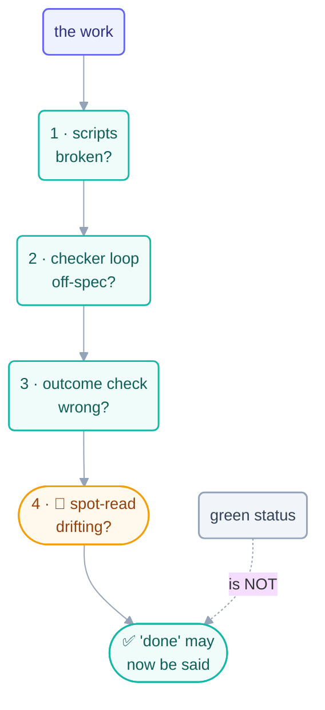

# Verification

> Green ≠ done. A loop's status tells you it *finished*; only verification tells
> you it was *right* — and the two come apart exactly when it matters most.

## The hook

The run log says `outcome: success` twenty times in a row. The website the loop was
"maintaining" has rendered a blank page since Tuesday. Nothing lied: the loop
finished every beat, updated its spine, exited zero. Finishing was never the same
thing as working — and no one had a beat anywhere whose job was to notice.

## The practice (plain English)

Verification is a **layered** habit — each layer catches what the one below can't
see:

1. **Script checks** — the free layer. Links resolve, tests pass, build exits 0,
   report matches template. Run on every beat; never trust a beat that skipped
   them. *Catches: broken.*
2. **Checker loops** — the cheap layer. A read-only grader with a rubric
   ([Step 11](../part-3-the-body/11-maker-checker.md)) verifying shape and
   consistency. *Catches: malformed, off-spec.*
3. **Outcome checks** — the layer scripts can't reach: is the *actual goal* served?
   The deployed page renders, the triage ranking matches what mattered, the
   "fixed" bug stays fixed. Drive the affected flow end-to-end, don't just check
   its artifacts. *Catches: wrong.*
4. **The human spot-read** — the gate. Sample the work like an editor: one page
   per part, one PR per day, chosen *by you*, not by the loop. *Catches: drift you
   didn't know to write a rule for.*

The discipline that binds them: **verify before declaring, at every level.** A loop
verifies before ticking its spine; a checker verifies before PASSing; the human
verifies before the checkpoint. This repo's rulebook says it in four words — *the
maker never grades its own work* — and its checkpoints exist because rule 12 of
[`CLAUDE.md`](../../CLAUDE.md) demands verification before "done" is ever declared.



## The habit in each tool

```claude
# Claude Code — live docs: https://docs.claude.com/en/docs/claude-code
# Bake layer 1 into the loop prompt itself:
> /loop … After writing the page, RUN the link check and lint before
  ticking the box. A beat that skips verification is a failed beat.
# Layer 3 as its own small loop (this is Day 4's render-checker):
> /loop Read render-state.md. Load the next page's route; confirm it
  renders with no console errors. Check it off; log failures.
```

```opencode
# OpenCode — live docs: https://opencode.ai/docs
# Layer 1 in the wrapper (the beat fails if verification fails):
opencode run "Write the next page per state.md" && \
  npx markdownlint-cli2 "docs/**/*.md" && \
  lychee --offline "docs/**/*.md" || echo "beat FAILED verification"
```

> [!NOTE]
> **Going deeper:** the observability instruments that make verification cheap —
> the run log as narrative, escalations as signal, reading a fleet's week in five
> minutes — get their own page in
> [operating/observability.md](../operating/observability.md). The failure this
> practice prevents has a name and a page too: *green ≠ done* in
> [failure modes](../operating/failure-modes.md).

## Check yourself

**Q: Your CI is green, your checker loop PASSes every page, and your users say the
search feature the loop "finished" last week returns nothing. Which verification
layer was missing, and why did layers 1–2 not catch it?**

<details><summary>Answer</summary>

Layer 3 — the **outcome check**. Scripts verified artifacts (files exist, lint
passes) and the checker verified *shape* (pages match template); neither ever
exercised the actual behavior — running a search and looking at results. Layers 1–2
can only catch failures that live in the artifacts they inspect; "finished but
doesn't work" lives in the running system, which only an end-to-end check visits.

</details>

## Try With AI

Pick any "done" item from a recent agent session and verify it at all four layers:
run the scripts, grade it against a rubric in a fresh read-only session, drive the
actual flow end-to-end, then spot-read the diff yourself. Score each layer
pass/fail. Most people find their first "green but wrong" within the first three
tries — finding yours now, on purpose, is the whole exercise.

## When it goes wrong

| Symptom | Cause | Fix |
| --- | --- | --- |
| "Success" for weeks, product broken | Only layer-1 checks existed | Add the outcome check — drive the flow, not the artifacts |
| Checker PASSes garbage | Rubric checks shape, goal drifted | Human spot-reads sample *content*; update the rubric when drift found |
| Verification skipped when beats run long | Verification optional in the prompt | Make it the beat's exit condition: no verify, no tick |
| Human gate rubber-stamps | Gate reviews everything, attention died | Sample small, sample randomly, sample *deliberately* |

---

*Glossary terms used on this page:* **green ≠ done**, **outcome check**,
**spot-read**, **checkpoint** — see the [glossary](../00-foundations/glossary.md).
