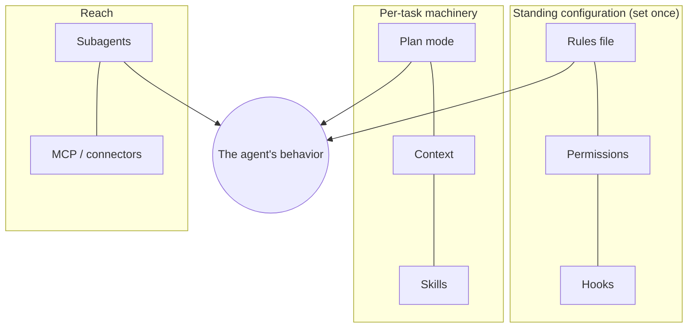

# Agentic Coding Primer

> The eight primitives your agent already has — the raw parts every loop is built from.

## The hook

You ask your agent to "clean up the failing tests." It edits four files, runs the
suite, opens a plan for the risky part, and asks permission before touching CI config.
None of that was in your prompt. Where did that behavior come from? From eight
primitives that were configured before you typed a word — and loop engineering is the
craft of configuring them *deliberately*.

## The eight primitives (plain English)

| Primitive | What it is | Loop-engineering job |
| --- | --- | --- |
| **Plan mode** | Agent proposes before it acts | Rehearse a loop's behavior safely |
| **Permissions** | What the agent may do without asking | The L1→L3 ladder lives here |
| **Context** | What the agent can see (files, history) | Keep beats cheap; avoid drowning |
| **Rules file** | Standing instructions loaded every session | A loop's "constitution" (`CLAUDE.md`, `AGENTS.md`) |
| **Skills** | Packaged, reusable instruction sets | A loop's trained moves |
| **Hooks** | Code that runs on agent events | Mechanical guardrails no prompt can skip |
| **Subagents** | Focused workers spawned for a subtask | Maker/checker separation |
| **MCP / connectors** | Bridges to external tools & data | A loop's senses beyond the repo |



## See them in your tool

```claude
# Claude Code — live docs: https://docs.claude.com/en/docs/claude-code
# rules file:   CLAUDE.md at the repo root (loaded every session)
# permissions:  /permissions   ·  plan mode: shift+tab (or /plan)
# skills:       .claude/skills/<name>/SKILL.md, invoked as /<name>
# hooks:        .claude/settings.json → "hooks"
# subagents:    .claude/agents/<name>.md
# MCP:          claude mcp add <server>
```

```opencode
# OpenCode — live docs: https://opencode.ai/docs
# rules file:   AGENTS.md at the repo root
# permissions:  opencode.json → "permission"
# plan mode:    switch agent to "plan"
# skills:       skills/ directory  ·  subagents: "agent" config
# MCP:          opencode.json → "mcp"
```

> [!WARNING]
> Exact flags and file names shift often — the shapes don't. When a command here and
> the tool's live docs disagree, the docs win.

> [!NOTE]
> **Going deeper:** this repo practices what it teaches — its own `CLAUDE.md` is a
> rules file, its loop guardrails live in `loop-constraints.md`, and its checker runs
> as a separate reviewer. Browse them from the repo root after this page.

## Check yourself

**Q: You want a guarantee that no loop can ever edit `.env`, even if a prompt asks it
to. Which primitive — rules file or hooks/permissions — and why?**

<details><summary>Answer</summary>

**Hooks/permissions.** A rules file is an instruction the model reads and follows —
strong, but ultimately advisory. Permissions and hooks are *enforced by the harness*:
the edit is blocked mechanically no matter what the prompt says. Rule of thumb: put
intent in rules, put guarantees in permissions and hooks.

</details>

## Try With AI

In your sandbox repo:

> 1. Create a `CLAUDE.md` (or `AGENTS.md`) with one rule: "Always run the test suite
>    before claiming a task is done."
> 2. Ask your agent to fix any small thing, and watch whether it obeys the rule.
> 3. Then ask it: "Which of your eight primitives did that rule use, and which would
>    make it *unbreakable*?"

## When it goes wrong

| Symptom | Cause | Fix |
| --- | --- | --- |
| Agent ignores your standing instruction | Rule buried in a huge rules file | Rules files are context too — keep them short and binding |
| Agent asks permission for everything | Permission mode too strict for the task | Loosen for the session, not globally; keep write-paths narrow |
| Agent confidently edits the wrong module | Context too broad or too stale | Point it at specific files; start a fresh session for new work |
| A "safety rule" was talked around | Guarantee placed in prose, not machinery | Move it from the rules file into permissions or a hook |

---

*Attribution: this page condenses ideas from Panaversity's Agentic Coding Crash Course
(source 2 in [../../resources/sources.md](../../resources/sources.md)).*

*Glossary terms used on this page:* **primitive**, **rules file**, **hook**,
**subagent**, **MCP** — see [../00-foundations/glossary.md](../00-foundations/glossary.md).
