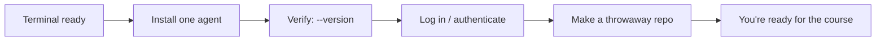

# Environment Setup

> Get one AI coding agent installed and verified. Fifteen minutes, once.

## The hook

Every lab in this course ends with *your agent* doing something while you watch. None
of that works if page one of your journey is a `command not found`. Set up now, verify
once, never think about it again.

## What you need (plain English)

Three things, in order:

1. **A terminal you're comfortable in** (macOS/Linux shell or Windows with WSL).
2. **One agent installed** — Claude Code or OpenCode is enough for every lesson;
   Codex and Grok are optional extras shown where their mechanics differ.
3. **A throwaway practice repo** — loops learn by doing, and you'll want a sandbox
   where mistakes cost nothing.

> [!WARNING]
> **Mechanics change weekly.** The commands below are the *shape* of installation, not
> gospel. The authoritative install steps are always the tool's live docs — linked in
> each section. If a command here disagrees with the official docs, the docs win.



## Install and verify

```claude
# Claude Code — live docs: https://docs.claude.com/en/docs/claude-code
npm install -g @anthropic-ai/claude-code
claude --version
claude   # first run walks you through login
```

```opencode
# OpenCode — live docs: https://opencode.ai/docs
curl -fsSL https://opencode.ai/install | bash
opencode --version
opencode auth login
```

Optional extras, same pattern (install → `--version` → authenticate): **Codex** (see
OpenAI's live docs) and **Grok CLI** (see xAI's live docs).

## Make your sandbox

```claude
mkdir loop-sandbox && cd loop-sandbox && git init
claude "create a tiny node project with one failing test"
```

```opencode
mkdir loop-sandbox && cd loop-sandbox && git init
opencode run "create a tiny node project with one failing test"
```

That failing test is deliberate — it's the raw material for your first loop in Project 1.

> [!NOTE]
> **Going deeper:** why a *throwaway* repo? Because week-1 loops run at L1
> (report-only) precisely so mistakes are cheap — the same reason this repo's own
> loops started report-only. The full permission ladder (L1→L3) is in the
> [agentic coding primer](agentic-coding-primer.md).

## Check yourself

**Q: The install command in this page fails with an error you don't recognize. What's
the *course-approved* first move?**

<details><summary>Answer</summary>

Open the tool's **live documentation** (linked above), not a search engine and not
this page. Mechanics change weekly; this course teaches lasting shapes and treats
commands as pointers to the current docs.

</details>

## Try With AI

Once *one* agent works, ask it:

> "Check this machine for everything a second AI coding agent would need — package
> manager, node/python versions, auth files — and report what's missing. Don't
> install anything."

You've just run your first **report-only (L1) task** — the mode every loop in this
course starts in.

## When it goes wrong

| Symptom | Cause | Fix |
| --- | --- | --- |
| `command not found` after install | Shell PATH not reloaded | Open a new terminal, or re-source your shell profile |
| Agent installs but won't authenticate | Corporate proxy / expired session | Re-run the tool's auth command; check its live docs' networking page |
| `npm install -g` permission errors | Global installs need elevated rights | Use a version manager (nvm/fnm) instead of system node |
| Works in one folder, not another | You're outside a git repo | Most agents want a repo root; `git init` first |

---

*Glossary terms used on this page:* **agent**, **L1 report-only**, **sandbox** — see
[../00-foundations/glossary.md](../00-foundations/glossary.md).
